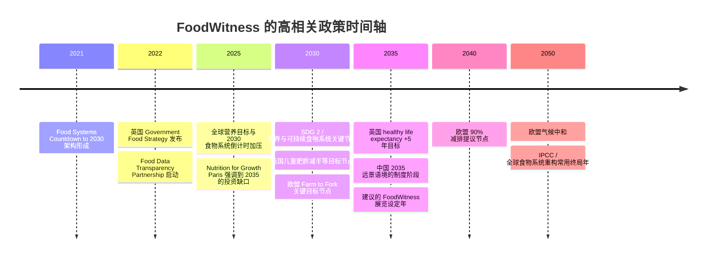

## 执行摘要

你这次 RCA 项目的年份，不是一个装饰性尾缀，而是整套叙事的“政治时间坐标”。你当前的材料已把项目标题、字幕与时间设定当作展示与评审中的核心表达层，因此年份会直接影响 tutor 对项目是“个人健康工具”、还是“面向制度问责的食物环境项目”的第一判断。fileciteturn0file0 fileciteturn0file1

综合联合国 SDG 目标、欧盟 Farm to Fork 与 Green Deal、英国 food strategy 与 Food Data Transparency Partnership、中国“2030 / 2035”型国家战略语境、IPCC 的 2030/2050 缓解时间框架，以及食物系统监测与营养治理领域的项目先例，我的**单一最佳建议是用 2035**。它比 2030 更像“结果已经开始被看见”的制度时间点，比 2050 更有现实压力，也比 2045 更有明确的政策语言和社会想象支撑。对一个强调“从个人自我追踪，转向集体证据与食物系统问责”的设计未来项目来说，2035 最能同时满足**政策贴合度、技术可行性、制度成熟度和展陈叙事力度**。citeturn7view0turn8view4turn8view0turn10view1turn35academia2

如果你需要两个备选，我建议依次是 **2040** 和 **2050**。2040 的优势是可直接挂靠欧盟 2040 减排提案，作为“2030 之后的第一次系统性问责节点”成立；2050 的优势是公众一眼能懂，且与气候中和、食物系统重构的宏大叙事天然相连，但它也最容易把你的项目稀释成过于宽泛、过于熟悉的“未来可持续”口号。相反，**2045 不建议作为首选**：它在政策检索中几乎没有强食品治理锚点，视觉上虽优雅，但论证成本明显更高。citeturn10view1turn10view2turn33search1turn33search2

## 判断框架

我把年份选择拆成四个判断维度。第一是**政策显著性**：年份是否能挂上已经存在、公众可识别、评审可理解的目标链条，比如 2030 的 SDGs、2035 的国家远景、2040 的过渡目标、2050 的净零或气候中和。第二是**技术与制度成熟度**：你的项目不是在做一个新的传感器，而是在重组“个体记录—共享证据—公共问责”的链路，因此关键不只是 CGM 或健康 App 是否存在，而是企业披露、公共报告、地方监测、平台型数据基础设施是否已经足够普及。第三是**展览修辞张力**：一个 RCA design futures subtitle 既要让人觉得“这不是今天”，又不能远到像科幻壁纸。第四是**项目内在逻辑**：FoodWitness 的重点是把私人经验转换成公共证词，再推进对环境和制度的问责，这意味着最合适的年份应当是“社会还来得及行动，但已经能看见结构性后果”的时点。citeturn8view0turn8view4turn35academia2turn7view0

从这个框架看，**2030 太像现有政策截止线，2035 像第一次后果显现与制度修补期，2040 像过渡性中考，2045 最自由但最少锚点，2050 最宏大但最泛化**。这不是简单的“近一点/远一点”问题，而是你想让项目落在“预防”“纠偏”还是“善后”的时态上。FoodWitness 如果要体现“从 private hunger 到 public testimony”的政治性，我更建议它落在**纠偏窗口**，而不是目标尚未到期的 2030，也不是几乎默认晚了的 2050。citeturn7view0turn8view4turn10view1turn10view2turn35academia2

## 政策锚点与时间窗口

全球层面最清晰的食物与营养时间锚仍然是 **2030**。联合国 SDG 2 明确把“终结饥饿、改善营养、推动可持续农业”设在 2030，同时 2.2 又把儿童发育迟缓、消瘦等国际营养目标与 2025/2030 连在一起。更重要的是，联合国最新进展页面已经明确显示：世界并**不在**按期实现 Zero Hunger 的轨道上，这使 2030 既是强锚点，也是一种“临近截止、尚未兑现”的背景。对你来说，这意味着 2030 更像世界观的前情设定，而不是最好的展陈落点。citeturn7view0

欧洲这边，**2030—2040—2050** 形成了非常完整的政策阶梯。Farm to Fork 将农药、化肥、抗菌药、食品浪费和有机农业比例等关键目标集中在 2030；European Green Deal 把 2050 气候中和写成法律约束目标，并在当前政策话语里把 2040 作为 90% 减排的中间门槛提出。对于做食物系统 accountability 的项目，这组年份很重要，因为它提供了一个“从健康与农业指标，到气候与产业重构”的可理解时间轴。也就是说，如果你把年份设在 2035 或 2040，评审会自然把它读成“2030 目标之后的审计期”；如果你设在 2050，它会被读成“终局图景”。citeturn10view1turn10view2turn6search3

英国语境对你的项目尤其有用，因为它已经开始出现**“数据透明—公共责任”**的政策原型。英国 Government Food Strategy 明确提出，到 2030 减半儿童肥胖、缩小地区健康寿命差距，并在 2035 增加 5 年 healthy life expectancy；同一份文件还启动了 Food Data Transparency Partnership，目标是提高食品系统数据的可得性、质量、可比性，并探索围绕健康指标的强制公开报告。这和 FoodWitness 的核心命题高度接近：不是替个人做更强的自律工具，而是把个人经验转成可以推动行业、平台、机构回应的公共证据。**2035 在英国语境里已经不是抽象年份，而是“问责工具开始长出制度牙齿”的中近未来。** citeturn8view4turn8view0

中国方面，本次浏览中可直接抓取到的官方中文原文页面有限，但检索到的信息仍然显示：与你最相关的两个公共时间锚是 **2030** 和 **2035**。前者对应“健康中国 2030”及其营养与健康治理周期，后者对应“十四五—2035 远景目标”式的国家发展话语。换言之，**2035 在中文语境里并不陌生，反而有一种天然的“国家—社会—生活方式同时进入新阶段”的语义密度**；它比 2045 更容易被中文读者理解为“正在靠近的制度阶段”。但需要说明的是，本次对于中国官方中文原文的直接抓取不够完整，因此这里更适合把 2035 作为“战略语境锚”，而非孤立地声称存在某一条单独的“食品系统 2035”政策。citeturn13search0turn15search1turn17academia4

IPCC 相关语境则告诉我们：**2030 与 2050 是减排和系统变革最硬的全球时钟，2040 正在成为新的中程门槛**。IPCC 的 1.5°C 叙事与 AR6 都反复把 2030 前的显著减排和 2050 左右的净零放在同一条路径中，而关于土地与食物系统的总结也强调，改善饮食结构、提升生产效率、减少食物损失与浪费，都是关键的系统杠杆。这对 FoodWitness 的价值在于：你的项目并不是只在讲“吃什么更健康”，而是在讲“食物环境怎样被看见、记录、举证、追责”。所以它最适合站在一个已经被气候与公共健康双重时间表挤压的年份上。2035 正好承接这种压迫感。citeturn33search2turn33search1turn33search0

## 先例地图

与你项目最直接同构的先例，不是消费级营养 App，而是**把分散数据组织成公共问责基础设施**的项目。英国的 Food Data Transparency Partnership 是最强先例之一：它不是单纯向消费者推送建议，而是围绕健康、环境、动物福利等指标，提高数据可比较性，并探索企业层面的公开报告机制。这说明主流政策已经意识到，单靠个人选择无法纠正食物环境，必须把数据变成一种可治理、可披露、可问责的公共对象。FoodWitness 如果设在 2035，会显得像这类机制经过十多年演化后在社区、地方政府、公共采购、平台治理中落地的样子。citeturn8view0

第二类重要先例是 **Food Systems Countdown to 2030 Initiative**。它的意义不在于某一项技术，而在于它提出了一个跨主题、跨尺度、可持续跟踪的食物系统指标架构，覆盖饮食与健康、环境、生产、贫困与公平、治理、韧性等维度。这个先例非常接近你想做的“从 self-tracking 到 collective evidence”的转向：它把零散的健康或营养问题，提升成一个需要长期监测和比较的系统问题。换言之，FoodWitness 最有力量的时候，不是“我知道我吃坏了”，而是“很多人的经验被组织成了可以指认环境失灵的证据”。citeturn35academia2turn37academia6

第三类是营养治理与企业责任的国际先例，比如 Nutrition for Growth 及其到 **2035** 的投资框架。2025 巴黎峰会周边讨论已经把“到 2035 仍需额外投入约 1280 亿美元以覆盖营养需要”作为衡量坐标之一。这类先例说明，在国际治理层面，2035 已经被当作一个现实的中程结算点：不是遥远的终局，也不是眼前的 KPI，而是足以衡量一轮政策与投资是否真的改写营养结果的周期。对 design futures 来说，这种年份非常适合做 subtitle。citeturn35news0

反过来看，**CGM 与个体代谢监测本身并不足以成为你的主叙事先例**。现有研究和产业讨论证明，连续血糖监测、个体化血糖反应预测等工具正在发展，并且越来越多地被用于个体生活方式干预；但如果项目止步于此，它很容易被读成“更高级的自我管理”。与此同时，超加工食品研究越来越明确地把健康风险与工业化食品环境联系起来，这恰恰支持你从“个人修身”转到“环境举证”的方向。也就是说，**技术上可用的个体监测，应该在你的项目里只是入口，不是终点**。citeturn32search0turn30search2turn29search3

## 候选年份比较

| 候选年份 | 主要政策锚点 | 与 FoodWitness 的匹配方式 | 先例/参照 | 优点 | 风险 |
|---|---|---|---|---|---|
| **2030** | SDG 2 与 2.2；EU Farm to Fork；英国 food strategy 的 2030 健康目标；中国“健康中国 2030”语境。citeturn7view0turn8view4turn6search3turn13search0 | 更像“目标截止年”而非“结果显现年” | Food Systems Countdown to 2030。citeturn35academia2 | 最易识别，政策密度最高 | 太近，容易像政策海报或 NGO 倡议，不像设计未来 |
| **2035** | 英国 2035 healthy life expectancy；中国 2035 远景语境；国际营养投资框架到 2035。citeturn8view4turn15search1turn35news0 | 最像“2030 之后，个人证据被制度化、共享化、开始反过来改变环境”的时间点 | FDTP 延伸落地；N4G/营养治理中程结算；后 2030 监测叙事。citeturn8view0turn35news0turn35academia2 | 近未来、可行动、制度成熟度合适、中文英文都自然 | 需要你在 synopsis 里明确这是“post-2030 accountability phase” |
| **2040** | 欧盟 2040 减排提案，连接 2030 与 2050。citeturn10view1 | 适合作为“系统问责基础设施已经成型”的中程世界 | 欧盟过渡目标逻辑。citeturn10view1 | 比 2050 更具体，比 2035 更显系统重构 | 在食品与营养治理上，现成锚点明显少于 2035 |
| **2045** | 本次检索中未发现强势、广为人知的食品系统公共锚点 | 更靠设计师自建世界观 | 无显著公共先例优于 2035/2040/2050 | 视觉上舒服，时间上有代际感 | 政策支撑最弱，最像“随手选了一个未来年” |
| **2050** | 欧盟 2050 气候中和；IPCC/气候与土地叙事；大量粮食、人口、气候研究默认 2050。citeturn10view2turn33search0turn33search2turn36search12 | 更像宏观文明图景，而非具体制度纠偏 | EAT-Lancet / 2050 食物转型想象、气候中和框架。citeturn36news0turn36news1turn10view2 | 一眼可懂，宏大、史诗感强 | 过于常见，容易把你的项目抽象成笼统的“可持续未来” |

从这张表可以看出，**2035 的优势不是“它最有名”，而是“它最平衡”**。2030 太近，所以证据基础设施还来不及从实验性工具变成制度惯例；2050 太远，因此你的项目容易失去“此刻就该开始”的紧迫感；2045 又太缺乏外部支撑。2035 刚好落在“2030 目标被检视之后、2040/2050 结构转轨之前”的窄门里。对一个讲 witness、testimony、accountability 的项目，这个窄门非常珍贵。citeturn7view0turn10view1turn10view2turn35academia2

## 建议落点与文案

### 最佳建议

**首选年份：2035**

我建议你把 subtitle/timeline 的标准落点定为 **2035**。核心理由有五条。

第一，**它最符合你项目的时间语法**。FoodWitness 不是要预言一个完全陌生的遥远社会，而是要展示：当个体在“脏的食物环境”里生成的大量身体经验被收集、比对、共享后，如何转化为一种集体证据，并反向迫使平台、品牌、学校、社区、地方政府乃至公共采购系统承担责任。这个过程需要一些时间，但又不能长到让制度显得完全不可触及。2035 提供的正是这种“已经开始结晶、但仍可逆转”的时间感。citeturn8view0turn35academia2

第二，**它与现成政策语言的接缝最好**。2030 已经被 SDG、营养、肥胖、农业、食品浪费等目标占满；2035 则是这些目标之后第一次能讨论“谁兑现了、谁失败了、谁被暴露出来”的时点。英国正好在 2035 放置了健康寿命目标；中国的 2035 远景语境也让这个年份在中文里不生硬。你用 2035，不需要写长篇解释，评审就会天然把它读为“后 2030 的制度后果期”。citeturn8view4turn15search1turn7view0

第三，**它与技术成熟度相配**。你项目需要的关键技术并不是 2035 才会出现，而是到那时更可能完成从“个体设备”到“公共基础设施”的跃迁：可穿戴/代谢感知、零售与产品数据、企业公开报告、地方仪表板、细粒度监测、平台化共享与比较，这些元素今天都已存在雏形。2035 足够近，观众会相信它能发生；也足够远，你可以合理想象它们被政治化、制度化。citeturn8view0turn35academia2turn37academia10

第四，**它比 2050 更能保留项目的“证词感”**。2050 很适合讲文明尺度、行星尺度、净零路径，但不适合讲“谁在此刻说了什么、留下了什么记录、如何被共同验证”。你的项目需要的是 witness，不只是 forecast；是 testimony，不只是 scenario。2035 仍然保留人的口述、身体、社区和地方冲突的温度。citeturn10view2turn33search2

第五，**它对 RCA 的展陈修辞最有利**。在设计学院语境里，2035 看起来足够像未来，但不会立刻落入一类常见的 mid-century green futurism 套路。它显得更“政治”，少一点空泛的 utopia，多一点“已经进入争执”的状态。这正适合 FoodWitness。citeturn10view1turn10view2

### 两个备选

**第一备选：2040**

如果你希望项目显得更“系统转轨中”，而不是“社会刚开始纠偏”，2040 是最好的替代。它的最大好处是能直接挂钩欧盟 2040 过渡目标，因此会让你的世界观更像一个已经进入政策审计、行业整改、基础设施扩张阶段的社会。缺点是：相较 2035，它在食品与营养层面的现成公共锚点没那么密，你需要在 synopsis 里多写一句，说明这是“2030 目标未完全兑现后的治理升级期”。citeturn10view1turn35academia2

**第二备选：2050**

如果你最终想把项目从“食物环境问责”推到“文明级食物系统重构”，2050 仍然成立。它和气候中和、行星健康饮食、人口与粮食需求等大叙事天然兼容，观众也最容易一眼代入。问题在于，它太熟悉了，也太容易把你的项目吞进“可持续未来”的通用图像库里。只有当你的展陈重点是**宏观制度、基础设施、地球系统**而非**证词、举证、社区问责**时，我才会把 2050 放到前面。citeturn10view2turn36news0turn36news1turn36search12

### 不建议作为首选的年份

**2045 不建议作为首选**。不是因为它不好看，而是因为它太需要额外解释。在本次高置信度资料中，2045 没有找到足够强的食品政策、公共健康或食物系统治理锚点。你当然可以用它，但那样 tutor 更可能问：“为什么不是 2040？为什么不是 2050？”——也就是说，你要把宝贵的 synopsis 文字花在替年份辩护，而不是替项目本身辩护。citeturn10view1turn10view2

## 年表与文案建议

下面这条时间线把与你项目最相关的“政策时钟”和“问责基础设施时钟”放在一起。它的作用不是覆盖所有事件，而是帮助你在 synopsis 或 process diagram 中说明：**FoodWitness 发生在一条已经启动、但尚未完成的治理链上**。相关年份与节点见下图。citeturn7view0turn8view0turn8view4turn10view1turn10view2turn35academia2turn35news0

### 推荐 subtitle 版本

以下英文与中文**故意不做逐词互译**，而是分别服务不同语境。

**最推荐用于海报的版本**

- **English**: *From Guarding Yourself to Changing the System, Together — 2035*  
- **中文**：**从保护自己，到一起改变系统——2035**

这个版本最稳。它保留了你已经定下来的项目气质，又把 2035 加成一个判断性的时代标签。它适合 poster，因为信息最直接，三秒内就能知道：这不是营养 app，而是讲“个体—集体—系统”的项目。这个版本也是我最建议你直接用于表格和海报的。citeturn8view0turn8view4

**更适合 synopsis 的版本**

- **English**: *FoodWitness, 2035: from personal metabolic traces to collective food-system accountability*  
- **中文**：**食证，2035：从个人代谢痕迹到集体性的系统问责**

这个版本信息密度更高，适合作为 synopsis 的首句、副标题下的说明句，或者 research summary 的 opening line。优点是它非常精确地把项目从“tracking”拉向“accountability”。缺点是海报上稍微重一些。citeturn8view0turn35academia2

**更有展览感的版本**

- **English**: *FoodWitness in 2035: when self-protection becomes public evidence*  
- **中文**：**2035年的食证：当自保变成公共证据**

这个版本比较适合 exhibition booklet、墙文、口头阐释。它更有“命题句”的感觉，也更贴近你最初的 conceptual move：保护自己，不再止于保护自己。citeturn8view0turn35academia2

**如果你坚持更公共、更强硬的语气**

- **English**: *A Public Record of Harm in the Food Environment, 2035*  
- **中文**：**2035：食物环境伤害的公共记录**

这个版本比较强，也比较“政治”。适合你后续如果把品牌、平台、学校、社区、城市食物环境中的责任方写得更清楚，再使用。否则现在可能略显提前。citeturn8view0turn35academia2

### 我会怎么定稿

如果今天就要交，我会这样定：

**Project Title**  
**FoodWitness / 食证**

**Subtitle**  
**From Guarding Yourself to Changing the System, Together — 2035**

**中文副标题**  
**从保护自己，到一起改变系统——2035**

原因很简单：它在表格里最稳，在 tutor review 里最好解释，在 poster 上也最不容易被误读成“健康管理工具”。而且 2035 会让你的 process diagram、synopsis 和 future timeline 都有自然展开空间：  
今天的个体记录 → 2030 目标失灵/不足的社会背景 → 2035 的共享证据与制度回应。citeturn7view0turn8view0turn8view4turn35academia2

## 开放问题与限制

本报告尽量优先使用联合国、欧盟、英国政府等高权威来源；但**中国官方中文网页与 OECD 官方页面在本次浏览环境中的直接抓取不完整**，因此关于中国“2035”与 OECD 相关内容，我主要将其作为**辅助语境锚**而非核心论据。换句话说，**2035 的推荐并不依赖某一条单独的中国或 OECD 食品政策条文**，而是依赖更高置信度的跨来源合流判断。citeturn13search0turn15search1

另一个限制是：**2045 的弱势并不意味着它不能用**，而是意味着它缺乏现成外部锚点。如果你后续决定把项目世界观写成“2030 失败、2040 修补、2045 形成群众证词基础设施”，那 2045 仍可成立；只是就“少解释、强落地、好评审”的目标而言，2035 明显更优。citeturn10view1turn10view2

**结论一句话版：如果你想让 FoodWitness 看起来既不是消费级 CGM 产品，也不是空泛的 2050 可持续乌托邦，而是一个已经进入公共问责阶段的近未来制度设计项目，就用 2035。** citeturn8view0turn8view4turn35academia2turn10view1