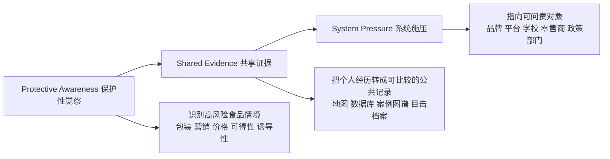
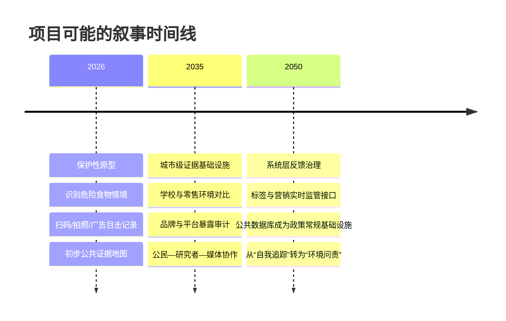

# 从自我追踪到食物环境反馈基础设施

## 执行摘要

你的项目方向转向——从“帮助个体更好地追踪自己”转为“设计一种能让人们在污染性的食物环境中先保护自己、再形成共享证据、最后向系统施压的反馈基础设施”——**是成立的，而且比单纯做 CGM 或自律 App 更有公共性、时代性与设计深度**。原因不只是“更宏大”，而是它更符合当前公共卫生与营养研究对问题成因的判断：肥胖、代谢紊乱和不健康饮食并不只是个人意志薄弱，而是由可得性、价格、营销、产品设计、包装、平台推荐和政策环境共同塑造的“致胖环境”与“商业健康决定因素”所驱动。WHO 明确把“市场力量”“获得健康饮食的机会”“更广泛环境”列为肥胖形成的关键因素，并指出政府需要通过税收、儿童营销限制、产品再配方、学校与公共场所标准等方式来建设健康食物环境。citeturn6view0turn6view2turn5view0

从证据上看，**超加工食品与不良健康结局之间的关联已非常强**；同时，个体自我追踪工具虽然可能促进某些行为改变，但证据总体是“有限、异质、容易滑向个体化责任”的。以 CGM 为例，它对糖尿病管理有明确临床价值，但在非糖尿病人群中，商业化平台更多把它用作“看见你身体真实反应”的优化工具；它可能提升食物选择意识，却也可能引发对正常波动的过度关注、食物焦虑、医疗化和阶层不平等。citeturn15view0turn16view0turn31news1turn31news0turn45academia2

产品审计也支持你的判断。Levels、Signos、MyFitnessPal、Noom、Nutrisense 虽然方法不同，但大多把责任框架放在**个人记录、个人纪律、个人理解、个人优化**上。最典型的是：以“看清身体信号”为名，实则将复杂的食物环境问题压缩为用户的行为管理问题；而在数据层面，这些产品从“数据不出售”的承诺到广告、跨设备追踪、第三方分析、外部供应商共享，透明度与治理逻辑差异很大。换句话说，它们已经证明“个体反馈界面”这条赛道存在，但也暴露了它的局限——这正是你可以切入的设计空间。citeturn15view0turn16view0turn22view0turn18view0turn18view1turn25view2turn19view1turn21view1turn23view0turn26view0

因此，更准确地说，你的新方向不是“放弃个体层”，而是**把个体感知重新嵌入集体与制度层**。最有力的项目逻辑不是“告诉你该吃什么”，而是：  
**Protective Awareness 保护性觉察**：个体识别高操控性、高营销暴露、高误导性的食物情境；  
**Shared Evidence 共享证据**：把分散体验转成可比较、可视化、可争论的公共证据；  
**System Pressure 系统施压**：让这些证据指向具体机构、规则、品牌与政策缺口。  
这一逻辑在世界上已有若干前例碎片：FoodSwitch 通过扫描与替代建议提升包装食品透明度；Open Food Facts 把商品成分与营养信息做成开放数据库；Bite Back 2030 将青年目击、证据与政策倡议连接起来；Rudd Center 长期把儿童食品营销、体重污名与政策研究结合。你的机会在于把这些分散路径整合为一个更明确的“反馈基础设施”叙事。citeturn43view1turn42search6turn43view2turn44view1

对 Show 2026 来说，最合适的交付不是一个“完整商业 App”，而是一个**可被看懂、可被质疑、可被扩展的原型系统**：一份清晰的 synopsis、一条能立住立场的 banner line、一张把“被食物环境包围”的感受显化的 hero image、一套从个人遭遇到公共证据再到政策压力的流程图，以及一组能让导师快速判断你不是在做“又一个健康管理 App”的关键视觉。下面的报告将围绕问题框定、理论与证据、产品审计、政策与前例、方法框架，以及 2026 年 7 月 6 日 tutor review 的具体交付建议展开。citeturn6view0turn6view2turn43view1turn43view2

## 方向判断

### 这个转向为什么是对的

如果沿着你最初的直觉，把项目理解成“让人更自律”，那么它会自然落入现有健康科技市场的语言：个体化、优化、可衡量、可 gamify、可订阅、可长期黏住用户。这个方向并非毫无价值，但它已经被商业产品充分占领，而且在理论上存在一个根本问题：**它把本来高度环境化、产业化、制度化的饮食风险，重新翻译成了个人行为失败**。WHO 对肥胖与饮食的判断并不把问题归结为意志力，而是明确把“市场力量”“工业化食物系统”“可获得性与可负担性”“法律与监管环境”纳入核心因果链条。citeturn6view0turn6view2

WHO 对“商业健康决定因素”的定义尤其与你的转向高度对齐。它指出，私营部门通过供应链、劳动条件、产品设计与包装、研究资助、游说、偏好塑造等方式影响社会、物理与文化环境；这些影响既包括超加工食品、含糖饮料和针对青少年的定向营销，也包括通过知识环境制造混淆和阻碍监管。也就是说，你现在想抓住的并不只是“人如何吃得更健康”，而是**食物环境如何被设计成让人难以健康地活着**。这恰恰是公共卫生研究近年越来越重视的层面。citeturn5view0

因此，这个项目的价值不在于提出一个全新的问题，而在于**把现有研究已经确认的问题，转译成公众可感知、可参与、可施压的设计语言**。这比“做一个更聪明的追踪工具”更强，因为它同时触及三层：  
一是日常层，帮助人识别环境陷阱；  
二是认识层，把零散体验汇聚为证据；  
三是政治层，把证据重新送回品牌、平台、学校、超市和政策制定者。  
这也是你相较于现成商业产品最明显的差异点。citeturn5view0turn6view2

### 这个方向不应该被误解成什么

这个转向不等于“反技术”。相反，它意味着你对技术的使用方式发生了变化：技术不再只是把身体内部信号提取出来给用户自我管理，而是把**外部环境的操控、暴露与不透明性**重新可视化。你不是从 CGM 走向“不要数据”，而是从“为了优化个体而采集身体数据”走向“为了理解并挑战环境而组织证据”。这一区别非常关键，因为它帮助你避免被看成又一个 wellness 工具。citeturn15view0turn16view0turn25view2

另一个需要避免的误解是：既然要做系统层，就不需要个体层。实际上，**个体层仍然是入口**。只是入口不再是“你吃错了”，而是“你正处在一个不断把高糖高盐高脂、强营销、高可得性产品推向你的环境里”。也就是说，个体反馈仍然重要，但它的伦理目标应从“规训身体”转向“提升保护性觉察”。这会直接改变你的视觉语言、交互语言和研究方法。citeturn6view2turn5view0

## 理论与证据基础

### 行为科学与食物环境

行为科学并不只支持“nudging 个体”，也支持你所说的“先保护、再共享、再推动系统改变”。WHO 关于健康饮食的官方表述非常明确：健康饮食不是单纯靠个人知识达成，而需要**健康食物环境**；政府应通过农业、财政、贸易、学校与工作场所标准、产品再配方、儿童营销限制以及选择架构调整来塑造条件。换句话说，行为不是悬浮在真空里的，环境本身就是行为设计。citeturn6view2

同样，WHO 对肥胖的描述已把它定义为一种由遗传、神经生物学、进食行为、获得健康饮食的机会、市场力量和更广泛环境复杂交互形成的慢性复发性疾病。这个表述的重要性在于，它把“市场力量”直接写进了问题定义里：在这种框架下，设计如果还只停留在“提升意志力”，就会在理论上显得过时。citeturn6view0

### 政治经济与商业健康决定因素

从政治经济角度看，你的新方向比个体自律工具更有解释力。WHO 的商业健康决定因素框架指出，商业主体通过产品生产、定价、包装、营销和政策影响，塑造了人们出生、成长、工作、生活和变老的环境；尤其是针对年轻人的广告与名人推广，会直接影响偏好形成与消费。它还指出，这些影响会加剧既有的经济、社会和种族不平等。citeturn5view0

这与食物系统中的“超加工食品—营销—可负担性—政策阻滞”链条高度一致。WHO 同时强调，不健康商品在年轻人和低收入群体中的暴露尤其严重，而一些国家和地区又更容易承受跨国企业压力。你要做的“从个人保护到系统重塑”，实际上就是把这种政治经济结构翻译成可被体验与讨论的公共界面。citeturn5view0turn6view2

### 超加工食品与健康结局

关于超加工食品，目前最核心的高置信度判断有两条。第一，NIH 所做的住院随机对照研究发现，当参与者摄入超加工饮食时，会自发摄入更多热量并出现体重增加；这说明问题不只是“知道多少营养知识”，而与食物系统如何组织口感、形态、便利性和摄入节律有关。第二，近期综合性综述与权威报道都显示，较高的超加工食品暴露与多种不良健康结局相关，包括肥胖、心血管疾病、2 型糖尿病和部分癌症风险上升，尽管不同品类和机制层面仍存在异质性与争论。citeturn3news4turn46news1turn47news0

这组证据对你的项目非常关键，因为它说明：**真正需要被设计和治理的不只是“用户对食物的反应”，而是食物本身如何在工业与商业逻辑中被制造成一种高可得、强诱导、低透明的环境力量。**你的项目方向，正是在把这种“反应式个体健康”推进到“前置式环境识别”。citeturn46news1turn5view0

### CGM 与自我追踪的证据边界

CGM 在糖尿病群体中的临床价值毋庸置疑，但在非糖尿病人群中的消费化扩张，证据与商业话术之间存在明显张力。Signos 自己引用的文献与市场材料强调，CGM 反馈会影响食物选择与活动行为，并把血糖稳定与体重管理、能量、专注度联系起来；Levels 也把“第一次真正看见食物对自己做了什么”作为核心卖点。citeturn16view0turn15view0

但另一方面，媒体对研究者与临床专家的采访一致表明：对于无糖尿病用户，CGM 的健康收益仍缺乏坚实共识，且容易诱发对正常血糖波动的过度解读、食物焦虑或近似强迫性的监测。英国媒体还报道了监管与准确性担忧，以及消费化 CGM 可能挤占真正高风险人群的可及性问题。更广泛的自我追踪文献综述也表明，这类工具的效果高度依赖人群、设计与场景，证据总体异质，并非天然能带来可持续的健康行为改变。citeturn31news1turn31news0turn45academia2

这正好为你的项目提供了一个清晰立场：**问题不在于“是否反馈”，而在于反馈为了谁、服务什么尺度、嵌入何种伦理目标。**如果反馈只是把用户困在个体最优化循环中，它容易滑向医疗化与自责；如果反馈被重新设计成识别环境风险、汇聚集体经验和触发制度问责，它就可能从“追踪自己”变成“认识系统”。citeturn45academia2turn5view0

### 监视、医疗化与伦理

你的项目如果继续使用生理数据或高度个体化日志，就必须正视“数据化身体”的伦理问题。现有穿戴和 mHealth 文献指出，这类系统经常把用户置于持续的自我监督与算法推断之中，而效能承诺往往伴随着对同意、可解释性和数据治理的不对称。广义 mHealth 研究还发现，大量应用在隐私政策完整性、数据传输安全和第三方共享上存在缺口。citeturn45academia0turn48academia4turn48academia10

这意味着，你的新方向在伦理上反而更有优势：因为它天然允许你降低对个体敏感生物数据的依赖，把项目重点移向**环境暴露、商品透明度、广告见证、集体地图、公共证据**。这不但更符合你想做的“保护”，也更容易避免把项目做成另一个“把每个人都变成病历”的系统。citeturn26view0turn21view1turn23view0

### 三阶段逻辑图

这一逻辑与 WHO 所强调的“从健康食物环境入手”的路径相一致，也更贴合你要处理的“肮脏食物环境”命题。citeturn6view2turn5view0

## 产品审计

### 一个核心发现

这五个产品并非完全相同，但它们共享一个强烈的共同点：**都把‘健康改善’的主要行动单位设定为个体用户**。差别只在于，有些偏向“看数据学自己”，有些偏向“记录摄入”，有些偏向“心理课程与教练”，有些加入 CGM 与营养师，但整个叙事中心几乎都是“你是否足够理解、足够坚持、足够优化”。citeturn15view0turn16view0turn22view0turn18view0turn25view2

这并不是说它们无效，而是说：它们已经构成了你项目最清晰的反面参照。你应该把它们当成“已有答案”，然后说明你的项目为什么不能只是它们的艺术版，而必须改写问题单位：从 **self-improvement** 改成 **environmental accountability**。citeturn5view0turn6view2

### 产品审计表

| 产品 | 主要功能 | 责任框架 | 数据与不透明性 | 目标受众 | 主要风险 |
|---|---|---|---|---|---|
| **Levels** | 食物记录、宏量营养、CGM、可穿戴接入、既往化验上传、AI 健康洞察、营养师/临床支持。citeturn15view0 | 强调“See how food affects your health”“Stop guessing”“你的身体独特”，把健康理解为通过个人数据不断校准自己的代谢系统。citeturn15view0 | 官方首页强调 HIPAA/SOC2 与“Your health data belongs to you”“does not sell your personal health data”；但其个性化建立在“最大的专有代谢数据集之一”之上，算法与数据建模细节并不透明。citeturn15view0 | 愿意为个性化代谢健康付费、偏高收入、偏 biohacking / longevity 用户。citeturn15view0 | 将复杂饮食问题缩减为个体代谢优化；高成本；可能强化“正确吃法只有一种、必须通过数据被证明”的思维。citeturn15view0turn31news1 |
| **Signos** | CGM + 餐食/运动/习惯记录 + 个性化建议，直接面向减重。citeturn16view0turn16view2 | 明确把血糖稳定与减脂、食欲再训练、长期体重管理绑定，责任单位几乎完全是用户的食物与运动选择。citeturn16view0 | 隐私政策列出极广泛的数据类型，包括病史、健康信息、社媒信息、浏览行为、地理位置、设备标识；并明确允许分析、画像、定向广告、跨站/跨应用功能与第三方追踪技术。citeturn19view1 | 以减重为首要目的的 non-diabetic/wellness 用户。citeturn16view0 | 医疗化减重；对正常波动过度解释；目标设定与体重规训可能加剧食物焦虑与羞耻。citeturn16view0turn31news1turn19view1 |
| **MyFitnessPal** | 卡路里/宏量/微量记录、条码、语音记录、间歇性断食、目标设定、设备同步。citeturn22view0 | 典型“tracking works”叙事：通过完整记录饮食、活动、体重来“take back control of your health and fitness”。citeturn22view0 | 隐私政策明确会收集饮食、活动、药物、睡眠、身体测量、健康设备数据；允许个性化广告、跨设备追踪，并承认某些 Cookie/广告实践在适用法律下可能构成“sale/sharing”。同时 HealthKit/Health Connect 的部分数据不用于营销。citeturn23view0 | 大众化体重管理和健身用户，门槛最低。citeturn22view0 | 热量中心化、长期记录负担、饮食误差/数据库误差、对部分人群可能触发饮食失调式监控。citeturn22view0turn34news0turn23view0 |
| **Noom** | 减重课程、每日心理/行为课程、食物/运动追踪、教练、支持群组，另有药物减重服务 Noom Med。citeturn18view0turn18view1 | 以心理学和行为科学语言包装减重，把问题表述为“更理解你与食物的关系、建立长期改变”。Noom Med 又把这种逻辑与减重药物整合。citeturn18view0turn18view1 | 隐私政策表明收集健康数据、敏感人口信息、地理位置、使用日志、广告伙伴数据；可用于产品改进、个性化、营销和广告，并承认部分披露在美国州法下可能构成“sale/sharing”。citeturn21view1 | 减重与行为改变市场，含需要药物辅助的用户。citeturn18view0turn18view1 | 容易把结构性问题心理化；在“同理心”界面下仍然延续个体责任叙事；药物化入口增强医疗化风险。citeturn18view0turn18view1turn21view1 |
| **Nutrisense** | 24/7 CGM、Nora AI、1:1 营养师指导、压力管理、血液检测、支持自带传感器。citeturn25view2turn16view6 | 将项目表述为“metabolism training”“train the habits that outlast diets”，仍是强化个体习惯与个体身体解释。citeturn25view2 | 隐私政策显示收集血糖、糖尿病状态、药物、既往病史、地理位置、推断画像、生物特征等；共享给大量第三方服务商，包括 Dexcom、Mixpanel、Segment、Google、Microsoft Azure GPT4 等；并明确声明 Nutrisense 一般**不是** HIPAA covered entity。citeturn26view0 | 想要“高接触式”教练与 CGM 解释的人群，价格更高。citeturn25view2turn26view0 | 健康数据高度平台化；用户可能以为自己处于医疗隐私保护框架下，但政策说明并非如此；系统更接近“高价 wellness platform”而非公共健康工具。citeturn26view0 |

### 你可以从这些产品学什么

你不应该简单地拒绝这些产品，而应该**拆解它们真正有效的界面策略**：  
它们都很善于把复杂问题变成清晰反馈；  
都很善于让用户“第一次看见某种东西”；  
都把行动建议做得低门槛；  
都懂得把“知识”做成故事。  
这些都是你可以借用的。citeturn15view0turn18view0turn22view0turn25view2

但你需要坚决反转的是它们的责任逻辑：  
不是“你为什么没有管好自己”，  
而是“为什么你的学校、超市、社交平台、外卖系统和广告系统被设计成不断推动不健康选择”。  
这就是你应当在 show 里反复强调的政治差异。citeturn5view0turn43view2

## 政策与系统杠杆

### 当前共识并不是只靠“教育消费者”

WHO 关于健康饮食最值得抓住的一点，是它把政策工具说得非常具体：政府应提高健康食品的激励，减少高糖高盐高饱和脂肪加工食品的激励，推进产品再配方，建立保护儿童免受有害食品营销影响的强制性工具，并在学校、学前机构、工作场所和公共机构中保障健康、可负担、安全的选择。也就是说，公共卫生的前沿早已不是“告诉大家多吃菜少喝糖”，而是要求把环境条件改变掉。citeturn6view2

这意味着你的项目在政策层面完全站得住：它不是在替代政策，而是在为政策创造更可见的公众证据和感知基础。设计的作用不是取代立法，而是让立法问题更难被忽视。citeturn6view2turn5view0

### 儿童营销、广告与透明度

食品营销对儿童与青少年的影响是当前最成熟、也最容易形成制度共识的切口之一。WHO 明确提出应建立强制机制保护儿童免受有害食品营销影响；Bite Back 2030 则把这一点直接做成青年行动平台，包括“Spot Junk Ads. Expose Big Food.” 之类的可参与式工具；Rudd Center 也长期把儿童在 YouTube 等平台上暴露于垃圾食品营销的情况转化为政策研究和传播议题。citeturn6view2turn43view2turn44view1

在英国，围绕高脂高盐高糖食品广告的限制已进入更实质性的法规阶段。根据 2025 年报道，原本延迟的限制在 2026 年 1 月开始具有法律义务：电视 9 点前禁止相关产品广告、线上任何时间限制相关广告，只是品牌广告口径仍有争议。这说明“广告暴露—儿童保护—品牌规避”正是一个现实、当下、且具有张力的政策战场。citeturn41news2

### 以标签和数据库作为系统切口

除了广告，透明度是另一个强切口。FoodSwitch 之所以重要，不只是它能“推荐更健康替代品”，而是它把包装食品数据库、扫码、比较和替代建议连成了一个实用公共工具，并且扩展到气候影响与乳糜泻等特定议题。它证明：**条码、包装信息与数据库的结合，可以成为一种低门槛但高扩展性的公共接口。**citeturn43view1

你的项目不必自己重新发明所有营养科学，也不必一开始就做极重的传感器开发。更合理的路径是借鉴这类系统：从**环境反馈**而不是**生理反馈**切入，让“商品信息—场景暴露—消费选择—集体证据”形成闭环。这样既减少隐私负担，也更能服务你的系统变化目标。citeturn43view1turn26view0

### 场景时间线

这个时间线不是预测，而是一种设计 futures 框架：它帮助你把 show 从一个 app 原型提升到“反馈基础设施如何演化”的叙事。其现实基础，来自当下公共卫生已经明确要求的环境治理方向。citeturn6view2turn5view0

## 前例与方法框架

### 与你方向最接近的前例，其实不是 CGM 产品

真正与你方向最接近的前例，往往不是那些最像“高科技健康产品”的东西，而是那些把消费者经验、商品透明度、食品环境与政策杠杆连起来的项目。FoodSwitch 把商品扫码、健康/环境评分和替代建议结合起来；Open Food Facts 把分散商品信息做成多语言开放数据库；Bite Back 2030 把青年见证、行动工具和政策运动连起来；Rudd Center 则把儿童食品营销、学校食物、体重污名与政策研究长期连接。它们共同说明：**最有力量的不是“一个人更懂自己了”，而是“很多人的局部经验被组织成改变环境的证据”。**citeturn43view1turn42search6turn43view2turn44view1

### 前例项目表

| 前例 | 类型 | 你可以借用的点 | 来源 |
|---|---|---|---|
| **FoodSwitch** | 公共健康数据平台 / 扫码工具 | 通过扫描包装食品提供营养信息与更健康替代；把数据库、比较和行动建议结合；已经扩展到气候影响等维度。citeturn43view1 | citeturn43view1 |
| **ecoSwitch / GlutenSwitch** | FoodSwitch 衍生应用 | 证明同一数据库/界面逻辑可以服务不同公共议题，而非只做“减重”。citeturn43view1 | citeturn43view1 |
| **Open Food Facts** | 开放数据库 / 社群共建 | 把商品配料、营养、添加剂、标签变成开放公共资料；非常适合启发“共享证据”层。由于官网对爬虫抓取有限，本报告仅能引用其公开概述性资料。citeturn42search6 | citeturn42search6 |
| **Bite Back 2030** | 青年行动主义 / 倡议平台 | 不是单纯“教育孩子吃更好”，而是组织青年打击垃圾食品广告、推动更公平的学校食物和企业问责。citeturn43view2 | citeturn43view2 |
| **Kick Big Soda Out** | Campaign 案例 | 把品牌赞助、体育、儿童健康串起来，说明“环境治理”可以从具体品牌关系入手。citeturn43view2 | citeturn43view2 |
| **Spot Junk Ads. Expose Big Food.** | 参与式证据收集 | 非常接近你想做的“目击—上传—公开化—施压”模式。citeturn43view2 | citeturn43view2 |
| **UConn Rudd Center** | 学术研究 / 政策转译机构 | 长期把儿童垃圾食品营销、学校膳食、体重污名做成可传播的政策研究与工具。citeturn44view1 | citeturn43view3turn44view1 |
| **Supportive Obesity Care** | 反污名设计前例 | 提醒你：做食物环境项目不能复制体重羞辱；空间不是“指责胖人”，而是反对环境与商业操控。citeturn44view0 | citeturn44view0 |

### 如何把你的逻辑操作化

你可以把项目方法明确写成一个三阶段系统，而不是一个功能堆积的 app。下面是更适合毕业设计语言的操作化版本：

**Protective Awareness 保护性觉察**  
目标不是给个人打分，而是帮助人识别“高操控性食物环境”。这可以通过三类输入完成：  
其一，扫码或拍照读取包装、成分、糖/脂/钠、添加剂与营销话术；  
其二，记录广告暴露、陈列位置、校园/通勤/外卖场景；  
其三，选填主观感受，如“想买”“焦虑”“以为健康”“吃完还想继续吃”。  
它强调的不是医疗诊断，而是环境识别。其公共卫生依据在于：市场力量、包装、营销与儿童保护已被 WHO 明确视为健康环境议题。citeturn5view0turn6view2

**Shared Evidence 共享证据**  
把个人记录转成公共可比较对象。你可以做的不是“大家共享血糖”，而是共享：  
广告在哪出现；  
哪些学校/社区/平台暴露更高；  
哪些产品长期以“健康”“高蛋白”“天然”包装高糖高盐高脂内容；  
哪些人群最容易被推送。  
这一步最适合借鉴 FoodSwitch 的数据库逻辑与 Bite Back 的行动逻辑：从单个体验转向地图、榜单、时间序列、案例档案。citeturn43view1turn43view2

**System Pressure 系统施压**  
公共证据必须能指向具体对象，否则它就会重新落回“用户自己注意点”。你需要让每一类证据都对应一个施压出口：  
广告目击 → 指向平台、品牌、监管部门；  
校园食品环境 → 指向学校、食堂供应商、地方教育系统；  
包装误导 → 指向零售商、品牌和标签规定；  
高暴露地图 → 指向媒体、NGO 与倡议组织。  
这一层决定了你的项目为什么不是“信息设计”而是“制度设计的前端接口”。citeturn43view2turn44view1turn6view2

### 关键利益相关方

如果你要把项目做成能被导师理解的系统设计，建议把利益相关方分为五类。  
第一类是**直接暴露者**：学生、年轻上班族、通勤者、外卖高频用户。  
第二类是**证据转译者**：公共卫生研究者、记者、NGO、学校社工、青年组织。  
第三类是**场景管理者**：学校、超市、便利店、平台、外卖界面、广告媒体。  
第四类是**被问责者**：品牌、零售商、赞助商、平台运营方。  
第五类是**规则制定者**：地方政府、教育系统、监管机构、行业标准组织。  
这个分类与 WHO 对多部门健康食物环境治理的理解是一致的，也能帮助你后续画 stakeholder map。citeturn6view2turn5view0

### 风险与伦理关注

这个项目最需要防止的，不是“做得不够酷”，而是做着做着又回到了你原本想离开的地方。最大的几个风险包括：

其一，**隐私风险**。如果你过度采集生理数据、位置数据或可识别健康信息，你会很快复刻现有 wellness 平台的伦理问题。Noom、MyFitnessPal、Signos、Nutrisense 的政策都显示，健康产品很容易滑向广告、画像、分析和多方共享；Nutrisense 甚至明确说明其一般并不受 HIPAA 覆盖。citeturn21view1turn23view0turn19view1turn26view0

其二，**医疗化**。如果你的界面语言过度借用临床监测语气，用户会把原本应被理解为“环境风险”的问题，当作“我身体有问题”的证据。这会把项目从公共健康设计拉回个人病理化。citeturn31news1turn26view0

其三，**污名化**。如果视觉或文案把项目做成“教你不要发胖”或“控制嘴馋”，它会无意中复制体重偏见与道德评判。Rudd Center 对 supportive obesity care 的强调提醒我们，健康设计不能建立在羞耻上。citeturn44view0

其四，**证据偏差**。如果系统主要由高教育、高收入、健康焦虑较强的人使用，那么它产出的“共享证据”可能失真。因此，原型阶段应更关注“环境目击”和“可见对象”，而不是要求高频、精细、长期的个人日志。citeturn31news1turn45academia2

## Show 2026 交付建议

### 你现在最需要的项目表述

#### synopsis draft

下面是一版更适合 show / tutor review 的中文 synopsis 草案，你可以直接改：

> 本项目不再把不健康饮食理解为个人自律失败，而将其视为由超加工食品、包装误导、平台推荐、价格结构与儿童/青年营销共同构成的食物环境问题。项目提出一种从“保护性觉察”到“共享证据”再到“系统施压”的反馈基础设施：它帮助人们在日常消费场景中识别高操控性食品与广告暴露，将分散的个人经历转化为可比较、可视化、可公开讨论的集体证据，并把这些证据重新指向品牌、平台、学校与政策系统。项目借鉴现有 CGM 与健康追踪工具对“反馈”的能力，但拒绝把责任缩减为个体优化，转而探索设计如何成为一种公共健康中的证据组织工具与制度问责界面。  
> citeturn5view0turn6view2turn43view1turn43view2

#### banner line options

可以从下面三类里选一条：

**更直接的政治版**  
**不是你不够自律，而是食物环境被设计成让你失败。**

**更设计学院版**  
**从自我追踪到环境问责。**

**更具有系统感的版**  
**把分散的饮食焦虑，转化为可施压的公共证据。**

这三条里，如果是 tutor review，我最推荐第二条作为主 banner，再把第一条放副标题。因为第二条最能迅速建立项目转向。其判断依据来自你与商业产品叙事的差异，以及 WHO 对环境与商业力量的明确定位。citeturn5view0turn15view0turn18view0

### hero image 概念

最推荐的 hero image 不是“一个人在看手机上的健康数据”，因为那会立刻让人以为你在做现成 wellness app。更好的方案有三种：

**方案 A：食物环境暴露剖面图**  
一个年轻人的移动路径被多层叠加：地铁广告、学校自动售货机、便利店货架热区、外卖首页推送、运动赛事赞助画面。人物本身很小，环境中的引导信号很大。  
这会把问题从身体内部转向环境外部。其概念基础是 WHO 对市场力量、广告与环境塑造的强调，以及 Bite Back 对 junk ads 的行动框架。citeturn5view0turn43view2

**方案 B：商品包装被“证据化”的法证图像**  
把一款看似“健康”的即食食品拆成多个证据层：正面 slogan、营养成分、配料表、添加剂、价格、陈列位置、广告投放平台、同类替代项。  
这更像设计研究与公共证据，而不是产品界面 demo。其灵感更接近 FoodSwitch/Open Food Facts 的透明度逻辑。citeturn43view1turn42search6

**方案 C：从个人日志到公共地图的转译图**  
左侧是个人的“今天路过了 12 次 junk prompts”，右侧是城市/校园热力图与品牌暴露榜。用箭头把“我看到”转成“我们可以证明”。  
这最适合说明你的三阶段逻辑。citeturn43view2turn44view1

### tutor review 必备视觉

如果 2026 年 7 月 6 日是 review deadline，你至少需要准备以下视觉，否则导师很容易把项目误读为普通 app：

| 项目 | 内容 | 为什么必须有 | 建议完成时间 |
|---|---|---|---|
| **问题图** | 一张“肮脏食物环境”系统图：广告、陈列、赞助、价格、包装、平台推荐如何共同作用。 | 先把问题做成系统，而不是功能清单。依据 WHO 对市场力量与环境的界定。citeturn5view0turn6view2 | 7 月 2 日晚 |
| **三阶段逻辑图** | Protective Awareness → Shared Evidence → System Pressure。 | 这是你项目的最重要骨架。 | 7 月 3 日中午 |
| **产品定位图** | 把 Levels / Signos / MFP / Noom / Nutrisense 放在“个体优化—公共问责”坐标里。 | 明确你和现有市场的差异。citeturn15view0turn16view0turn22view0turn18view0turn25view2 | 7 月 3 日晚 |
| **precedent wall** | 至少 6 个前例截图 + 每个一句话。 | 说明你不是空想，而是在已有生态上推进。citeturn43view1turn43view2turn44view1 | 7 月 4 日上午 |
| **hero image** | 选上文三方案之一。 | 用来决定导师对项目第一眼的分类。 | 7 月 4 日晚 |
| **关键界面草图** | 至少三帧：目击记录、共享证据页、施压出口页。 | 让项目从理念进入操作层。 | 7 月 5 日中午 |
| **伦理页** | 写清楚不采什么数据、为何不做体重羞辱式反馈、如何避免医疗化。 | 显示你的批判不是口号而是方法。citeturn44view0turn26view0turn21view1 | 7 月 5 日下午 |
| **review 版 synopsis** | 150–220 字精炼版。 | 导师常先读这个再看板。 | 7 月 5 日晚 |
| **一页式板书** | 问题、方法、前例、原型、价值、风险各一块。 | 作为 7 月 6 日现场讲述支架。 | 7 月 6 日早上 |

### 最低可行原型建议

到 tutor review 阶段，我建议你不要承诺一个完整 app，而是做一个**“证据组织原型”**，包含三种最小功能：

**一种记录**：拍下/扫码一个产品或广告，并标出为什么它值得警惕。  
**一种聚合**：把 20–50 条记录按场景、品牌、地点或学校/社区聚合成可视化。  
**一种出口**：让用户把证据导向“分享给同学”“做成 poster”“给学校/议员/平台写信”等具体行动。  
这比做一个完整健康平台更适合 show，也更能体现你的新方向。citeturn43view2turn43view1

### 接下来几步

最值得立刻做的事情只有四件：

先把题目从“健康管理”改成“食物环境反馈基础设施”。这将决定你后续所有视觉。其理论支撑来自 WHO 对健康环境与商业决定因素的定义。citeturn5view0turn6view2

再做一张两轴定位图：横轴“个体优化 ↔ 集体问责”，纵轴“身体内部数据 ↔ 环境外部证据”。把五个商业产品都放进去，你的项目应在右上角。citeturn15view0turn16view0turn22view0turn18view0turn25view2

然后决定你原型最小输入是什么。我的建议是**先选广告/包装/陈列目击**，不要先选 CGM。因为后者会立即把你拉回产品审计中那些已经很拥挤的叙事。citeturn43view2turn43view1

最后，尽快做 hero image 与三阶段流程图。只要这两张图站住，项目就已经和普通 wellness app 拉开距离。citeturn5view0turn43view2

### 参考资料短名单

以下是最值得优先继续读的 10 个来源；因你未指定参考文献格式，本报告采用文内引注，点击即可跳转：

- WHO：**Commercial determinants of health**。对“市场力量—产品设计—游说—偏好塑造”框架最关键。citeturn5view0  
- WHO：**Healthy diet**。适合支撑“健康食物环境”的政策部分。citeturn6view2  
- WHO：**Obesity and overweight**。适合支撑“环境与市场力量共同造成肥胖”的问题表述。citeturn6view0  
- NIH / Kevin Hall 相关报道：**超加工饮食导致更高热量摄入与体重增加**。citeturn3news4  
- Reuters / Lancet 系列报道：**UPF 作为全球公共健康威胁**。citeturn46news1  
- FoodSwitch 官方站点。看它如何把数据库、扫码、替代和报告结合。citeturn43view1  
- Bite Back 2030 官方站点。看它如何把青年行动、研究与政策诉求整合。citeturn43view2  
- UConn Rudd Center。尤其适合你处理儿童营销、学校食物、体重污名。citeturn43view3turn44view1  
- MyFitnessPal / Noom / Signos / Nutrisense 的官方隐私政策。适合写“数据与责任框架”的批判段落。citeturn23view0turn21view1turn19view1turn26view0  
- 自我追踪综述与穿戴伦理评论。用于写 surveillance / ethics 部分，但需要注意其中部分是概念性论文而非临床证据。citeturn45academia2turn45academia0  

### 开放问题与局限

这份报告的高置信度部分主要来自 WHO 官方资料、产品官网/隐私政策、大学研究中心与主流媒体对近期研究和监管进展的报道。关于中文官方政策文件、部分学术原文和若干设计展览/艺术项目，由于当前可抓取来源有限，本报告没有逐一核实到最理想的一手页面，因此没有强行扩写。citeturn5view0turn6view2turn43view1turn43view2turn43view3

最需要你在下一轮进一步明确的研究问题是：  
你想把“肮脏食物环境”优先定义为**超加工商品问题**、**广告与平台暴露问题**、**儿童/青年保护问题**，还是**学校/社区空间问题**。这四个入口都成立，但会决定原型输入、证据格式和最终视觉气质。根据现有证据，我最建议你先从**广告/包装/场景暴露**切入，再视情况接入商品数据库，而不是从 CGM 或个人生理追踪重新出发。citeturn43view2turn43view1turn31news1turn15view0