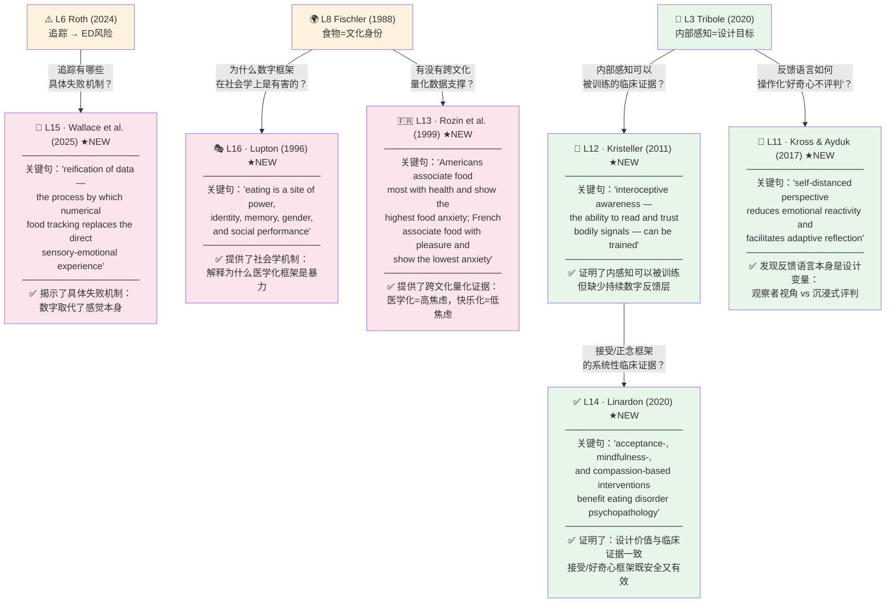
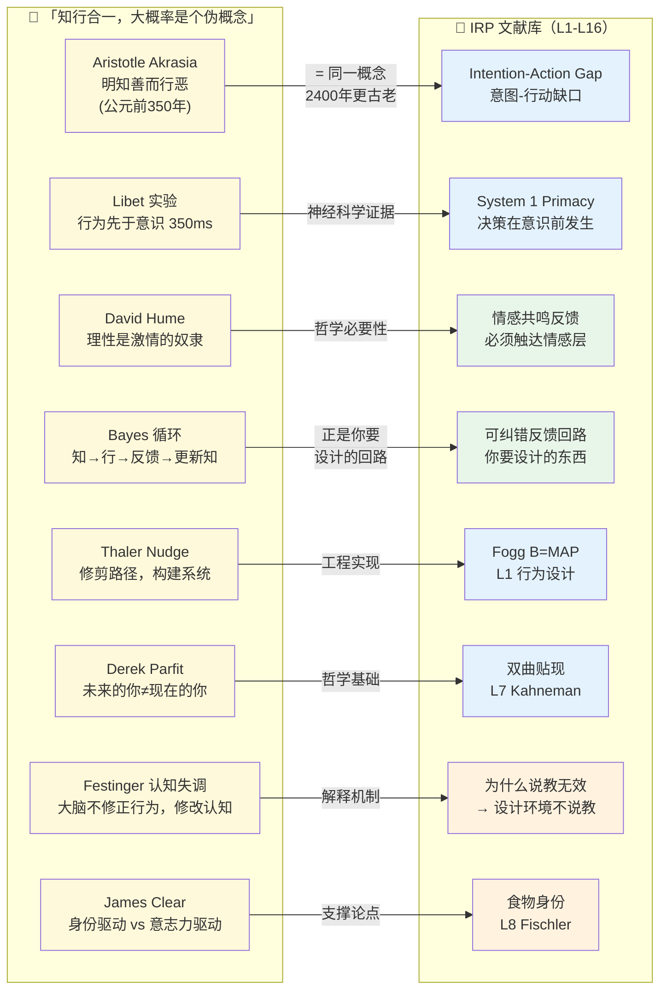

====
# IRP 文献推演链 — 知识溯源图

> **这张图回答的问题：** 不是"这些文献是什么"，而是"**是哪句话让你从这篇文献走到了那篇文献**"。这是你研究思维的一步步推演，是最难被别人抄走的东西，也是 Shannon 最想看到的智识诚实。

---

## 一、文献推演链：主干（从问题到方法论）

```mermaid
flowchart TD

    START(["🔍 起点问题<br>'为什么好好吃饭感觉毫无反馈？'<br>而运动、睡眠已经被设计解决了"])
    
    SCH["📊 L4 · Schembre et al. (2018)<br>──────────────────<br>关键句：'most users abandon<br>food tracking within weeks'<br>──────────────────<br>✅ 证实了现象：不是个例，是系统性失效"]
    
    FOGG["⚙️ L1 · Fogg (2009)<br>──────────────────<br>关键句：'behaviour = M × A × P,<br>all three must converge'<br>──────────────────<br>✅ 解释了机制：三要素同时失效<br>→ 行为不可能发生"]
    
    KAH["🧠 L7 · Kahneman (2011)<br>──────────────────<br>关键句：'dietary decisions are made<br>hundreds of times daily in System 1'<br>──────────────────<br>✅ 深化了问题：工具在 System 2 操作<br>但决策在 System 1 发生 → 根本错位"]
    
    NORM["🔍 L5 · Norman (2013)<br>──────────────────<br>关键句：'gulf of evaluation — the user<br>cannot determine whether their<br>actions are having any effect'<br>──────────────────<br>✅ 命名了设计失败：不是动力问题<br>是信息回路的断裂"]
    
    ROTH["⚠️ L6 · Roth et al. (2024)<br>──────────────────<br>关键句：'significant associations between<br>intensive dietary tracking and<br>elevated ED risk in adults'<br>──────────────────<br>✅ 发现伦理炸弹：解法不能是<br>更多/更密集的追踪"]
    
    TRIB["🌿 L3 · Tribole & Resch (2020)<br>──────────────────<br>关键句：'cultivating internal attunement<br>to hunger, fullness, and satisfaction<br>rather than imposing external rules'<br>──────────────────<br>✅ 提供了设计哲学：<br>放大内部感知，而非替代"]
    
    FISC["🌍 L8 · Fischler (1988)<br>──────────────────<br>关键句：'eating is never merely<br>nutritional: it is social, emotional,<br>cultural, and existential'<br>──────────────────<br>✅ 扩展了问题维度：<br>数字框架化约了整个饮食体验"]
    
    DR["🔭 L2 · Dunne & Raby (2013)<br>──────────────────<br>关键句：'objects not to solve problems<br>but to make problems visible,<br>to provoke debate'<br>──────────────────<br>✅ 找到了方法论：<br>投机设计作为批判性工具"]

    START -->|"Schembre 引用了 Fogg<br>行为设计文献作为解释框架"| SCH
    SCH -->|"为什么 App 失败？<br>需要行为学机制解释"| FOGG
    FOGG -->|"为什么能力/提示都低？<br>认知层级哪里出了问题？"| KAH
    KAH -->|"S1/S2 错位有设计词汇吗？<br>哪个框架命名了这个缺口？"| NORM
    NORM -->|"知道了设计失败的机制<br>但有没有更危险的副作用？"| ROTH
    ROTH -->|"如果不能追踪，那应该<br>是什么样的反馈哲学？"| TRIB
    TRIB -->|"食物不只是营养，<br>那它究竟是什么？"| FISC
    FISC -->|"既然范式本身有问题<br>用什么方法论来质疑范式？"| DR

    style START fill:#f3e5f5,stroke:#9c27b0,stroke-width:2px
    style SCH fill:#ffebee
    style FOGG fill:#e3f2fd
    style KAH fill:#e3f2fd
    style NORM fill:#e3f2fd
    style ROTH fill:#fff3e0
    style TRIB fill:#e8f5e9
    style FISC fill:#fff3e0
    style DR fill:#fce4ec
```



---

## 二、文献推演链：新文献分支（今日新增 L11-L16）



---

## 三、「知行合一是伪概念」× IRP 跨学科连接图

> 这篇文章提供了哲学/神经科学/行为经济学的底层武器，可以在会面中作为"广度"证明随时引用。



---

## 四、关键句索引表（16篇文献 × 一句定义）

> 每行包含：文献代码 · 作者年份 · **一句定位句**（你记住这一句就够） · 在提案中的角色

| 代码 | 文献 | 一句定位句（记住这一句） | 角色 |
|------|------|----------------------|------|
| **L1** | Fogg (2009) | *"B = M × A × P — all three must converge simultaneously."* | 诊断工具（为什么失败） |
| **L2** | Dunne & Raby (2013) | *"Design fiction: not to solve problems but to make problems visible."* | 方法论（怎么做） |
| **L3** | Tribole & Resch (2020) | *"Internal attunement, not external rules."* | 设计哲学（应该是什么） |
| **L4** | Schembre et al. (2018) | *"Most users abandon food tracking within weeks."* | 现象证据（问题存在） |
| **L5** | Norman (2013) | *"Gulf of evaluation: user cannot tell if actions have any effect."* | 命名设计失败 |
| **L6** | Roth et al. (2024) | *"Intensive tracking is associated with elevated disordered eating risk."* | 伦理炸弹 |
| **L7** | Kahneman (2011) | *"Dietary decisions happen in System 1; tools only reach System 2."* | 认知层级错位 |
| **L8** | Fischler (1988) | *"Eating is never merely nutritional — it is social, cultural, existential."* | 文化维度 |
| **L9** | Thaler & Sunstein (2008) | *"Choice architecture: make the healthy choice the easy choice."* | 助推工程 |
| **L10** | Attia (2023) | *"Nutrition is the primary lever for longevity — Medicine 3.0."* | 重要性框架 |
| **L11** ★ | Kross & Ayduk (2017) | *"Self-distanced framing reduces emotional reactivity."* | 反馈语言设计 |
| **L12** ★ | Kristeller (2011) | *"Interoceptive awareness can be trained through MB-EAT."* | 内感知可训练 |
| **L13** ★ | Rozin et al. (1999) | *"Americans: food=health, highest anxiety. French: food=pleasure, lowest anxiety."* | 医学化有害证据 |
| **L14** ★ | Linardon (2020) | *"Acceptance-based interventions benefit eating disorder psychopathology."* | 临床安全证据 |
| **L15** ★ | Wallace et al. (2025) | *"Reification of data: numbers replace sensory experience."* | 追踪失败机制 |
| **L16** ★ | Lupton (1996) | *"Eating is a site of power, identity, memory, and social performance."* | 社会学机制 |

> ★ = 2026-04-07 新增

---

## 五、研究逻辑的三段论（Shannon 视角）

> 如果你用三段论向 Shannon 总结，应该这样说：

```
大前提（文化哲学层）：
  饮食是文化、身份、情感的体验，不只是营养摄入。
  — Fischler (1988) + Lupton (1996) + Rozin (1999)

小前提（行为科学层）：
  当前工具用医学化数字框架处理这个多维体验，
  导致行为失效 + 认知错位 + 伦理风险。
  — Fogg (2009) + Kahneman (2011) + Roth (2024)

结论（设计层）：
  需要一种质上不同的反馈——
  不是更多数字，而是放大内部感知、
  使用观察者语言、脚手架走向自主。
  — Tribole (2020) + Kross (2017) + Kristeller (2011)
```

---

*生成：Claudian，2026-04-07*  
*关联：[[IRP Tutorial 架构图 2026-04-08]] · [[IRP 图表索引 - 15张必找视觉资料]]*  
*参考：[[知行合一，大概率是个伪概念]]*
