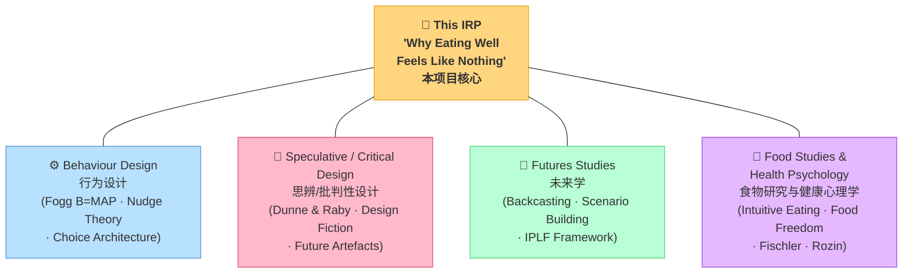
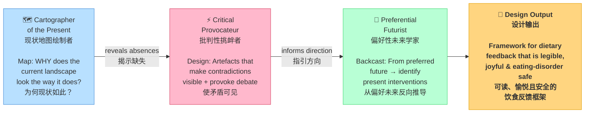
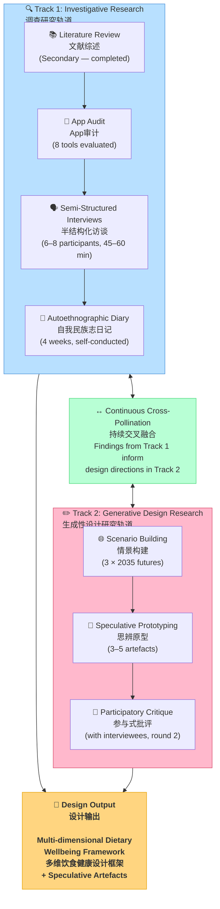
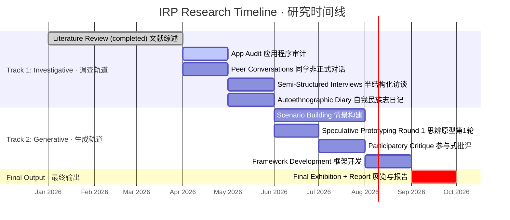

---
tags:
  - IRP
  - proposal
  - bilingual
  - behavioural-design
  - food-futures
date: 2026-04
version: v2-bilingual
updated: 2026-04-08
changes: Bilingual EN/CN · Tutor feedback April 8 integrated · Mermaid diagrams Sections 4 & 5
---

> [!tip] 版本说明 Version Notes
> **v2 — April 8, 2026** | Bilingual edition (EN + CN) · Changes from tutor feedback ==highlighted in yellow== · Mermaid diagrams added to Sections 4 & 5
> **v2 — 2026年4月8日** | 双语版（英文+中文）· 来自导师反馈的修改内容==以黄色高亮标注== · 第4、5节新增Mermaid图表
>
> 📎 Related: [[Feedback摘要-20260408]] · [[推荐Case Study摘要]]

> [!abstract] 📊 数据支撑文件夹 Data Evidence Hub
> 本文中所有需要数据支撑的论断均已核查并配备真实数据与动态图表，存放于 **[[00-INDEX-数据总览]]**。
>
> | 快速链接 | 内容 |
> |---------|------|
> | [[01-App留存率与放弃率\|📱 01 App留存率]] | App 30天留存3% · 70%用户2周内放弃 |
> | [[02-进食障碍流行率\|🧠 02 进食障碍流行率]] | 全球7000万 · 英国住院率+84% |
> | [[03-Krukow-COOP行为设计\|✅ 03 Krukow COOP验证]] | 14%CO₂ / 25%销售 / 60%食物浪费 · 全部核实 |
> | [[04-CGM市场增长\|📈 04 CGM市场]] | $3.707亿 · CAGR 16.9% · 非糖尿病占41% |
> | [[05-运动健康追踪平台用户\|🏃 05 Strava×Oura数据]] | Strava 1.8亿 · Oura $10亿营收 |
> | [[06-跨文化饮食态度Rozin\|🇫🇷 06 Rozin跨文化研究]] | 法国最享受·最少焦虑 · 美国相反 |
> | [[07-直觉饮食保护效应\|🌱 07 直觉饮食证据]] | 暴食风险降低74% (8年纵向研究) |
> | [[08-GID-DesignFutures工具全图谱\|🔭 08 GID工具全图谱]] | 所有Design Futures工具+工具包+案例样本 |

---

**Why Eating Well Feels Like Nothing:**

Redesigning the Feedback Loop for Dietary Behaviour

**为何健康饮食毫无反馈感：**

重新设计饮食行为的反馈回路

---

**Weijie Li**

Student Number: 20417836

Global Innovation Design | Royal College of Art

_IRP Proposal  |  April 2026  |  Working Draft_

---

# Statement of Authorship and Acknowledgements
# 作者声明与致谢

This proposal was written independently as part of the IRP Proposal module, Global Innovation Design, Royal College of Art. The research direction emerged from my ongoing inquiry into preventive health, dietary behaviour, and the design of feedback systems, which began in my prior study at the University of Nottingham (IRP: The Small Revolution in Lifestyle Habits, 2024–2025).

*本提案作为皇家艺术学院全球创新设计专业IRP提案模块的一部分，由本人独立撰写。研究方向源于我对预防性健康、饮食行为及反馈系统设计的持续探索，这一探索始于我在诺丁汉大学的前期研究（IRP：生活方式习惯的微小革命，2024–2025年）。*

I am grateful to my tutors for their feedback during the April 2026 project discussion, which helped sharpen the focus of this proposal — particularly in identifying the ethical dimension of eating disorders and food freedom as essential constraints on any proposed feedback design.

*我对导师们在2026年4月项目讨论期间提供的反馈深表感谢，这些反馈帮助我进一步聚焦本提案——尤其是在识别进食障碍与食物自由的伦理维度方面，这是任何拟议反馈设计不可或缺的约束条件。*

All sources are cited using the Harvard Referencing System. Where I have drawn on AI assistance for literature search and document organisation, this is declared below.

*所有来源均采用哈佛引用格式标注。凡使用AI辅助进行文献检索和文档整理之处，均已在下文声明。*

---

# Use of AI Disclosure
# AI使用声明

This submission was produced by me in my own words and using my own imagery, except for quotations and images from published and unpublished sources which are clearly indicated and acknowledged as such.

*本提交内容均为本人原创文字和图像，已发表和未发表来源的引用及图片均已明确标注并致谢。*

For this submission, I used AI assistance in the following ways: (1) literature search and source identification to help locate real academic papers and practice projects; (2) document formatting and organisation. All content, arguments, and critical analysis are my own. The thinking, framing, and intellectual direction of this project are mine.

*在本次提交中，我以以下方式使用了AI辅助：（1）文献检索和来源识别，以协助定位真实学术论文和实践项目；（2）文档格式化和整理。所有内容、论点和批判性分析均为本人所有。本项目的思维方式、框架构建和智识方向均源于本人。*

I am satisfied that I have used AI in accordance with my programme's assessment requirements and that I have fully declared the extent to which I have used it.

*我确信已按照课程评估要求使用AI，并已全面声明其使用范围。*

Print name: Weijie Li          Signed: ___________________          Date: April 2026

---

**PART 1: IRP PROPOSAL**

---

# 1. Introduction and Justification of the Topic
# 1. 研究课题简介与论证

I am interested in the future of preventive health behaviour and in particular the future of dietary feedback design in the context of people who want to eat better but cannot feel whether they are doing so. This is an important challenge because, unlike exercise or sleep, the benefits of good nutrition are almost entirely invisible on a human timescale: a week of eating well generates no signal, no score, no sense of progress. This is not a motivation problem — it is a feedback problem.

*我对预防性健康行为的未来深感兴趣，尤其是在"想要吃得更好却无法感知是否做到"这一情境下，饮食反馈设计的未来走向。这是一个重要挑战，因为与运动或睡眠不同，良好营养的益处在人类可感知的时间尺度上几乎完全不可见：一周的健康饮食不会产生任何信号、评分或进步感。这不是动机问题——而是反馈问题。*

_Exercise has been transformed by design._ Strava turns a morning run into a social performance: segments, kudos, leaderboards, personal records. Oura Ring makes sleep legible: a nightly score distils hours of invisible biology into a single recoverable number. Whoop quantifies recovery, telling users not just how they slept, but how ready their body is to perform. These tools work because they close the feedback loop — they translate invisible physiological processes into immediate, emotionally resonant signals ([[L5 - Norman (2013)|Norman, 2013]]).

*_运动已被设计所彻底改变。_ Strava将清晨跑步变为一种社交表演：路段计时、点赞、排行榜、个人记录。Oura Ring使睡眠变得可读：一个夜间评分将数小时不可见的生理活动提炼成一个可查阅的单一数字。Whoop将恢复状态量化，不仅告诉用户睡眠质量，更告诉他们身体准备好表现了吗。这些工具之所以有效，是因为它们闭合了反馈回路——将不可见的生理过程转化为即时的、情感共鸣的信号（[[L5 - Norman (2013)|Norman, 2013]]）。*

_Dietary behaviour, by contrast, remains a design desert._ The dominant tool — MyFitnessPal, launched in 2005 — asks users to manually log every meal into a calorie database. The interface has barely evolved in two decades. There is no metabolic signal, no wellbeing score, no social ritual around eating well. The consequence is predictable: ==most users abandon food tracking within weeks== ([[L4 - Schembre et al (2018)|Schembre et al., 2018]]). The Fogg Behaviour Model clarifies why: motivation alone is insufficient without ability and prompt — and current dietary tools fail on both ([[L1 - Fogg (2009)|Fogg, 2009]]).

*_饮食行为，相比之下，仍是一片设计荒漠。_ 主流工具——2005年推出的MyFitnessPal——要求用户将每顿饭手动记录到卡路里数据库中。该界面二十年来几乎没有演进。没有代谢信号，没有健康评分，没有围绕健康饮食的社交仪式。后果可以预见：大多数用户在数周内便放弃了食物追踪（[[L4 - Schembre et al (2018)|Schembre et al., 2018]]）。Fogg行为模型阐明了原因：仅有动机而没有能力和提示是不够的——而当前饮食工具在两方面均告失败（[[L1 - Fogg (2009)|Fogg, 2009]]）。*

> [!example] 📊 数据支撑 — App留存率
> **健康/健身App 第30天留存率仅 3%**（Business of Apps, 2024）；**70%的用户在2周内放弃**，首要原因是"太耗时间"（IFIC, 2023）。MyFitnessPal注册用户2.2亿 vs 月活仅3000万 → **86.4%的注册用户已流失**。
> 
> The 30-day Retention Rate of Health/Fitness Apps is only 3% (Business of Apps, 2024); 70% of users abandon within 2 weeks, with the primary reason being "too time-consuming" (IFIC, 2023). MyFitnessPal has 220 million registered users vs. only 30 million monthly active users → 86.4% of registered users have churned.


> 📁 完整数据：[[01-App留存率与放弃率]]

```chartsview
#-section-
type: Line
data:
  - day: "Day 1"
    retention: 26
  - day: "Day 7"
    retention: 15
  - day: "Day 14"
    retention: 8
  - day: "Day 28"
    retention: 10
  - day: "Day 30"
    retention: 3
options:
  xField: 'day'
  yField: 'retention'
  point:
    size: 5
    shape: 'diamond'
  color: '#F4664A'
  meta:
    retention:
      alias: '健康/健身App留存率 (%)'
```


This project investigates the design gap between what we know about dietary behaviour change and what existing tools actually deliver. It asks: what would it take for eating well to feel as meaningful, legible, and rewarding as completing a run? And it adds a critical ethical constraint: any feedback system must not only improve health metrics but must also preserve food joy, prevent disordered eating, and support genuine food freedom — the right to make informed choices about eating without guilt or compulsion ([[L3 - Tribole and Resch (2020)|Tribole and Resch, 2020]]).

*本项目探究我们对饮食行为改变的认知与现有工具实际提供之间的设计差距。它追问：要使健康饮食感觉像完成一次跑步一样有意义、可读且令人满足，需要什么？并增加了一个关键伦理约束：任何反馈系统不仅必须改善健康指标，还必须保护食物的愉悦感、预防饮食失调，并支持真正的食物自由——在没有罪恶感或强迫感的情况下做出知情饮食选择的权利（[[L3 - Tribole and Resch (2020)|Tribole and Resch, 2020]]）。*

A design futures approach is appropriate here because this is not simply a product design problem: it is a question about the kind of relationship we want technology to have with the most intimate act of daily life. Using speculative and critical design tools ([[L2 - Dunne and Raby (2013)|Dunne and Raby, 2013]]), this project can interrogate the assumptions embedded in current health technology and prototype radically different futures for dietary feedback.

*设计未来学方法在此处是适切的，因为这不仅仅是产品设计问题：这是一个关于我们希望技术与日常生活中最亲密行为之间建立何种关系的问题。借助思辨与批判性设计工具（[[L2 - Dunne and Raby (2013)|Dunne and Raby, 2013]]），本项目可以审视当前健康技术中隐含的假设，并为饮食反馈设计截然不同的未来原型。*

---

# 2. Background: Literature, Practice, Signals and Trends
# 2. 背景：文献综述、实践、信号与趋势

## 2a. Research Questions
## 2a. 研究问题

The following research questions guided the secondary research phase of this project:
*以下研究问题指导了本项目的二级研究阶段：*

1. Why does dietary behaviour produce so little immediate, legible feedback compared to exercise and sleep, and what are the design, behavioural, and physiological reasons for this gap?
   *与运动和睡眠相比，饮食行为为何产生如此少的即时、可读的反馈？这一差距背后的设计、行为和生理原因是什么？*

2. What existing tools and approaches have attempted to address dietary feedback, and why do they fail to achieve sustained engagement?
   *哪些现有工具和方法尝试解决饮食反馈问题？为何它们未能实现持续参与？*

3. What is the relationship between dietary feedback design and the risk of disordered eating, and how can feedback systems be designed to support food freedom?
   *饮食反馈设计与进食障碍风险之间的关系是什么？如何设计反馈系统以支持食物自由？*

4. What signals and speculative possibilities exist for alternative dietary feedback paradigms that are immediate, holistic, and emotionally resonant without being punitive?
   *有哪些信号和思辨可能性，可以支持即时、全面、具有情感共鸣且不具惩罚性的替代饮食反馈范式？*

## 2b. Research Process
## 2b. 研究过程

Research was conducted across three phases. The first phase involved a systematic literature review drawing on Google Scholar, PubMed, and design databases, using search terms including 'dietary feedback design', 'nutrition behaviour change technology', 'eating disorders and health tracking', 'intuitive eating', 'speculative design health', and 'future self continuity'. The second phase was a practice review covering existing apps, wearables, critical design projects, and public health programmes. The third phase involved mapping signals and trends using the four-lens framework (Human / Society / Technology / Nature) introduced in the RCA Project Design Approach workshop (March 2026).

*研究分三个阶段进行。第一阶段进行了系统性文献综述，检索Google Scholar、PubMed及设计数据库，使用的检索词包括"饮食反馈设计""营养行为改变技术""进食障碍与健康追踪""直觉饮食""思辨设计健康"和"未来自我连续性"等。第二阶段为实践综述，涵盖现有应用程序、可穿戴设备、批判性设计项目及公共卫生计划。第三阶段运用RCA项目设计方法工作坊（2026年3月）引入的四维框架（人类/社会/技术/自然）绘制信号与趋势图谱。*

The research board is documented in Appendix A. One discovery consistently led to another: the literature on food tracking apps led directly to the literature on self-monitoring and eating disorder risk, which led to the discourse of intuitive eating and food freedom, which in turn raised the central design challenge of this project: how to build feedback that improves health without worsening the relationship with food.

*研究板记录于附录A。一个发现不断引向下一个：食物追踪应用程序的文献直接引向自我监控与进食障碍风险的文献，进而引向直觉饮食与食物自由的话语，这反过来提出了本项目的核心设计挑战：如何构建改善健康同时不恶化与食物关系的反馈系统。*
![[01 — Futures Triangle.png]]
![[02 — Futures Wheel.png]]
![[03 — 2035 Scenario Matrix.png]]
![[04 — Tutor's 3 Frameworks (April 8).png]]


## 2c. Research Summary
## 2c. 研究摘要

### The Feedback Gap: Why Eating Well Feels Like Nothing
### 反馈缺口：为何健康饮食毫无感知

The core problem this project addresses can be stated precisely: nutritional behaviour produces almost no immediate, perceivable feedback. When you complete a run, you feel it: the endorphins, the sweat, the distance on your app. When you sleep well, you feel the difference the next morning, and your Oura Ring confirms it with a score. But when you eat a nutritious meal, you feel … full. That is all. The metabolic benefits — reduced inflammation, improved insulin sensitivity, better gut microbiome composition — play out over weeks and months at a cellular level that is entirely imperceptible to conscious experience. This is what one student in the RCA Project Design Approach workshop described: _'就像健身，你是能看到你的健身数据…像饮食的话就缺'_ [just like with exercise you can see your fitness data … with eating it's missing] (Anonymous, RCA Project Design Approach Discussion, March 2026).

*本项目所要解决的核心问题可以精确表述：营养行为几乎不会产生任何即时、可感知的反馈。当你完成一次跑步时，你能感受到它：内啡肽、汗水、应用程序上的距离。当你睡眠良好时，你第二天早上能感受到不同，而Oura Ring用评分加以确认。但当你吃了一顿营养丰富的餐食时，你感受到的是……饱足感。仅此而已。代谢益处——炎症减少、胰岛素敏感性改善、肠道微生物组成优化——在细胞层面历经数周乃至数月才得以体现，完全超出意识体验的感知范围。这正是RCA项目设计方法工作坊（2026年3月）中一名学生所描述的：_"就像健身，你是能看到你的健身数据……像饮食的话就缺"_（匿名，RCA项目设计方法讨论，2026年3月）。*

This feedback gap has profound behavioural consequences. [[L7 - Kahneman (2011)|Kahneman]]'s dual-process framework (2011) establishes that humans are governed by System 1 thinking — fast, automatic, present-biased. Dietary decisions are made hundreds of times daily in System 1, where long-term health benefits are systematically discounted in favour of immediate reward. [[L9 - Thaler and Sunstein (2008)|Thaler and Sunstein (2008)]] showed that this _hyperbolic discounting_ makes future health outcomes feel abstract and remote. Without immediate feedback, eating well cannot compete with the immediate pleasure of eating badly. Fogg's Behaviour Model (B=MAP: Behaviour = Motivation × Ability × Prompt) identifies the prompt as critical: behaviour change requires timely signals that make the right action feel easy and rewarding at the moment of decision ([[L1 - Fogg (2009)|Fogg, 2009]]). Current food tracking apps fail because they demand effortful manual logging (low ability) and produce only lagging numerical outputs (weak prompt) with no emotional resonance.

*这一反馈缺口具有深远的行为影响。[[L7 - Kahneman (2011)|卡尼曼]]的双过程框架（2011）确立了人类受系统1思维支配——快速、自动、偏向当下。饮食决策每天在系统1中做出数百次，长期健康益处被系统性地打折以换取即时奖励。[[L9 - Thaler and Sunstein (2008)|Thaler和Sunstein（2008）]]表明，这种_双曲折现_使未来健康结果感觉抽象而遥远。没有即时反馈，健康饮食无法与不健康饮食的即时愉悦相竞争。Fogg行为模型（B=MAP：行为=动机×能力×提示）将提示识别为关键因素：行为改变需要及时的信号，使正确行动在决策时刻感觉容易且值得（[[L1 - Fogg (2009)|Fogg, 2009]]）。当前食物追踪应用程序失败，是因为它们要求费力的手动记录（低能力），且只产生滞后的数字输出（弱提示），没有情感共鸣。*

The most promising technical development in this space is continuous glucose monitoring (CGM), which provides real-time feedback on how specific foods affect blood glucose levels. ==Tools like Levels Health and Signos now offer CGM to non-diabetic consumers as a metabolic feedback tool.== Arakawa et al. (2026) found that CGM use was associated with significant changes in dietary behaviour among insulin-treated patients. However, CGM has critical limitations: it measures only one metabolic signal, it requires a sensor inserted under the skin, and there is an acute risk of producing anxiety-inducing data that reinforces disordered eating patterns.

> [!example] 📊 数据支撑 — CGM市场规模
> **全球OTC CGM市场（2024）：$3.707亿，CAGR 16.9%（2025–2034）**。非糖尿病用户已占最大市场份额（**41.46%**）。Dexcom Stelo（2024年3月）& Abbott Lingo（2024年6月）已获FDA批准为首批OTC CGM产品，标志着"代谢追踪消费品"时代正式开启。
> 📁 完整数据与增长曲线图表：[[04-CGM市场增长]]

*这一领域最具前景的技术发展是连续血糖监测（CGM），它提供特定食物如何影响血糖水平的实时反馈。Levels Health和Signos等工具现在向非糖尿病消费者提供CGM作为代谢反馈工具。Arakawa等人（2026）发现，CGM使用与胰岛素治疗患者的显著饮食行为变化相关。然而，CGM存在关键局限：它只测量一种代谢信号，需要在皮肤下插入传感器，且存在产生诱发焦虑数据的急性风险，可能强化紊乱的饮食模式。*

### The Eating Disorder Constraint
### 进食障碍约束条件

The critical ethical dimension of this project, sharpened by tutor feedback in April 2026, is the risk that dietary feedback systems could worsen disordered eating. [[L6 - Roth et al (2024)|Roth et al. (2024)]] conducted a systematic review and meta-analysis on weight-related self-monitoring and eating disorder symptoms, ==finding significant associations between intensive dietary tracking and elevated disordered eating risk in adults.== Wallace et al. (2025) similarly reviewed the literature on health-tracking technologies and eating attitudes, identifying a sub-group for whom tracking becomes compulsive and harmful.


*本项目的关键伦理维度——经2026年4月导师反馈进一步明确——是饮食反馈系统可能加剧饮食失调的风险。[[L6 - Roth et al (2024)|Roth等人（2024）]]对体重相关自我监控与饮食失调症状进行了系统综述和荟萃分析，发现强化饮食追踪与成人饮食失调风险升高之间存在显著关联。Wallace等人（2025）同样综述了健康追踪技术与饮食态度的文献，识别出一个追踪行为变得强迫且有害的亚群体。*

> [!example] 📊 Data Support - Prevalence of Eating Disorders
> 数据支撑 — 进食障碍流行率
> 
📊 Data Support — Prevalence of Eating Disorders
> 
> **全球约7000万人**受进食障碍困扰（NEDA）；英国**6.4%成人**显示进食障碍迹象；英国进食障碍住院率2015–2021年间增长**84%**（NHS England）。英国儿童/青少年饮食失调比例达**22.4%**，成人达**31%**。
> 
> Approximately 70 million people worldwide are affected by eating disorders (NEDA); 6.4% of adults in the United Kingdom show signs of eating disorders; the hospitalization rate for eating disorders in the United Kingdom increased by 84% between 2015 and 2021 (NHS England). The proportion of eating disorders among children/adolescents in the United Kingdom reaches 22.4%, and that among adults reaches 31%.
> 
> 📁 完整数据：[[02-进食障碍流行率]]

```chartsview
#-section-
type: Column
data:
  - group: '英国成人显示ED迹象'
    percent: 6.4
  - group: '英国儿童/青少年饮食失调'
    percent: 22.4
  - group: '英国成人饮食失调行为'
    percent: 31
  - group: '住院率增长2015-2021'
    percent: 84
options:
  xField: 'group'
  yField: 'percent'
  color: '#F4664A'
  label:
    position: 'top'
  meta:
    percent:
      alias: '百分比 / 增长率 (%)'
```


The dominant food tracking paradigm — calorie counting, macronutrient targets, food scoring — is grounded in a reductive, medicalised view of food as fuel. [[L8 - Fischler (1988)|Fischler's (1988)]] foundational work on food, self, and identity established that eating is never merely nutritional: it is social, emotional, cultural, and existential. Food is how humans mark celebration, express care, construct identity, and connect with heritage. ==Rozin et al.'s (1999) cross-cultural study found striking differences in the emotional relationship with food across nationalities, with French participants showing the strongest association between food and pleasure and the lowest rates of food-related anxiety.== Lupton (1996) further demonstrated that the body's relationship with food is deeply intertwined with power, control, and societal norms.


*主流食物追踪范式——卡路里计算、宏量营养素目标、食物评分——建立在将食物视为燃料的简化主义、医学化观点之上。[[L8 - Fischler (1988)|Fischler（1988）]]关于食物、自我与身份认同的奠基性研究表明，饮食从来不仅仅是营养摄入：它是社交的、情感的、文化的和存在性的。食物是人类标记庆典、表达关怀、构建身份认同、连接遗产的方式。Rozin等人（1999）的跨文化研究发现，不同国籍人群在与食物的情感关系上存在显著差异，法国参与者表现出最强的食物与快乐关联，以及最低的食物相关焦虑率。Lupton（1996）进一步证明，身体与食物的关系与权力、控制和社会规范深度交织。*

> [!example] 📊 Data Support - Cross-Cultural Food Attitudes (Rozin, 1999)
> 数据支撑 — 跨文化饮食态度（Rozin, 1999）
> 
> 四国研究（美国、法国、日本、比利时）核心结论：**法国人=最高食物愉悦导向+最低健康焦虑；美国人=最高健康焦虑+最低食物愉悦**；且"美国人改变饮食最多，却最少认为自己是健康饮食者"。所有国家中，**女性的食物焦虑程度普遍高于男性**。 Core findings from the four-country study (US, France, Japan, Belgium): French people = highest food pleasure orientation + lowest health anxiety; Americans = highest health anxiety + lowest food pleasure; and "Americans change their diets the most but least often consider themselves healthy eaters". Among all countries, women generally have a higher level of food anxiety than men.

> 
> 📁 完整数据、雷达图与跨国对比图表：[[06-跨文化饮食态度Rozin]]


==**Cultural Case Study: French Food Culture.** The French paradox — lower food anxiety alongside a rich, structured, pleasure-oriented food culture — offers a productive counter-model. Where American food culture tends to associate eating with health anxiety and moral judgement, French food culture structures eating as a social ritual, an aesthetic pleasure, and a form of cultural identity. The _déjeuner_ (lunch) is protected as a two-hour social event; meals are multi-course experiences shared in company; snacking outside meals is culturally discouraged. The implication for feedback design is significant: the 'feedback' in French food culture is not numerical or technological — it is social, sensory, and ritualistic. This suggests that effective dietary feedback may operate through social and cultural channels as much as through technological ones (Rozin et al., 1999).==

*==**文化案例研究：法国饮食文化。** 法国悖论——更低的饮食焦虑伴随着丰富、结构化、以愉悦为导向的饮食文化——提供了一个富有价值的反向模型。美国饮食文化倾向于将饮食与健康焦虑和道德判断相关联，而法国饮食文化则将饮食构建为社交仪式、审美愉悦和文化身份认同的形式。_午餐（déjeuner）_被保护为两小时的社交活动；餐食是与他人共享的多道菜体验；餐间零食在文化上不被鼓励。这对反馈设计的启示意义重大：法国饮食文化中的"反馈"不是数字化或技术性的——而是社交的、感官的和仪式化的。这表明，有效的饮食反馈可能通过社交和文化渠道运作，与技术渠道同等重要（Rozin等人，1999）。==*

==**Cultural Case Study: Japanese Pre-Meal Ritual (いただきます / Itadakimasu).** Before eating, Japanese tradition involves saying _itadakimasu_ — a word that simultaneously means "I humbly receive" and expresses gratitude to every element that contributed to the meal (the farmers, the animals, the cooks, the ecosystem). This ritual functions as a designed transition: a moment of intentional pause between the activity of daily life and the act of eating. It creates a micro-feedback loop at the entry point of each meal — not a numerical signal, but an embodied act of acknowledgement that frames eating as significant. As a design inspiration, the _itadakimasu_ ritual suggests that feedback systems need not be technological: they can be cultural, relational, and embodied — closer to mindfulness practice than data dashboard.==

*==**文化案例研究：日本餐前仪式（いただきます / Itadakimasu）。** 进食前，日本传统要说_いただきます_——这个词同时意味着"我恭敬地接受"，并表达对促成这顿饭的每个元素（农民、动物、厨师、生态系统）的感谢。这一仪式作为一种设计性过渡发挥功能：在日常生活的活动与进食行为之间，一个刻意停顿的时刻。它在每顿饭的入口处创造了一个微型反馈回路——不是数字信号，而是一种承认进食重要性的具身行为。作为设计灵感，_いただきます_仪式表明反馈系统不必是技术性的：它们可以是文化的、关系性的和具身的——更接近正念实践而非数据仪表板。==*

The intuitive eating movement, articulated by Tribole and Resch (2020) over four editions, offers an important counter-framework: rather than imposing external nutritional rules, intuitive eating cultivates internal attunement to hunger, fullness, and satisfaction signals. ==This approach has empirical support as protective against disordered eating (Linardon, 2020).== The design implication is significant: any dietary feedback system must work _with_ internal attunement, not against it. It must expand food freedom, not restrict it. (See: [[L3 - Tribole and Resch (2020)]])

*直觉饮食运动由Tribole和Resch（2020）在四个版本中阐述，提供了一个重要的反向框架：直觉饮食不是强加外部营养规则，而是培养对饥饿、饱腹和满足感信号的内在感知。这种方法作为预防饮食失调的保护因素具有实证支持（Linardon, 2020）。设计启示意义重大：任何饮食反馈系统必须_顺应_内在感知，而非与之对抗。它必须扩展食物自由，而非限制它。（参见：[[L3 - Tribole and Resch (2020)]]）*

> [!example] 📊Data Support - Protective Effect of Intuitive Eating
>  数据支撑 — 直觉饮食保护效应
> 
> 8年纵向研究（EAT 2010–2018，PMC）：**直觉饮食基线高1分 → 暴食风险降低74%**；8年内直觉饮食增长1分 → 暴食风险降低**71%**。保护效应覆盖5个维度：暴食、极端减重行为、身体不满意、低自尊、高抑郁症状。
> 8-year longitudinal study (EAT 2010–2018, PMC): A 1-point increase in intuitive eating at baseline → a 74% reduction in binge eating risk; a 1-point increase in intuitive eating over 8 years → a 71% reduction in binge eating risk. The protective effect covers 5 dimensions: binge eating, extreme weight loss behavior, body dissatisfaction, low self-esteem, and high depressive symptoms.
> 
> 📁 完整证据与保护效应图表：[[07-直觉饮食保护效应]]


![[Pasted image 20260409123421.png]]

### The Promise and Limits of Existing Practice
### 现有实践的潜力与局限

The practice review reveals a bifurcation in the existing landscape. On one side, apps like MyFitnessPal (2005) and Noom (2008) attempt to build habits through tracking and behavioural psychology respectively. Noom's use of cognitive behavioural therapy principles represents an advance over pure calorie counting, and its colour-coded food system attempts to shift users away from numerical obsession. But Noom still operates within a weight-loss framework that is fundamentally at odds with food freedom principles. On the other side, apps like Levels Health and Signos provide real-time metabolic feedback through CGM, demonstrating genuine behaviour change among users — but at high cost, with invasive sensors, and with no safeguards against the anxious over-monitoring that can tip into disordered eating.

*实践综述揭示了现有格局的两极分化。一方面，MyFitnessPal（2005）和Noom（2008）等应用程序分别尝试通过追踪和行为心理学建立习惯。Noom使用认知行为疗法原则代表了对纯卡路里计算的进步，其颜色编码食物系统尝试将用户从数字强迫中转移。但Noom仍在减重框架内运作，这与食物自由原则从根本上相悖。另一方面，Levels Health和Signos等应用程序通过CGM提供实时代谢反馈，在用户中展示出真实的行为改变——但成本高昂，传感器具有侵入性，且没有防止焦虑性过度监控滑入饮食失调的保护措施。*

The design practice review reveals that the most interesting work on feedback and the body does not come from health technology at all. [[P4 - Dunne and Raby Placebo Project (2001)|Dunne and Raby's _Placebo Project_ (2001)]] created a series of speculative electronic objects that used the body's own signals — electromagnetic fields, mobile radiation, bodily fluids — as data for ambient feedback. Their methodology, formalised in _Speculative Everything_ (2013), provides the critical design lens for this project: using objects not to solve problems but to make problems visible, to provoke debate about what kind of futures we actually want. [[P5 - Superflux Mitigation of Shock (2017)|Superflux's _Mitigation of Shock_ (2017)]] used a fully realised 2050 apartment — including a functioning edible garden, fermentation jars, and insect-protein meals — to make the future of food systems visceral and immediate.

*实践综述揭示，关于反馈与身体最有趣的工作根本不来自健康技术领域。[[P4 - Dunne and Raby Placebo Project (2001)|Dunne和Raby的_安慰剂项目_（2001）]]创造了一系列思辨性电子对象，使用身体自身的信号——电磁场、手机辐射、体液——作为环境反馈的数据。他们的方法论，在_思辨一切_（2013）中正式化，为本项目提供了批判性设计视角：使用对象不是为了解决问题，而是使问题可见，激发关于我们实际想要何种未来的辩论。[[P5 - Superflux Mitigation of Shock (2017)|Superflux的_冲击缓解_（2017）]]使用一个完全实现的2050年公寓——包括一个可运作的可食用花园、发酵罐和昆虫蛋白餐食——使食物系统的未来变得直观和即时。*

==**Behavioural Design Practice: Karl Krukow (krukow.net).** A particularly relevant precedent is the work of behavioural designer Karl Krukow, whose collaboration with COOP (European grocery retail) demonstrates how environmental design at decision points can achieve measurable behaviour change at scale. By redesigning point-of-sale environments, product placement, and in-store nudges to make climate-friendly food choices the intuitive default, the project achieved a **14% CO₂ reduction in six months** (exceeding planned 2030 targets), a **25% sales increase** for climate-friendly products, and a **60% reduction in food waste** — without requiring any change in consumer motivation or explicit decision-making. This case study demonstrates a key principle directly applicable to dietary feedback design: the most powerful behaviour change happens not when you inform people or motivate them, but when you redesign the architecture of choice at the moment of decision. The feedback system does not need to be on a screen; it can be embedded in the environment itself (Krukow, krukow.net).==

*==**行为设计实践：Karl Krukow（krukow.net）。** 一个特别相关的先例是行为设计师Karl Krukow的工作，他与COOP（欧洲杂货零售商）的合作展示了决策点的环境设计如何在规模上实现可量化的行为改变。通过重新设计销售点环境、产品摆放和店内助推，使气候友好型食物选择成为直觉性默认，该项目在六个月内实现了14%的CO₂减少（超过2030年计划目标）、气候友好产品销售额增长25%，以及食物浪费减少60%——无需改变消费者动机或明确决策过程。这一案例研究展示了一个直接适用于饮食反馈设计的关键原则：最有力的行为改变不是在你告知或激励人们时发生，而是当你重新设计决策时刻的选择架构时发生。反馈系统不必在屏幕上；它可以嵌入环境本身（Krukow, krukow.net）。==*

> [!success] ✅ 数据验证完毕 — Krukow × COOP 案例
> **三项核心数字均已通过官方来源核实**（krukow.net 原始案例页）：14% CO₂减少 ✅ / 25%销售增长 ✅ / 60%食物浪费减少 ✅。
> 额外：净营业额+123.2%、顾客气候友好认知从7%升至65%、共94项行为干预措施。
> 📁 完整验证数据：[[03-Krukow-COOP行为设计]]

```chartsview
#-section-
type: Column
data:
  - metric: 'CO₂减少 (%)'
    value: 14
  - metric: '气候友好产品销售增长 (%)'
    value: 25
  - metric: '食物浪费减少 (%)'
    value: 60
options:
  xField: 'metric'
  yField: 'value'
  color: '#30BF78'
  label:
    position: 'top'
  meta:
    value:
      alias: '变化幅度 (%) — COOP × Krukow 6个月成果'
```


Meanwhile, ==Strava and Oura demonstrate the power of well-designed feedback to transform behaviour.== Strava's genius is not its GPS accuracy but its social layer: the segment leaderboard turns any stretch of road into a competition, creating immediate status and recognition for the act of exercise. Oura's Sleep Score does something equally powerful: it translates the invisible complexity of sleep stages, heart rate variability, and overnight temperature into a single number that users check first thing every morning. These design patterns — social proof, emotional resonance, immediate legibility, ambient integration — are precisely what dietary feedback currently lacks ([[L5 - Norman (2013)|Norman, 2013]]; [[L1 - Fogg (2009)|Fogg, 2020]]).

> [!example] 📊 数据支撑 — Strava & Oura 用户规模
> **Strava：1.8亿用户，覆盖185+国家**（2025年12月）。**Oura：累计售出550万+枚戒指，2024年营收$5亿+，2025年达$10亿，估值约$110亿**。2024年一年销量超过历史总量的50%。对比：MyFitnessPal月活3000万，30天留存率仅3%。
> 📁 完整数据：[[05-运动健康追踪平台用户]]

```chartsview
#-section-
type: Column
data:
  - platform: 'Strava 月活(估,百万)'
    users: 60
  - platform: 'Oura 付费订阅(百万)'
    users: 2
  - platform: 'MFP 月活(百万)'
    users: 30
  - platform: 'MFP 30天留存(%)'
    users: 3
options:
  xField: 'platform'
  yField: 'users'
  color: ['#30BF78', '#000000', '#5B8FF9', '#F4664A']
  label:
    position: 'top'
  meta:
    users:
      alias: '规模对比（百万 / %）'
```

*与此同时，Strava和Oura展示了精心设计的反馈改变行为的力量。Strava的天才之处不在于其GPS精度，而在于其社交层：路段排行榜将任何一段路转变为竞争，为运动行为创造即时的地位和认可。Oura的睡眠评分做了同样强大的事情：它将睡眠阶段、心率变异性和夜间温度的不可见复杂性转化为用户每天早上第一件事查看的单一数字。这些设计模式——社会证明、情感共鸣、即时可读性、环境整合——恰恰是饮食反馈目前所缺乏的（[[L5 - Norman (2013)|Norman, 2013]]；[[L1 - Fogg (2009)|Fogg, 2020]]）。*

> 💡 灵感笔记 Inspiration Note: 同体型蔬菜之王？谁蔬菜吃的最多？— 社交比较机制的饮食应用？
> 💡 Inspiration: Who among similar body types eats the most vegetables? — Application of social comparison mechanisms to dietary feedback?

## 2d. Conclusion
## 2d. 结论

The three most important insights from this research are:
*本研究最重要的三个洞见是：*

**1. The feedback gap is real, structural, and designable.** Dietary behaviour produces almost no immediate feedback because nutrition's benefits operate at subcellular timescales invisible to experience. This is not a motivational failure but a design failure — a failure to translate invisible biology into legible signal. The exercise and sleep tracking industries have solved analogous problems; the question is why nutrition has not.

***1. 反馈缺口是真实的、结构性的，且可被设计解决。** 饮食行为几乎不产生即时反馈，因为营养益处在超细胞时间尺度上运作，对体验而言是不可见的。这不是动机失败，而是设计失败——未能将不可见的生物学转化为可读信号。运动和睡眠追踪行业已解决了类似问题；问题是为何营养领域还没有。*

**2. Feedback design carries acute ethical risk.** The literature is unambiguous that intensive dietary self-monitoring is associated with disordered eating risk in a significant sub-population. Any design intervention in this space must therefore be designed not only to improve nutritional behaviour but to actively support food freedom, joy, and a healthy body-food relationship.

***2. 反馈设计承载着急迫的伦理风险。** 文献明确表明，强化饮食自我监控与显著亚群体中的饮食失调风险相关。因此，该领域的任何设计干预不仅必须改善营养行为，还必须积极支持食物自由、愉悦感和健康的身体-食物关系。*

**3. The most powerful feedback is emotional, not numerical.** The design patterns of Strava and Oura succeed because they produce emotional resonance — pride, relief, motivation — not because they display accurate data. A successful dietary feedback system must operate on this emotional register, making eating well feel meaningful in the moment, not just statistically beneficial in the long run.

***3. 最有力的反馈是情感性的，而非数字性的。** Strava和Oura的设计模式之所以成功，是因为它们产生情感共鸣——自豪、释然、动力——而非因为它们显示准确数据。成功的饮食反馈系统必须在这一情感维度上运作，使健康饮食在当下感觉有意义，而不仅仅是从长远来看统计上有益。*

The three most important trends relevant to this project are:
*与本项目相关的三大最重要趋势是：*

- **Quantified Self 2.0:** From fitness tracking to metabolic tracking. The emergence of CGM for non-diabetics (Levels, Signos, Nutrisense) signals a shift toward real-time biological feedback as a consumer product category. The technology exists — the design and ethical questions remain.
  ***量化自我2.0：** 从健身追踪到代谢追踪。非糖尿病人群CGM（Levels、Signos、Nutrisense）的出现标志着向实时生物反馈作为消费品类别的转变。技术已存在——设计和伦理问题仍待解决。*

- **Anti-Diet Cultural Shift:** Intuitive eating, food freedom, and the critique of diet culture have moved from fringe to mainstream. The design space is bifurcating: tools that optimise food vs. tools that cultivate a healthy relationship with food. This project sits at that bifurcation.
  ***反节食文化转变：** 直觉饮食、食物自由和对节食文化的批判已从边缘走向主流。设计空间正在分化：优化食物的工具vs.培养与食物健康关系的工具。本项目正处于这一分叉点。*

- **Medicine 3.0 and Preventive Health:** Attia's (2023) framework of Medicine 3.0 positions nutrition as a primary lever for longevity and healthspan, not a secondary concern. This reframes dietary behaviour from a lifestyle choice to a critical health infrastructure problem, justifying design investment.
  ***医学3.0与预防性健康：** Attia（2023）的医学3.0框架将营养定位为长寿和健康寿命的主要杠杆，而非次要关切。这将饮食行为从生活方式选择重新定位为关键健康基础设施问题，为设计投资提供了依据。*

Key gaps in current knowledge and practice:
*当前知识与实践的关键空白：*

- No existing dietary feedback tool successfully combines real-time metabolic signal, emotional resonance, and eating disorder safety in a single design.
  *现有饮食反馈工具均未能在单一设计中成功结合实时代谢信号、情感共鸣和进食障碍安全性。*
- The speculative design literature has not engaged substantively with dietary behaviour — food futures work tends to address supply chains and sustainability, not the phenomenology of eating.
  *思辨设计文献尚未实质性地涉及饮食行为——食物未来研究倾向于关注供应链和可持续性，而非饮食现象学。*
- There is no design framework for multi-dimensional dietary wellbeing that integrates health metrics, food joy, and social eating — a gap this project aims to address.
  *目前没有整合健康指标、食物愉悦感和社交饮食的多维饮食健康设计框架——这一空白是本项目旨在填补的。*

---

# 3. Problem Framing
# 3. 问题框架

## The Challenge
## 核心挑战

The central challenge this project engages is the _Intention-Action Gap in dietary behaviour_: the persistent, well-documented failure of people to translate genuine intentions to eat better into sustained dietary behaviour change. This gap exists not because people lack information or motivation, but because eating well produces no immediate, perceivable signal of success. Without feedback, behaviour cannot be reinforced, iterated, or emotionally validated. Design has not solved this problem: the dominant approach (calorie counting apps) has been in steady decline in user retention for over a decade. This project asks whether a fundamentally different feedback paradigm — one that makes nutrition as legible and emotionally resonant as exercise — could close this gap without harming the relationship with food.

*本项目所要解决的核心挑战是_饮食行为中的意图-行动鸿沟_：人们将真实的改善饮食意图转化为持续饮食行为改变的持续性、有充分记录的失败。这一鸿沟的存在，不是因为人们缺乏信息或动机，而是因为健康饮食不会产生任何即时、可感知的成功信号。没有反馈，行为就无法被强化、迭代或情感认可。设计尚未解决这个问题：主流方法（卡路里计算应用程序）的用户留存率已稳步下降超过十年。本项目追问：一种根本不同的反馈范式——使营养如运动一样可读且具有情感共鸣——是否能在不损害与食物关系的前提下弥合这一鸿沟。*

## System-Level Perspectives
## 系统层面视角

This project operates primarily at the intersection of two systemic lenses:
*本项目主要运作于两个系统视角的交汇处：*

- **Human:** Individual dietary behaviour, cognitive biases (hyperbolic discounting, present bias), emotional relationships with food, body image, and lived eating experience. This is the primary lens.
  ***人类：** 个体饮食行为、认知偏见（双曲折现、当下偏见）、与食物的情感关系、身体形象和实际进食体验。这是主要视角。*

- **Technology:** Existing feedback tools, sensor technology (CGM, wearables), data visualisation, AI food recognition, and the design infrastructure of behaviour change applications. This is the secondary lens.
  ***技术：** 现有反馈工具、传感器技术（CGM、可穿戴设备）、数据可视化、AI食物识别和行为改变应用程序的设计基础设施。这是次要视角。*

- **Society (contextual):** Diet culture, eating disorder prevalence, the anti-diet movement, food advertising, and public health frameworks. This provides critical context and ethical constraints.
  ***社会（情境性）：** 节食文化、进食障碍流行率、反节食运动、食物广告和公共卫生框架。这提供了关键情境和伦理约束。*

- **Nature (contextual):** Gut microbiome, metabolic biology, circadian eating patterns, and the physiological reality of nutrition. This grounds the project in biological reality.
  ***自然（情境性）：** 肠道微生物组、代谢生物学、昼夜节律饮食模式和营养的生理现实。这将项目根植于生物学现实。*

## Temporal Scale
## 时间尺度

The project operates at a medium-to-long term temporal scale: 5–20 years. This is appropriate because: (1) preventive health interventions require years to demonstrate measurable outcomes; (2) the sensor technology needed for non-invasive dietary feedback is 5–10 years from consumer readiness; and (3) the cultural shift from diet-culture to food freedom thinking is still unfolding. The speculative design work will project forward to 2035, using backcasting from a preferred future to identify present-day intervention points ([[P10 - Martell (2026)|Martell, 2026]]).

*本项目运作于中长期时间尺度：5-20年。这是适切的，因为：（1）预防性健康干预需要多年才能展示可量化的结果；（2）非侵入性饮食反馈所需的传感器技术距消费者就绪还有5-10年；（3）从节食文化到食物自由思维的文化转变仍在展开。思辨设计工作将向前预测至2035年，使用从偏好未来的反向预测来识别当前干预点（[[P10 - Martell (2026)|Martell, 2026]]）。*

## Contextual Scale
## 情境尺度

The primary scale is micro — the individual's daily experience of eating, at the level of a single meal, a kitchen, a phone screen. This is where the feedback gap is most acutely felt and where design can most directly intervene. The project will also engage meso scale considerations (how design products shape cultural norms around eating) and acknowledge macro drivers (public health systems, food industry incentives) as the systemic context within which any intervention must operate.

*主要尺度是微观层面——个体每日进食体验，在一顿饭、一个厨房、一个手机屏幕的层面。这是反馈缺口感受最为强烈之处，也是设计最能直接干预之处。本项目还将涉及中观尺度考量（设计产品如何塑造围绕饮食的文化规范），并将宏观驱动因素（公共卫生系统、食品行业激励）作为任何干预必须在其中运作的系统性情境加以承认。*

---

# 4. Design Futures Approach
# 4. 设计未来学方法

> [!note] 📐 Tutor Feedback Update — April 8, 2026
> The tutor confirmed the behavioural design approach as appropriate and introduced two key new frameworks: **Compassion-Based Design** and an **Embodiment/Empowerment framing**. These have been integrated into this section (highlighted). A visual diagram of the disciplinary positioning has been added below.
>
> 导师确认行为设计方法恰当，并引入两个关键新框架：**基于关怀的设计**和**具身/赋权框架**。这些内容已整合至本节（高亮标注）。下方新增了学科定位的可视化图表。

This project is situated at the intersection of two primary disciplinary fields: _Behaviour Design_ (the design of systems that support deliberate human behaviour change) and _Speculative / Critical Design_ (the use of design fiction and provocative artefacts to interrogate assumptions about technology and futures). It draws on Futures Studies for its temporal orientation, and on Food Studies and Health Psychology for its empirical grounding.

*本项目位于两个主要学科领域的交汇处：_行为设计_（支持刻意人类行为改变的系统设计）和_思辨/批判性设计_（使用设计虚构和挑衅性人工物审视关于技术和未来的假设）。它从未来学汲取时间导向，从食物研究和健康心理学汲取实证基础。*

---

### 🗺️ Disciplinary Map: Where This Project Sits
### 学科定位图：本项目的位置



---

As a design futurist on this project, my role is threefold. First, I act as a _cartographer of the present_: mapping why the current dietary feedback landscape looks the way it does — what assumptions it encodes, what it optimises for, and whose interests it serves. Second, I act as a _critical provocateur_: designing speculative artefacts that make visible the absences and contradictions in current food technology, and that open space for imagining radically different futures. Third, I act as a _preferential futurist_: using backcasting methodology (working backwards from a preferred future in which eating well is as legible and rewarding as sleep tracking) to identify near-term design opportunities and interventions ([[P10 - Martell (2026)|Martell, 2026]]).

*作为本项目的设计未来学家，我的角色是三重的。首先，我扮演_现状地图绘制者_：绘制当前饮食反馈格局如此面貌的原因——它编码了何种假设，为何优化，服务于谁的利益。其次，我扮演_批判性挑衅者_：设计思辨性人工物，使当前食物技术中的缺失和矛盾变得可见，并为想象根本不同的未来开辟空间。第三，我扮演_偏好性未来学家_：使用反向预测方法论（从健康饮食如睡眠追踪一样可读且有价值的偏好未来反向工作）识别近期设计机会和干预点（[[P10 - Martell (2026)|Martell, 2026]]）。*

---

### 🔄 The Three Roles of the Design Futurist
### 设计未来学家的三重角色



---

The design approaches informing this project are: _Human-Centred Design_ (centring the lived experience of eaters, not nutritional abstractions), _Behaviour Architecture_ (designing the environment and feedback system to make healthy choices easier and more rewarding, drawing on [[L1 - Fogg (2009)|Fogg's B=MAP model]] and [[L9 - Thaler and Sunstein (2008)|Thaler and Sunstein's (2008)]] nudge theory), and _Critical Design_ (using design to challenge the dominant assumption that food is primarily fuel to be optimised, rather than a relational, cultural, and pleasurable act). [[L5 - Norman (2013)|Norman's (2013)]] feedback principle — that good design makes the state of the system visible and interpretable — provides the functional design anchor for the project: the problem is not that people don't want to eat well, but that the system gives them nothing to see.

*为本项目提供信息的设计方法是：_以人为中心的设计_（以饮食者的实际体验为中心，而非营养抽象概念）、_行为架构_（设计环境和反馈系统以使健康选择更容易且更有价值，汲取[[L1 - Fogg (2009)|Fogg的B=MAP模型]]和[[L9 - Thaler and Sunstein (2008)|Thaler和Sunstein（2008年）]]助推理论）和_批判性设计_（使用设计挑战食物主要是待优化燃料而非关系性、文化性和愉悦性行为的主流假设）。[[L5 - Norman (2013)|Norman（2013年）]]的反馈原则——好的设计使系统状态可见且可解释——为项目提供了功能性设计锚点：问题不在于人们不想好好吃饭，而在于系统没有给他们任何可见的东西。*

==**Compassion-Based Design** is the fourth and most distinctive design approach informing this project. Drawing on tutor feedback (April 2026), compassion-based design reframes the designer's relationship to the user: it is not the user who must become more disciplined, more data-literate, or more motivated. Rather, it is the designer who must intervene with *genuine care* — designing systems that celebrate food, honour the body, and treat eating as a site of joy rather than surveillance. This approach counters the hegemonic trajectory of food tracking (more data, more optimisation, more anxiety) with a counter-proposition: technology in service of food freedom. Compassion-based design positions the designer as a steward, not an optimiser — asking not "how can we make people eat better?" but "how can we help people feel better about eating?" This framing produces a radically different set of design constraints and opportunities.==

*==**基于关怀的设计**是为本项目提供信息的第四个也是最具特色的设计方法。汲取导师反馈（2026年4月），基于关怀的设计重新框定了设计师与用户的关系：不是用户必须变得更自律、更懂数据或更有动力。而是设计师必须以*真正的关怀*介入——设计颂扬食物、尊重身体，并将饮食视为愉悦而非监控场所的系统。这一方法以一个反命题对抗食物追踪的霸权轨迹（更多数据、更多优化、更多焦虑）：服务于食物自由的技术。基于关怀的设计将设计师定位为守护者，而非优化者——不是问"我们如何让人们吃得更好？"而是问"我们如何帮助人们对饮食感觉更好？"这一框架产生了一套截然不同的设计约束和机会。==*

==**Embodiment and Empowerment Framing.** Grounded in tutor feedback (April 2026), this framing positions the project at the intersection of two complementary goals. *Embodiment* asks: how can a design intervention help people connect more deeply with their own bodies — not as objects to be optimised, but as subjects to be inhabited and understood? Drawing on the mindfulness tradition, this suggests a design stance closer to *observer consciousness*: noticing sensations without reactivity, developing curiosity about bodily states rather than anxiety about them. *Empowerment* asks: how can this intervention give people agency over information — making data available for those who choose to use it, without imposing data on those who do not? Together, these two framings suggest that the most valuable dietary feedback system is one that amplifies the body's own signals rather than replacing them with external metrics.==

*==**具身与赋权框架。** 基于导师反馈（2026年4月），这一框架将项目定位于两个互补目标的交汇处。*具身*追问：设计干预如何帮助人们与自身身体建立更深层次的连接——不是将其视为待优化的对象，而是视为待居住和理解的主体？汲取正念传统，这暗示了一种更接近*观察者意识*的设计立场：在没有反应性的情况下注意感觉，对身体状态发展出好奇而非焦虑。*赋权*追问：这一干预如何给予人们对信息的能动性——使选择使用数据的人可以获得数据，而不将数据强加于不选择使用的人？这两个框架共同表明，最有价值的饮食反馈系统是放大身体自身信号而非用外部指标替代它们的系统。==*

The futures approaches informing this project are: _Speculative Design and Critical Design_ ([[L2 - Dunne and Raby (2013)|Dunne and Raby, 2013]]) to construct provocative design propositions that defamiliarise the current landscape and imagine alternatives; _Scenario Building_ to develop three distinct futures for dietary feedback (high-tech biometric, ambient low-tech, and social-relational) that capture the range of possible trajectories; and _Backcasting_ to work from a preferred future — a world where eating well feels as meaningful and rewarding as completing a run, without producing anxiety or compulsion — back to the present, identifying what design decisions need to be made now. This approach directly addresses the Connected Places Catapult's Intelligence–Perspective–Logic–Foresight framework presented in the RCA Futures Strategy lecture ([[P10 - Martell (2026)|Martell, 2026]]): the 'foresight' dimension requires not just predicting futures but making them desirable and actionable.

*为本项目提供信息的未来学方法是：_思辨设计与批判性设计_（[[L2 - Dunne and Raby (2013)|Dunne和Raby, 2013]]）构建挑衅性设计主张，使当前格局陌生化并想象替代方案；_情景构建_开发三个不同的饮食反馈未来（高科技生物特征、环境低技术和社交关系）以捕捉可能轨迹的范围；以及_反向预测_从偏好未来——健康饮食感觉像完成一次跑步一样有意义且有价值、不产生焦虑或强迫的世界——反向推导到现在，识别现在需要做出哪些设计决策。这一方法直接回应了RCA未来学战略讲座中介绍的Connected Places Catapult的智识-视角-逻辑-前瞻框架（[[P10 - Martell (2026)|Martell, 2026]]）："前瞻"维度不仅需要预测未来，还要使未来可欲且可行。*

The benefits of a design futures approach are: it allows engagement with a problem whose solution does not yet technically exist; it integrates empirical research with speculative imagination; and it produces artefacts that can provoke genuine public and institutional debate about what we want from health technology. The key limitation is that speculative work can feel disconnected from the practical constraints of deployment — a tension this project will manage by grounding all speculation in real behavioural science and real user experience.

*设计未来学方法的优势在于：它允许参与一个技术解决方案尚不存在的问题；它将实证研究与思辨想象相整合；并且产生可以激发关于我们希望从健康技术中得到什么的真实公众和机构辩论的人工物。关键局限在于思辨工作可能感觉与部署的实际约束脱节——本项目将通过将所有思辨根植于真实行为科学和真实用户体验来管理这一张力。*

---

# 5. Methodology
# 5. 研究方法

> [!note] 📐 Tutor Feedback Update — April 8, 2026
> The tutor recommended adding diagrams for this section, emphasising the **emotional/phenomenological focus** of primary research, and adding **peer informal conversations** as an initial research step. The **observer/mindfulness perspective** has been integrated into the autoethnographic diary design. All additions are ==highlighted==.
>
> 导师建议为本节添加图表，强调初级研究的**情感/现象学焦点**，并将**与同学的非正式对话**作为初始研究步骤加入。**观察者/正念视角**已整合入自我民族志日记设计。所有新增内容均==高亮标注==。

The methodology operates on two parallel and mutually informing tracks: investigative research (understanding the current landscape and its failures) and generative design research (developing and testing alternative feedback paradigms). This dual-track structure reflects the nature of the problem: the failure of dietary feedback is simultaneously an empirical, behavioural, and design question, and no single disciplinary method is sufficient to address it.

*研究方法在两条平行且相互信息化的轨道上运作：调查研究（理解当前格局及其失败）和生成性设计研究（开发和测试替代反馈范式）。这种双轨结构反映了问题的本质：饮食反馈的失败同时是一个实证的、行为的和设计的问题，没有单一学科方法足以解决它。*

---

### 📊 Dual-Track Methodology Overview
### 双轨研究方法概览



---

## 5a. Data: Types, Sources and Participants
## 5a. 数据：类型、来源与参与者

**Data types:** The project will draw on three types of data. Primary qualitative data will be generated through semi-structured interviews and an autoethnographic diary study. Secondary qualitative data will be drawn from the literature review and app audit (documented in Sections 2 and Appendix A). Secondary quantitative data will be drawn from published studies on app adoption rates, disordered eating prevalence, and behaviour change outcomes (e.g., Roth et al., 2024; Schembre et al., 2018).

***数据类型：** 本项目将汲取三类数据。初级定性数据将通过半结构化访谈和自我民族志日记研究生成。次级定性数据将来自文献综述和应用程序审计（记录于第2节和附录A）。次级定量数据将来自关于应用程序采用率、饮食失调流行率和行为改变结果的已发表研究（例如，Roth等人，2024年；Schembre等人，2018年）。*

**Data sources:** Academic databases (Google Scholar, PubMed), design archives and app stores, peer-reviewed journals in behavioural science and health psychology, and primary research participants.

***数据来源：** 学术数据库（Google Scholar、PubMed）、设计档案和应用商店、行为科学和健康心理学同行评审期刊以及初级研究参与者。*

**Participants:** For the semi-structured interview phase, 6–8 participants will be recruited. Inclusion criteria: adults aged 22–45; current or prior use of at least one dietary tracking or food logging tool; willingness to discuss emotional relationship with food. Exclusion criteria: current diagnosis of an eating disorder (to protect participant wellbeing and avoid harm). Recruitment will be conducted through the RCA student community and personal networks. This sample size is appropriate for qualitative thematic analysis, following Braun and Clarke's (2006) guidance that 6–10 participants typically suffice to reach thematic saturation in homogeneous purposive samples.

***参与者：** 半结构化访谈阶段将招募6-8名参与者。纳入标准：22-45岁成人；目前或曾使用至少一种饮食追踪或食物记录工具；愿意讨论与食物的情感关系。排除标准：目前诊断有进食障碍（保护参与者健康并避免伤害）。将通过RCA学生社区和个人网络进行招募。遵循Braun和Clarke（2006）的指导，6-10名参与者通常足以在同质目的性样本中达到主题饱和，该样本量适合定性主题分析。*

## 5b. Data Collection Methods
## 5b. 数据收集方法

==**Phase 0 — Informal Peer Conversations (exploratory, pre-interview).** Before conducting formal interviews, an initial exploratory phase will involve informal conversations with peers in the RCA GID programme. These conversations will focus on a simple, open question: *what is your current relationship with health tracking and your body?* This phase is not formal data collection but serves to: (1) identify recurring themes and blind spots before designing the interview protocol; (2) begin the process of primary research in a low-stakes, naturalistic setting; and (3) practise the researcher's role as an engaged listener on this topic. As the tutor noted, *"people do have aura rings, you could have kind of informal conversations to start around what is their relationship with tracking technology when it comes to their food and their body — that could be a really gentle place to start."* This approach is particularly appropriate given that the emotional dimension of dietary tracking is difficult to access through secondary research alone.==

*==**第零阶段——与同学的非正式对话（探索性，访谈前）。** 在进行正式访谈之前，一个初始探索阶段将涉及与RCA GID项目同学的非正式对话。这些对话将聚焦于一个简单、开放的问题：*你目前与健康追踪和你的身体的关系是什么？* 这一阶段不是正式数据收集，但有助于：（1）在设计访谈方案之前识别反复出现的主题和盲点；（2）在低风险、自然主义环境中开始初级研究过程；（3）练习研究者在该主题上作为参与性倾听者的角色。正如导师所言，*"人们有Oura环，你可以进行非正式对话，围绕他们与食物和身体追踪技术的关系——这可能是一个非常温和的起点。"* 鉴于饮食追踪的情感维度仅通过二级研究难以获取，这一方法尤为适切。==*

**Semi-structured interviews** (6–8 participants, 45–60 minutes each). Interviews will explore participants' lived experience of dietary tracking: what prompted them to use it, how it made them feel, what worked and what failed, and how it affected their relationship with food. The semi-structured format allows flexibility while ensuring consistency across participants. Interviews will be conducted in-person or via video call, audio-recorded with informed consent, and transcribed using automated transcription verified against the recording. This method is appropriate because the research question — why does dietary feedback feel like nothing? — is phenomenological and cannot be answered by observation or quantitative measurement alone.

***半结构化访谈**（6-8名参与者，每次45-60分钟）。访谈将探索参与者的饮食追踪实际体验：是什么促使他们使用它，它使他们感觉如何，什么有效而什么失败了，以及它如何影响了他们与食物的关系。半结构化格式允许灵活性同时确保参与者之间的一致性。访谈将面对面或视频通话进行，在知情同意下录音，并使用对照录音核对的自动转录进行文字转录。该方法是适切的，因为研究问题——为何饮食反馈感觉什么都没有？——是现象学的，无法仅通过观察或定量测量来回答。*

**Autoethnographic diary study** (4 weeks, self-conducted). A structured self-observation practice logging eating events, emotional states, design observations (what feedback did I receive, or not receive, from this eating experience?), and sketches of design responses. ==The diary will incorporate a specific phenomenological practice drawn from mindfulness traditions: when eating, adopting an *observer perspective* — noticing and recording bodily sensations, emotional responses, and social contexts without reactive judgement. Rather than evaluating meals as "good" or "bad", the diary will ask: *what did I notice?* This observer stance — inspired by the tutor's prompt to "consider how choice plays a role in that, how empowerment around knowledge is right, and how this intervention connects us more with our body" — is itself a prototype of the kind of embodied, non-punitive feedback this project seeks to design.== This method is appropriate because the researcher is also a potential user of any designed system, and autoethnographic data provides rich primary material for speculative design iteration.

***自我民族志日记研究**（4周，自我进行）。一种结构化自我观察实践，记录进食事件、情绪状态、设计观察（我从这次进食体验中收到了什么反馈，或没有收到？）以及设计回应草图。==日记将融入源自正念传统的具体现象学实践：进食时，采用*观察者视角*——不带反应性判断地注意和记录身体感觉、情绪反应和社交背景。日记不是将餐食评价为"好"或"坏"，而是追问：*我注意到了什么？* 这种观察者立场——受到导师提示"考虑选择在其中扮演的角色、围绕知识的赋权如何发挥作用，以及这一干预如何将我们与身体更紧密地连接"的启发——本身就是本项目寻求设计的那种具身的、非惩罚性反馈的原型。== 该方法是适切的，因为研究者也是任何设计系统的潜在用户，且自我民族志数据为思辨设计迭代提供了丰富的初级材料。*

**App audit and comparative analysis**. A systematic evaluation of 8 dietary feedback tools (MyFitnessPal, Noom, Levels Health, Signos, Nutrisense, FoodVisor, NHS Weight Loss Plan, and one further tool identified during research) using a custom evaluation framework assessing: immediacy of feedback, emotional tenor, legibility for non-specialists, social dimension, and eating disorder risk indicators. This audit will generate a comparative map of the current design landscape and identify specific design gaps.

***应用程序审计与比较分析**。使用自定义评估框架对8个饮食反馈工具（MyFitnessPal、Noom、Levels Health、Signos、Nutrisense、FoodVisor、NHS减重计划，以及研究期间识别的另一个工具）进行系统评估，评估维度包括：反馈即时性、情感基调、对非专业人士的可读性、社交维度以及进食障碍风险指标。该审计将生成当前设计格局的比较图，并识别具体设计差距。*

## 5c. Data Analysis Methods
## 5c. 数据分析方法

Interview data will be analysed using _reflexive thematic analysis_ (Braun and Clarke, 2006), a method appropriate for identifying patterns of meaning across qualitative data without imposing predetermined categories. Themes will be developed inductively from the data, then reviewed against the theoretical framework (Fogg's B=MAP, intuitive eating principles) to develop design implications. Diary data will be analysed through _design-led synthesis_: converting observational notes and sketches directly into design provocations, using the 'what if' question as an analytical tool. The app audit will generate a comparative matrix, analysed thematically to identify patterns of success and failure.

*访谈数据将使用_反身性主题分析_（Braun和Clarke，2006年）分析，这是一种适合在不强加预设类别的情况下识别定性数据中意义模式的方法。主题将从数据中归纳发展，然后对照理论框架（Fogg的B=MAP、直觉饮食原则）进行审查以发展设计启示。日记数据将通过_设计驱动综合_分析：将观察笔记和草图直接转化为设计挑衅，使用"如果……会怎样"问题作为分析工具。应用程序审计将生成比较矩阵，通过主题分析识别成功与失败模式。*

## 5d. Design and Futures Methods
## 5d. 设计与未来学方法

**Speculative Prototyping** (Dunne and Raby, 2013). Drawing on critical design methodology, a series of three to five speculative artefacts will be developed that propose radically different dietary feedback mechanisms: for example, an ambient object that changes texture in response to nutritional balance; a social ritual tool that makes eating well a shared, celebratory experience; or a wearable that provides physiological biofeedback from the gut. These are not solutions but provocations — design fictions that defamiliarise current assumptions and make alternative futures imaginable.

***思辨原型**（Dunne和Raby，2013）。汲取批判性设计方法论，将开发一系列三至五个思辨性人工物，提出根本不同的饮食反馈机制：例如，一个根据营养均衡改变纹理的环境对象；一个使健康饮食成为共享庆典体验的社交仪式工具；或一个从肠道提供生理生物反馈的可穿戴设备。这些不是解决方案，而是挑衅——陌生化当前假设并使替代未来可以想象的设计虚构。*

**Scenario Building**. Three scenarios for dietary feedback in 2035 will be developed: (1) the High-Tech Biometric scenario, in which non-invasive continuous metabolic monitoring is ubiquitous and personalised; (2) the Ambient Social scenario, in which feedback is distributed across shared dining environments and social rituals rather than individual devices; and (3) the Intuitive Technology scenario, in which AI works to amplify internal body attunement rather than replace it. Scenarios will be built using the Intelligence–Perspective–Logic–Foresight framework ([[P10 - Martell (2026)|Martell, 2026]]) and will be grounded in the interview and literature research.

***情景构建**。将开发三个2035年饮食反馈情景：（1）高科技生物特征情景，其中非侵入性连续代谢监测无处不在且个性化；（2）环境社交情景，其中反馈分布于共享饮食环境和社交仪式而非个人设备；以及（3）直觉技术情景，其中AI致力于放大内在身体感知而非替代它。情景将使用智识-视角-逻辑-前瞻框架（[[P10 - Martell (2026)|Martell, 2026]]）构建，并以访谈和文献研究为基础。*

**Participatory critique**. Speculative artefacts and scenarios will be shared with interview participants for a second round of engagement, following participatory design principles. This closes the loop between investigation and generation, and ensures the speculative work remains grounded in real user experience.

***参与式批评**。思辨性人工物和情景将与访谈参与者分享，进行第二轮参与，遵循参与式设计原则。这闭合了调查与生成之间的回路，确保思辨工作保持根植于真实用户体验。*

---

### 📅 Research Timeline Overview
### 研究时间线概览



---

## 5e. Methodological Justification
## 5e. 研究方法论证

This methodology is appropriate because the problem — the absence of meaningful dietary feedback — is fundamentally an experiential and cultural problem, not merely a technical one. The choice to eat, and the feelings it generates, are shaped by biology, memory, identity, social context, and centuries of cultural meaning. Qualitative and speculative methods are therefore better suited than quantitative approaches to uncovering the phenomenology of eating and to imagining feedback systems that can operate within this complexity.

*本研究方法是适切的，因为问题——缺乏有意义的饮食反馈——从根本上是一个体验性和文化性问题，而非仅仅是技术性的。饮食的选择以及它产生的感受，由生物学、记忆、身份认同、社交背景和数百年文化意义所塑造。因此，定性和思辨方法比定量方法更适合揭示饮食现象学并想象能够在这种复杂性中运作的反馈系统。*

The combination of user research and speculative prototyping is methodologically consistent with the design futures approach described in Section 4: investigative methods ground the work in present reality; generative methods project it toward a preferred future. The dual-track structure also manages the ethical risk inherent in this topic: by centering user voices throughout, and by explicitly testing speculative artefacts against real user responses, the methodology builds in a safeguard against designing systems that could harm rather than help.

*用户研究与思辨原型设计的结合在方法论上与第4节描述的设计未来学方法一致：调查方法将工作根植于当前现实；生成方法将其投射到偏好的未来。双轨结构还管理了该主题内在的伦理风险：通过始终以用户声音为中心，并通过明确测试思辨人工物对真实用户反应，该方法建立了防止设计可能造成伤害而非帮助的系统的保障措施。*

Appendix C contains the completed ethics checklist. Key ethical considerations include: informed consent for interview recordings; participant exclusion criteria to protect those with active eating disorders; the researcher's own reflexive position as both designer and potential user; and the obligation to acknowledge that any dietary feedback system could cause harm if poorly designed.

*附录C包含已完成的伦理核查清单。关键伦理考量包括：访谈录音的知情同意；保护活跃进食障碍患者的参与者排除标准；研究者自身作为设计师和潜在用户的反身性立场；以及承认任何设计不当的饮食反馈系统都可能造成伤害的义务。*

---

# 6. Critique Documentation
# 6. 批评文献记录

[Placeholder — to be completed after critique exhibition. Will include: photographs of the display, summary of peer and tutor feedback, and a brief description of how this feedback informed the revised proposal.]

*[占位符——将在批评展览后完成。将包括：展示照片、同伴和导师反馈摘要，以及这些反馈如何影响修订提案的简要描述。]*

==**Summary of tutorial feedback received (April 1, 2026):** Direction confirmed as valid and significant. Critical addition requested: the project must explicitly address the eating disorder dimension — any dietary feedback system must be designed to support food freedom, not restrict it. The tutor noted the importance of a multi-dimensional wellbeing score that integrates health metrics, food joy, and social eating. This feedback has been incorporated throughout the revised proposal, particularly in Sections 2, 4, and 5.==

*==**2026年4月1日导师反馈摘要：** 方向确认有效且重要。要求关键补充：项目必须明确解决进食障碍维度——任何饮食反馈系统必须被设计为支持食物自由，而非限制它。导师指出了整合健康指标、食物愉悦感和社交饮食的多维健康评分的重要性。这些反馈已融入整个修订提案，特别是在第2、4和5节。==*

==**Summary of tutorial feedback received (April 8, 2026):** The tutor confirmed the overall work as impressive and the project direction as unique. Key new frameworks introduced: (1) **Compassion-Based Design** — the designer must intervene with genuine care, treating food as joy and cultural celebration rather than a site of surveillance; (2) **Embodiment and Empowerment framing** — the design intervention should help people connect more with their bodies (embodiment) and give them agency over information (empowerment). Cultural case studies recommended for deeper exploration: Japanese itadakimasu ritual; French vs. American food culture (Rozin et al.). Behavioural design case study recommended: Karl Krukow (krukow.net). Further case studies sent: Stanford Future of Eating Disorders; Future of Food 2050; Future Food Tech London. Primary research guidance: start with informal peer conversations; focus primary research on emotional/phenomenological dimensions not accessible through secondary research. Diagram recommendation: sketch models for Sections 4 and 5. All feedback has been incorporated into this revised proposal. See full notes: [[Feedback摘要-20260408]].==

*==**2026年4月8日导师反馈摘要：** 导师确认整体工作令人印象深刻，项目方向独特。引入的关键新框架：（1）**基于关怀的设计**——设计师必须以真正的关怀介入，将食物视为愉悦和文化庆典而非监控场所；（2）**具身与赋权框架**——设计干预应帮助人们与身体建立更深连接（具身）并给予他们对信息的能动性（赋权）。推荐深入探索的文化案例研究：日本いただきます仪式；法国vs.美国饮食文化（Rozin等人）。推荐行为设计案例研究：Karl Krukow（krukow.net）。进一步发送的案例研究：斯坦福进食障碍的未来；2050年食物的未来；伦敦未来食品科技。初级研究指导：从非正式同学对话开始；将初级研究聚焦于二级研究无法获取的情感/现象学维度。图表建议：为第4、5节草绘模型。所有反馈已融入修订提案。完整笔记参见：[[Feedback摘要-20260408]]。==*

---

# 7. Project Outputs, Stakeholders and Impacts
# 7. 项目成果、利益相关方与影响

Potential outputs by end of Term 3:
*第三学期末的潜在成果：*

- A series of 3–5 speculative design artefacts proposing alternative dietary feedback mechanisms
  *一系列3-5个思辨设计人工物，提出替代饮食反馈机制*
- Three 2035 scenarios for dietary feedback design (High-Tech Biometric / Ambient Social / Intuitive Technology)
  *三个2035年饮食反馈设计情景（高科技生物特征/环境社交/直觉技术）*
- A design framework for multi-dimensional dietary wellbeing (health metrics + food joy + social eating)
  *多维饮食健康设计框架（健康指标+食物愉悦感+社交饮食）*
- An exhibition or presentation of the speculative work, aimed at provoking public debate
  *思辨工作的展览或展示，旨在激发公众辩论*

Key stakeholders: health technology product designers and developers; public health policymakers; eating disorder charities and clinicians; food brands and restaurant industry; RCA and design research community.

*关键利益相关方：健康技术产品设计师和开发者；公共卫生政策制定者；进食障碍慈善机构和临床医生；食品品牌和餐饮行业；RCA和设计研究社区。*

Potential impacts: contribution to the emerging discourse on ethical health technology design; a design framework that health tech companies could use to evaluate products for disordered eating risk; and speculative provocations that can shift the cultural conversation about what good dietary technology should feel like.

*潜在影响：对新兴的伦理健康技术设计话语的贡献；健康科技公司可用于评估产品进食障碍风险的设计框架；能够改变关于好的饮食技术应该是什么感觉的文化对话的思辨挑衅。*

---

# 8. Personal Objectives
# 8. 个人目标

Through this IRP, I aim to develop expertise at the intersection of behavioural design, health technology, and speculative futures — a space I believe is critically underserved by current design practice. I want to build the research and prototyping skills needed to make this work rigorous, not just provocative. I hope this project opens pathways toward working in health innovation design, whether at a product company, a design consultancy, or a public health institution — and that the speculative work creates the kind of conversation that influences how food technology develops over the next decade.

*通过这个IRP，我旨在在行为设计、健康技术和思辨未来的交汇处发展专业知识——我认为这是当前设计实践严重不足的领域。我想建立使这项工作严谨而非仅具挑衅性所需的研究和原型设计技能。我希望这个项目为在健康创新设计领域工作开辟路径，无论是在产品公司、设计咨询公司还是公共卫生机构——并且思辨工作能够创造影响食物技术未来十年发展的对话。*

---

# 9. Project Plan to End of Programme
# 9. 项目至课程结束计划

[See separate timeline document. Key milestones: April 2026 — proposal submission and tutorial; May 2026 — interview phase complete; June 2026 — speculative prototyping round 1; July 2026 — participatory critique with participants; August 2026 — scenarios and framework development; September 2026 — final exhibition and report submission.]

*[参见单独时间线文档。关键里程碑：2026年4月——提案提交和导师会议；2026年5月——访谈阶段完成；2026年6月——思辨原型第一轮；2026年7月——与参与者进行参与式批评；2026年8月——情景和框架开发；2026年9月——最终展览和报告提交。]*

---

> **Linked notes 相关笔记:**
> - [[Feedback摘要-20260408]] — April 8 tutorial feedback notes
> - [[推荐Case Study摘要]] — Recommended case study summaries
> - [[【Feedback】20260408-Food Research Discussion.pdf]] — Original transcript
> - [[【Feedback】20260401—Project Discussion Meeting.pdf]] — April 1 feedback
