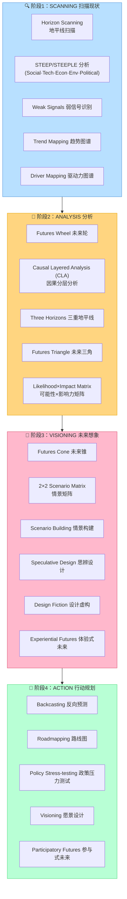
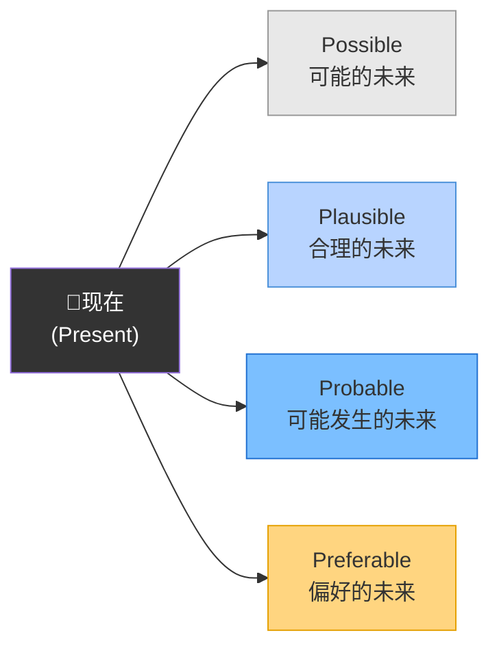
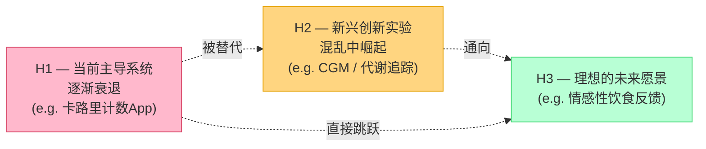

---
tags:
  - GID
  - design-futures
  - tools
  - frameworks
  - foresight
  - speculative-design
  - resource-hub
created: 2026-04-08
linked-to: "[[【02】IRP Proposal （Draft）]]"
---

# 🔭 GID Design Futures — 工具全图谱 & 资源库

> [!info] 本文件用途
> 收录 **Global Innovation Design（RCA×Imperial）** 设计未来学方向所涉及的全部核心工具、系统图、框架图，以及可参考的案例样本和完整工具包资源。
> 分为四大板块：① 核心工具图谱 ② 完整工具包资源 ③ 案例样本参考 ④ 在线交互模板

---

## 🗺️ 一、GID Design Futures 核心工具全景图

### 工具分类框架（按使用阶段）

---

## 🛠️ 二、核心工具详解 & 图示资源

### 工具1：Futures Cone（未来锥）

**用途：** 可视化从"可能"到"概率"到"偏好"的未来范围
**来源：** Charles Taylor (1990) → Hancock & Bezold (1994) → Joseph Voros (2000)

🔗 **在线模板：**
- [Miroverse — Futures Cone Workshop Template](https://miro.com/miroverse/futures-cone-workshop/) （可直接复制使用）
- [Yondar — Futures Cone Toolkit](https://yondar.org/toolkit/futures-cone/)
- [Journal of Futures Studies — Futures Cone Reimagined](https://jfsdigital.org/the-futures-cone-reimagined-a-framework-for-critical-and-plural-futures-thinking/)

---

### 工具2：Futures Wheel（未来轮）

**用途：** 结构化头脑风暴——从一个核心趋势/事件向外辐射，映射一级、二级、三级影响
**发明者：** Jerome Glenn, 1971

🔗 **在线模板：**
- [Visual Paradigm — Futures Wheel Templates](https://online.visual-paradigm.com/diagrams/templates/futures-wheel/) ← 免费在线制作
- [Miroverse — Futures Wheel](https://miro.com/miroverse/futures-wheel-1/)
- [4strat — Futures Wheel Guide](https://www.4strat.com/trends-design/futures-wheel/)

---

### 工具3：Three Horizons（三重地平线）

**用途：** 分析当前主导系统（H1）、新兴替代方案（H2）、理想未来（H3）的共存与演替
**来源：** Bill Sharpe / International Futures Forum

🔗 **资源：**
- [H3Uni — Three Horizons Tutorial](https://www.h3uni.org/tutorial/three-horizons/)
- [ResearchGate — Three Horizons Diagram](https://www.researchgate.net/figure/Schematic-of-the-futures-oriented-Three-Horizons-model_fig3_253444667)
- [ITC ILO — Three Horizons PDF](https://training.itcilo.org/delta/Foresight/3-Horizons.pdf)

---

### 工具4：2×2 Scenario Matrix（情景矩阵）

**用途：** 选取两个最不确定的关键驱动力作为坐标轴，构建四个截然不同的未来情景
**在GID语境中的对应：** IRP Proposal Section 5d — 三个2035年情景构建

🔗 **资源：**
- [Futures Platform — 2x2 Scenario Planning Matrix Guide](https://www.futuresplatform.com/blog/2x2-scenario-planning-matrix-guideline)
- [ALDA Europe — Scenario Building Toolkit PDF](https://www.alda-europe.eu/wp-content/uploads/2024/09/D7.2_Toolkit-Scenario-building.pdf)

---

### 工具5：Causal Layered Analysis / CLA（因果分层分析）

**用途：** 从表面问题→系统因素→世界观→神话/隐喻，四层深挖一个议题的深层结构
**发明者：** Sohail Inayatullah

| 层级 | 内容 | IRP示例 |
|------|------|--------|
| **Litany 表面现象** | 官方/媒体描述 | "人们吃得不健康" |
| **Systemic 系统因素** | 社会政治经济驱动 | 食品行业激励、快餐文化 |
| **Worldview 世界观** | 价值观和叙事框架 | "食物=燃料"vs"食物=愉悦" |
| **Myth/Metaphor 神话** | 深层文化隐喻 | 节制/罪恶感/道德化饮食 |

🔗 **资源：**
- [Shaping Tomorrow — CLA Method](https://www.shapingtomorrow.com/methods/CLA)
- [McGuinness Institute — CLA Toolbox PDF](https://www.mcguinnessinstitute.org/wp-content/uploads/2024/11/CLATOOLBOXNEWCHAPTER2017FORFUTURIBLES.pdf)

---

### 工具6：Backcasting（反向预测）

**用途：** 从理想未来出发，反向推导"现在需要做什么"
**与IRP的直接关联：** Section 3 & 4 — 从2035偏好未来反向识别设计干预点

🔗 **资源：**
- [Service Design Tools — Future Backcasting](https://servicedesigntools.org/tools/future-backcasting)
- [Gov.uk Futures Toolkit — Backcasting](https://www.gov.uk/government/publications/futures-toolkit-for-policy-makers-and-analysts/the-futures-toolkit-html)

---

### 工具7：STEEP/STEEPLE 分析

**用途：** 系统扫描宏观环境变化信号

| 维度 | 含义 | IRP示例 |
|------|------|--------|
| **S** — Social | 社会变化 | 反节食文化运动兴起 |
| **T** — Technology | 技术变化 | CGM、AI食物识别 |
| **E** — Economic | 经济变化 | 健康科技投资增长 |
| **E** — Environmental | 环境变化 | 食物系统可持续性 |
| **P** — Political | 政策变化 | 公共卫生预防框架 |
| **L** — Legal | 法律变化 | 数据隐私、医疗设备监管 |
| **E** — Ethical | 伦理变化 | 进食障碍伦理约束 |

🔗 **资源：**
- [Connected Places Catapult — STEEPLE Analysis](https://cp.catapult.org.uk/criteria-method/analysing-external-influences-steeple-and-strategic-foresight/)

---

### 工具8：Speculative / Critical Design 方法体系

**用途：** 设计挑衅性原型，使未来可见，引发辩论
**来源：** Dunne & Raby, RCA Design Interactions

| 工具/方法 | 描述 | 参考案例 |
|-----------|------|---------|
| **Design Fiction** | 创建存在于假想未来中的设计人工物 | Dunne & Raby《Speculative Everything》 |
| **What If...? 提问** | 用反事实问题打开设计空间 | "如果饮食像运动一样有社交反馈会怎样？" |
| **Diegetic Prototype** | 在叙事世界中嵌入的原型（电影道具式） | 《黑镜》中的技术道具 |
| **Futures Artefact** | 来自未来世界的人工物 | Superflux 2050公寓项目 |
| **Experiential Futures** | 让人"体验"未来场景 | Stuart Candy / Jake Dunagan |
| **Placebo Design** | 用设计对象引发反思（不强调功能） | Dunne & Raby Placebo Project 2001 |

🔗 **资源：**
- [SpeculativeEdu — Critical about Speculative Design](https://speculativeedu.eu/critical-about-critical-and-speculative-design/)
- [Critical Design — What is Speculative Design?](https://www.critical.design/post/what-is-speculative-design)
- [Wikipedia — Speculative Design](https://en.wikipedia.org/wiki/Speculative_design)
- [ResearchGate — Speculative and Critical Design: Features, Methods, Practices (PDF)](https://www.researchgate.net/publication/334714904_Speculative_and_Critical_Design_-_Features_Methods_and_Practices)

---

## 📦 三、完整工具包资源（可直接使用）

> [!tip] 使用建议
> 以下工具包均可免费下载或在线访问。推荐优先看 **① UK Gov Futures Toolkit** 和 **③ FUEL4DESIGN**，最适合设计专业使用。

### 🥇 一级推荐（最完整）

| # | 工具包名称 | 机构 | 内容 | 链接 |
|---|-----------|------|------|------|
| ① | **UK Government Futures Toolkit** (Edition 2) | UK Gov Office for Science | 12个工具+7种路径+完整案例+可视化图表 | [PDF直达](https://assets.publishing.service.gov.uk/media/66c4493f057d859c0e8fa778/futures-toolkit-edition-2.pdf) |
| ② | **FUEL4DESIGN Futures Design Toolkit** | FUEL4DESIGN / 欧盟大学联合 | 专为设计师设计，包含情景构建、思辨设计、未来读写 | [PDF直达](https://fuel4design.org/wp-content/uploads/2021/04/00-IO4_FUTURES-DESIGN-TOOLKIT_APR21.pdf) |
| ③ | **OECD Playbook for Strategic Foresight & Innovation** | OECD / OPSI | 系统性方法库，含完整工具指南 | [在线版](https://oecd-opsi.org/toolkits/playbook-for-strategic-foresight-and-innovation/) |
| ④ | **IFTF Equitable Futures Toolkit** | Institute for the Future | 卡片游戏式工具，含场景卡+工作表 | [PDF](https://legacy.iftf.org/fileadmin/user_upload/images/people/f4g/IFTF_equitable_futures_toolkit_v2_031319.pdf) |

### 🥈 二级推荐（专项深度）

| # | 工具包名称 | 机构 | 特点 | 链接 |
|---|-----------|------|------|------|
| ⑤ | **Our Futures** (Nesta) | Nesta + Jose Ramos | 参与式方法，多元声音 | [PDF](https://media.nesta.org.uk/documents/Our_futures_by_the_people_for_the_people_WEB_v5.pdf) |
| ⑥ | **The Future is Ours** | Save the Children + SOIF | 12种技术+工作坊模板 | [PDF](https://resourcecentre.savethechildren.net/node/16327/pdf/strategic_foresight_toolkit_online.pdf) |
| ⑦ | **Horizon Scanning Toolkit** | Cranfield University / SEPA | 地平线扫描深度指南 | [PDF](https://www.sepa.org.uk/media/367059/lsw-b4-horizon-scanning-toolkit-v10.pdf) |
| ⑧ | **Strategic Foresight Primer** | European Political Strategy Centre | 精简易读，适合快速上手 | [PDF](https://espas.secure.europarl.europa.eu/orbis/sites/default/files/generated/document/en/epsc_-_strategic_foresight_primer.pdf) |
| ⑨ | **Futures Frequency** | Sitra (Finland) | 含Miro模板+音频剧 | [官网](https://www.sitra.fi/en/projects/futures-frequency/) |
| ⑩ | **Forks in the Timeline** | Kepler Games | 卡牌游戏式情景探索 | [官网](https://forksinthetimeline.com/) |

---

## 🏫 四、案例样本参考（可照着做）

### RCA Design Futures 学生项目案例

| 学生/项目 | 主题 | 方法 | 参考链接 |
|-----------|------|------|---------|
| **Trisha Mehta** (2024) | 伦敦2050年出行的未来 | 4个情景×定量定性研究 | [RCA 2024 Profile](https://2024.rca.ac.uk/school-of-design/design-futures-mdes/profile/trisha-mehta/) |
| **Chenjia Zhu** (2024) | 昆虫食物系统 | 未来预测方法+情景规划+系统设计 | [RCA 2024 Profile](https://2024.rca.ac.uk/school-of-design/design-futures-mdes/profile/chenjia-zhu/) |
| **Douce De Boisgelin** (2025) | 设计未来研究 | 思辨设计 | [RCA 2025 Profile](https://2025.rca.ac.uk/school-of-design/design-futures-mdes/profile/douce-de-boisgelin/) |
| **RCA SuperFutures Studio** (2023) | 生活方式未来 | 39个思辨近未来场景 | [RCA 2023](https://2023.rca.ac.uk/programmes/interior-design-superfutures-2yr/) |

### Superflux 专业实践案例（最相关）

| 项目名称 | 年份 | 主题 | 方法 | 链接 |
|---------|------|------|------|------|
| **Mitigation of Shock** | 2017 | 2050年公寓+食物系统 | 体验式未来+实物原型 | [Superflux.in](https://superflux.in/index.php/work/mitigation-of-shock/) |
| **Instant Arcadia** | 2018 | 生态系统未来 | 沉浸式装置 | [Superflux.in](https://superflux.in/) |
| **Song of the Machine** | 2011 | 技术与身体 | 设计虚构 | [Superflux.in](https://superflux.in/) |

### Dunne & Raby 经典案例

| 项目 | 年份 | 核心方法 | 链接 |
|------|------|---------|------|
| **Placebo Project** | 2001 | 批判性设计+日常物件 | [RCA Impact Case Study](https://impact.ref.ac.uk/casestudies/CaseStudy.aspx?Id=44132) |
| **United Micro Kingdoms** | 2013 | 投机性国家设计 | [Artforum](https://www.artforum.com/columns/dunne-raby-speculative-design-alex-estorick-1234724076/) |
| **Robots of Brixton** | 2011 | 设计虚构+社会场景 | [SpeculativeEdu](https://speculativeedu.eu/interview-dunne-raby/) |

---

## 🖥️ 五、在线交互模板（Miro / Mural）

| 工具 | 平台 | 免费？ | 链接 |
|------|------|--------|------|
| Futures Cone 未来锥 | Miro | ✅ | [Miroverse](https://miro.com/miroverse/futures-cone-workshop/) |
| Futures Wheel 未来轮 | Miro | ✅ | [Miroverse](https://miro.com/miroverse/futures-wheel-1/) |
| Futures Wheel 未来轮 | Visual Paradigm | ✅ | [VP Online](https://online.visual-paradigm.com/diagrams/templates/futures-wheel/) |
| 2×2 Scenario Matrix | Futures Platform | ✅（文章） | [Futures Platform](https://www.futuresplatform.com/blog/2x2-scenario-planning-matrix-guideline) |
| STEEP Analysis | Miro | ✅ | Miro搜索"STEEP" |

---

## 🔗 六、Connected Places Catapult 资源

（即IRP Proposal中提及的 IPLF 框架来源机构）

| 资源 | 描述 | 链接 |
|------|------|------|
| **Strategic Foresight Playbook** | CPC官方战略预见工具库 | [cp.catapult.org.uk](https://cp.catapult.org.uk/playbook-tool/strategic-foresight/) |
| **STEEPLE Analysis Tool** | 外部影响分析方法 | [CPC STEEPLE](https://cp.catapult.org.uk/criteria-method/analysing-external-influences-steeple-and-strategic-foresight/) |
| **Playbook Tools Archive** | 全部工具存档 | [Playbook Archive](https://cp.catapult.org.uk/playbook-tool/) |

---

## 📌 七、与IRP Proposal的对应关系

| IRP章节 | 使用的Design Futures工具 | 对应本文工具编号 |
|---------|------------------------|----------------|
| Section 3 — Problem Framing | STEEP扫描 / Three Horizons | 工具7 / 工具3 |
| Section 4 — Design Futures Approach | Backcasting / Futures Cone | 工具6 / 工具1 |
| Section 5d — Design & Futures Methods | Scenario Building / Speculative Prototyping | 工具4 / 工具8 |
| Section 2d — Trends (IPLF Framework) | IPLF = Intelligence×Perspective×Logic×Foresight | Connected Places Catapult |
