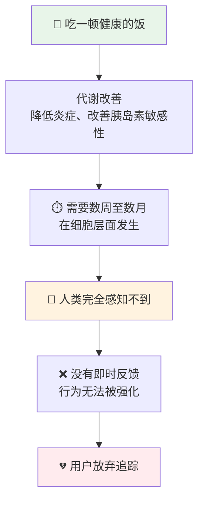
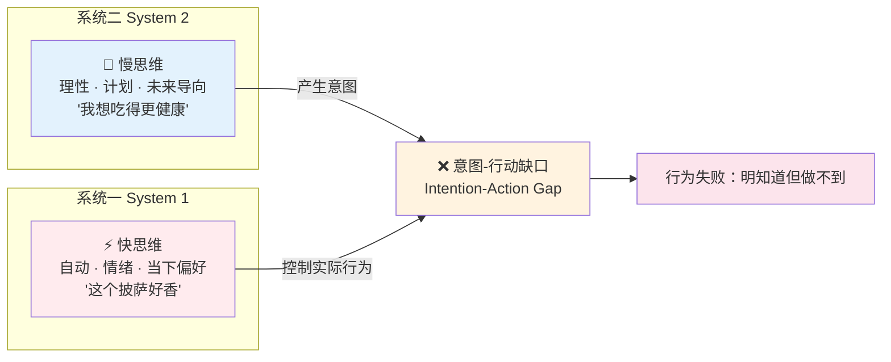
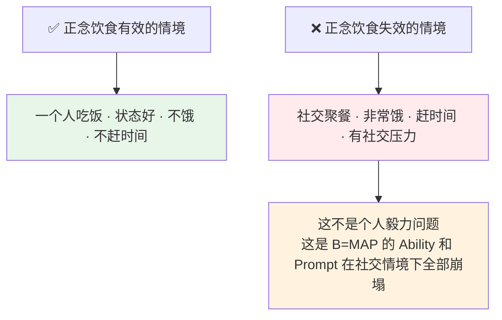
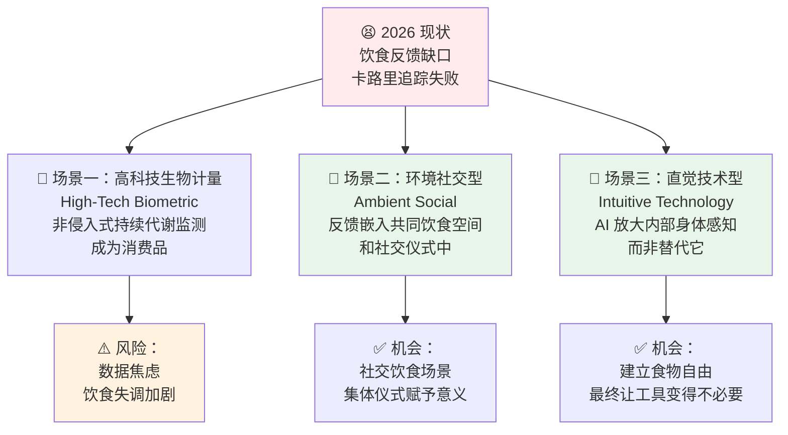
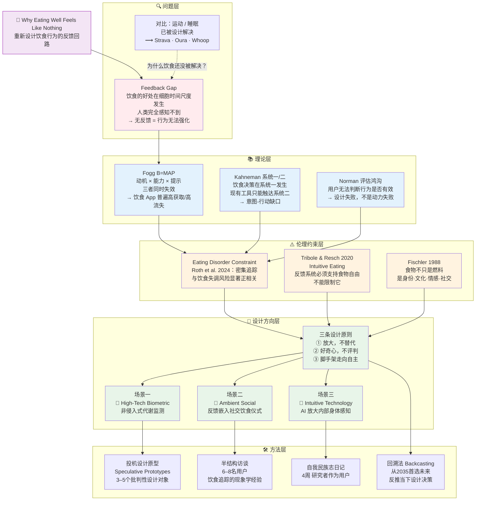
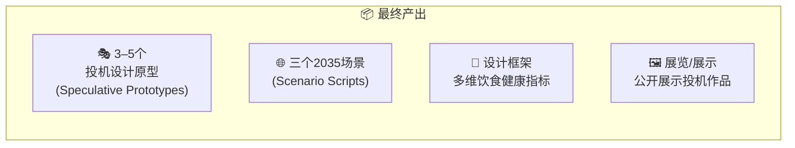

# IRP Shannon 会面备考 — Claudian 讲解笔记

> 本文件记录 Claudian（AI 学术私教）对 [[【01】IRP Proposal （Draft）]] 的逐节讲解内容，供明天（2026-04-08）与导师 Shannon 会面前复习使用。
> 学生个人理解与回答记录见：[[克老师教我理解IRP]]

---

## 第一节：核心问题 — The Feedback Gap（反馈缺口）

### 一句话论点
> **这不是动力问题，而是设计问题。** 饮食行为无法持续改变，根本原因是反馈系统的结构性失效——而不是意志力不足。

### 与 Shannon 对话的关键句
> *"The problem isn't motivation — it's feedback. Nutritional benefits operate at a cellular timescale that's entirely imperceptible to lived experience. Without feedback, behaviour can't be reinforced. It's a classic design failure: what Norman (2013) calls the 'gulf of evaluation' — the user cannot determine whether their actions are having any effect."*

### 📊 三大行为的反馈对比表

| | 🏃 跑步（Strava） | 😴 睡眠（Oura Ring） | 🥗 饮食（MyFitnessPal） |
|---|---|---|---|
| **即时反馈** | ✅ 5分钟内 — 内啡肽、距离、配速 | ✅ 次日早晨 — Sleep Score | ❌ 无生物信号，只有"饱了" |
| **反馈形式** | 排行榜、Kudos、个人记录 | 单一数字评分（情感共鸣强） | 手动输入卡路里（枯燥，低情感）|
| **用户留存** | 高 | 高 | **数周内大量流失**（Schembre et al., 2018）|
| **核心问题** | 已解决 | 已解决 | **反馈缺口尚未闭合** |

### 反馈失效的逻辑链（Mermaid）



### 核心学术术语
- **Gulf of Evaluation**（评估鸿沟）—— Norman (2013)：用户无法判断自己的行为是否有效
- **Intention-Action Gap**（意图-行动缺口）—— Section 3 核心术语
- **Feedback Loop Failure**（反馈回路失效）—— 不是动力失败，是设计失败

---

## 第二节：理论双引擎 — B=MAP × 系统一/二

### Fogg B=MAP 模型 × 饮食追踪失败分析

```
B = M × A × P
行为 = 动机 × 能力 × 提示
```

| 维度 | 理想状态 | MyFitnessPal 的现实 | 你的设计目标 |
|------|---------|---------------------|------------|
| **M 动机** | 持续存在 | 初期高，数周后骤降 ❌ | 通过即时反馈维持动机 |
| **A 能力** | 操作简单 | 手动记录每口食物，认知成本极高 ❌ | 记录摩擦降至趋近于零 |
| **P 提示** | 及时、有情感共鸣 | 延迟的数字汇总，毫无情感 ❌ | 情感共鸣的即时信号 |
| **结果** | B 发生 | **B 不发生 → 用户流失** | B 自然发生 |

> **核心洞见：** 三个要素必须**同时**满足，少一个行为就不会发生。当前饮食工具三个全失败。

### 系统一 vs 系统二 — 饮食决策的战场



### 两个理论的连接点

| | Fogg B=MAP | Kahneman 系统一/二 |
|--|-----------|-----------------|
| **核心问题** | Prompt 太弱、太慢 | 工具只触达系统二 |
| **共同答案** | 反馈必须**即时、有情感共鸣** | 设计必须在**系统一**层面运作 |
| **设计标准** | "用户能在3秒内、无需思考地使用吗？" | "这个反馈让人感觉良好，还是需要计算才能理解？" |
| **成功案例** | Strava 排行榜（即时✅ 情感✅）| Oura 晨间分数（情感仪式✅）|

### 为什么 Strava 的逻辑无法直接复制？（你的回答精华）

> 你的核心洞见（极为准确）：
> 1. **B=MAP 三维全部失效**：动机衰减（无正向反馈）× 能力门槛高（手动输入）× 提示无情感共鸣（卡路里数字模糊）
> 2. **认知层级错位**：工具停在"思维层"（系统二），无法触达"本能层"（系统一）

> **补充一个维度（答案更完整）：**
> Strava 的运动有内生生物反馈——跑完步你会感到内啡肽、心跳、出汗。饮食没有这个生理基础。这是设计障碍之外的**生理障碍**，也是为什么这个问题比运动追踪难得多。

---

## 第三节：伦理约束 — The Eating Disorder Constraint

### 核心悖论（Shannon 会直接问这个）

> *"你如何同时实现——让饮食行为改变更有效，同时又不增加饮食失调风险？"*

这个矛盾**是可以解的**，但需要换一个思维框架。

---

### 关键转变：换掉问题本身

❌ 错误的问题：*"应该相信外部数字，还是内部感知？"*
==✅ 正确的问题：*"外部反馈如何帮助人**学会听见**自己身体的声音？"*==

---

### 📊 两种外部反馈的本质区别

| | **监控型反馈** | **感知放大型反馈** |
|---|---|---|
| **逻辑** | 外部数字**替代**内部感知 | 外部信号**训练**内部感知 |
| **典型表现** | "你今天摄入了1800卡，超标了❌" | "注意：你通常在高碳水午餐后2小时会感到疲倦" |
| **与身体的关系** | 数字凌驾于身体感受之上 | 数字帮你翻译身体在说什么 |
| **长期目标** | 依赖工具（永远需要数字） | 内化感知（最终不再需要工具）|
| **饮食失调风险** | ❌ 高 | ✅ 低 |

---

### 三条设计原则（明天直接用）

1. **Amplify, don't replace（放大，不替代）** — 外部信号让内部感知更清晰
2. **Curiosity, not judgment（好奇心，不评判）** — "有趣，不是吗？" 而不是 "你做错了"
3. **Scaffold toward autonomy（脚手架走向自主）** — 设计的目标是让自己变得不再必要

---

### 与提案的连接

> 这三条原则直接对应 Section 5d 的 **"Intuitive Technology scenario"**：
> *"AI works to amplify internal body attunement rather than replace it."*
>
> 以及 Tribole & Resch (2020) 的 Intuitive Eating 框架：参见 [[L3 - Tribole and Resch (2020)]]

---

### 你需要的文献缺口（尚未在 L1–L10 中覆盖）

| 领域 | 搜索关键词 | 与项目的连接 |
|------|-----------|------------|
| **正念饮食** | "mindful eating" + "interoception" | 证明内部感知可以被训练 |
| **生物反馈治疗** | "biofeedback" + "interoceptive awareness" | 外部传感器训练内部控制的经典范例 |
| **内感知准确性** | "interoceptive accuracy" + "eating behaviour" | 身体感知能力可以学习的科学证据 |

---

## 第三节（延伸讨论）：你提出的三个新视角

### 视角一：第三人称描述 / 自我疏离（Self-Distancing）

> 你提到的冷水澡例子：与其说"我好冷"，不如说"现在有7°C的水从我身体流过"。

这个概念有明确的学术来源，最可能是 **Ethan Kross** 的研究（《Chatter》，2021）。

**核心机制：**

| 普通描述            | 第三人称/观察者描述              |
| --------------- | ----------------------- |
| "我好想吃这块蛋糕"      | "我注意到我的身体在发出强烈的进食信号"    |
| "我今天吃得太多了，我好失败" | "今天我的进食模式和平时不一样，发生了什么？" |
| 高情绪激活 → 系统一接管   | 情绪降温 → 系统二参与 → 更清晰的感知   |

**与项目的直接连接：**
- 这是一种让系统二在系统一时刻"插进来"的语言技巧
- 应用到饮食反馈设计：工具的语言应该诱导自我疏离，而不是强化情绪反应
- 例如：Woebot（P9）的对话设计已经部分采用这种语言框架

**建议补充文献：** Kross, E. and Ayduk, O. (2017) 'Self-distancing: Theory, research, and current directions', *Advances in Experimental Social Psychology*, 55, pp. 81–136.

---

### 视角二：你关于 AI 时代的洞见（极为重要）

> "AI 现在能提供很多数字化建议，而我们最欠缺的，反而是对自我需求认知的把握。"

这个观察触及了你整个项目的哲学核心，值得在论文里明确表述：

```
当前 AI 健康工具的逻辑：
外部数据 → AI 分析 → 给用户建议 → 用户执行

你的项目提出的逻辑：
外部数据 → 帮助用户理解自己身体 → 用户建立内部感知 → 工具变得不再必要
```

**这个洞见的学术表达：**
> ==*"The most profound failure of current health technology is not that it gives bad recommendations — it's that it outsources self-knowledge. The goal of a well-designed dietary feedback system should be its own obsolescence: to build interoceptive literacy until the user no longer needs the tool."*==

这句话可以直接用在 Section 4 或者你和 Shannon 的对话中。

---

### 视角三：正念饮食深度解析

**你的三个问题统一回答：**

正念饮食最成熟的临床项目是 **MB-EAT**（Mindfulness-Based Eating Awareness Training，Jean Kristeller 开发，1990s）：

| 你的问题 | MB-EAT 的回答 | 设计启示 |
|---------|--------------|---------|
| 有反馈机制吗？ | 有——反馈就是内部感知本身：你练习完，你的感受就是数据 | 但这对普通用户太抽象，需要具象化 |
| 有后续引导吗？ | 有——9周结构化课程，小组讨论，家庭练习日志 | 有结构，但像课程不像产品 |
| 只教方法没有后续？ | 介于两者之间 | **这正是设计机会：** 把 MB-EAT 的内容，配上即时的数字化反馈层 |

**你发现的真正问题（非常准确）：**

> "任何没有后续反馈机制的东西，其实都挺难持续下去的。"

这个批评直接命中了正念饮食作为干预的核心局限。MB-EAT 在临床环境有效，但缺乏持续性 Prompt（Fogg B=MAP 再次出现！）。

**关于社交场合的问题（你说的完全正确）：**



**设计启示：** 这是你的"Ambient Social"场景（Section 5d）的核心动机——把反馈嵌入到社交环境本身，而不是要求个人在社交中独自维持一套仪式。

---

## 第四节：解决方案方向 — Speculative Design

### 为什么用投机设计（Speculative Design）？

这个项目选择投机设计不是因为"答案还不存在"而是因为：

> **当前的设计范式本身就是问题所在。** 需要的不是更好的卡路里追踪应用，而是重新想象"饮食反馈"这件事应该是什么样的。

这正是 Dunne & Raby（2013）区分 **Affirmative Design**（在已有范式内解决问题）和 **Critical Design**（质疑范式本身）的意义。

### 你的三重身份（Section 4 的精华）

| 身份 | 任务 | 工具 |
|------|------|------|
| 🗺️ **现状绘图师** | 为什么当前饮食反馈是这个样子？它优化了什么？服务了谁的利益？| 文献综述 + 应用审计 |
| 🔍 **批判性挑衅者** | 设计能让问题变得可见的对象，而不是解决方案 | 投机原型 |
| 🎯 **偏好未来学家** | 从一个"首选未来"反推——现在应该做哪些设计决策？| 情景构建 + 回溯法 |

### 三个 2035 场景（你的核心输出方向）



### 回溯法（Backcasting）怎么用

> **首选未来（2035）：** 吃得好和完成一次晨跑一样——有意义、可感知、有情感共鸣，而不产生焦虑或强迫。
>
> **反推现在需要做的设计决策：**

| 从现在到 2035 | 需要的设计行动 |
|-------------|--------------|
| 非侵入式传感器（5–10年后可用） | 现在设计感知接口和反馈语言，而不是等传感器 |
| 饮食失调保护框架 | 现在建立设计排除标准（哪些模式绝对不能用）|
| 食物自由文化转型 | 现在的投机设计推动文化对话 |

---

---

## 阶段二：完整研究逻辑图（明天向 Shannon 展示）



---

## 新洞见：日本饮食仪式 —— Itadakimasu（いただきます）

### 这个仪式是真实的，而且直接命中你的研究

> 你的问题：日本人饭前合掌说"我开动啦"——这是普遍现象还是只在电视里？

**是真实的、全国性的日常习惯。** 以下是它的完整形态：

| 时间 | 动作 | 词语 | 含义 |
|------|------|------|------|
| 饭前 | 双手合掌 | いただきます (Itadakimasu) | "我谦卑地接受" / 感谢食物的生命、耕种者、烹饪者 |
| 饭后 | 双手合掌 | ごちそうさまでした (Gochisousama) | "这是一场盛宴 / 你辛苦了" |

这个仪式从幼儿园就开始教，渗透进每一餐，家庭/学校/餐厅都有。它**书挡式地包裹整个饮食行为**——开始有一个意识的进入，结束有一个感恩的退出。

---

### 为什么这个洞见对你的项目极为重要

这个仪式本质上是一种**零摩擦的环境感知放大器**：


| 设计维度 | Itadakimasu 提供了什么 |
|---------|----------------------|
| **B=MAP 的 Prompt** | ✅ 每次吃饭都有可靠的触发信号 |
| **Kahneman 系统一/二** | ✅ 仪式暂停让系统二能在系统一时刻短暂介入 |
| **摩擦成本** | ✅ 几乎为零——只是两句话 |
| **饮食失调风险** | ✅ 无评判，无数字，纯粹感恩 |
| **社交场合适用性** | ✅ 恰恰是社交场合最强——大家一起说 |
| **食物身份认同（Fischler）** | ✅ 将食物置于文化/关系/感恩的框架中 |

### 学术连接

- **Rozin et al. (1999)**：在你的 L 系列文献里没有单独建笔记，但这篇论文是关键——它发现法国人（和日本人类似）有强烈的"食物=快乐"关联，同时食物焦虑最低。原因之一：饮食被嵌入文化仪式中，而非医疗化数字框架中
- **Fischler (1988)** [[L8 - Fischler (1988)]]：食物是身份和文化的载体——日本仪式正是这个理论的活体实例
- **Tribole & Resch (2020)** [[L3 - Tribole and Resch (2020)]]：Itadakimasu 本质上是每天两次的"Honour Your Hunger / Respect Your Fullness"实践

### 设计机会

> **"如果反馈不是一个数字，而是一个仪式，会发生什么？"**

这个问题直接孵化你的**场景二：Ambient Social**——反馈不是个人设备上的数据，而是嵌入共同饮食时刻的社会性行为。

建议补充文献搜索：`"food rituals" + "eating behaviour"` / `"mindful eating" + "ritual" + "cultural practice"`

---

## 你的全局地图：现在在哪里，下一步去哪里

### 你已经完成了什么（你比你想象的做了更多）

根据 IRP Report Template，整个项目分两个阶段：

| 阶段 | 时间 | 内容 | 状态 |
|------|------|------|------|
| **Part 1: IRP Proposal** | Term 2（到现在）| 文献综述、问题框架、设计方向、方法论提案 | ✅ **已完成** |
| **Part 2: IRP Realisation** | Term 3（从现在开始）| 初级研究、投机原型、场景构建、展览 | 🔜 即将开始 |

**你不是什么都没做。你已经完成了整个项目的地基：**
- ✅ 10篇文献综述（L1–L10，现在有独立笔记）
- ✅ 10个实践案例综述（P1–P10，现在有独立笔记）
- ✅ 4个研究问题
- ✅ 问题框架（Section 3）
- ✅ 设计未来方向（Section 4）
- ✅ 完整方法论提案（Section 5）

---

### 从现在到9月：你需要产出什么

**最终产出（来自 Section 7）：**



**要产出这些东西，你需要做的研究（Section 5）：**

| 方法          | 具体内容                            | 可以开始的时间      |
| ----------- | ------------------------------- | ------------ |
| **自我民族志日记** | 4周，记录每次进食的感受、反馈体验               | **今天就能开始**   |
| **应用审计**    | 系统评估8个饮食工具（MyFitnessPal、Noom 等） | **本周就能开始**   |
| **伦理审查表**   | 填表，获批后才能访谈                      | **本周提交**     |
| **半结构访谈**   | 6–8人，45–60分钟/人                  | 伦理审批后（约2–3周） |
| **投机原型**    | 3–5个设计对象                        | 访谈后（6月）      |
| **参与式评议**   | 把原型拿给访谈者看                       | 7月           |

---

### 立刻可以做的三件事（明天会面之后）

**第一件：今晚/明天开始自我民族志日记**
在 Obsidian 里创建一个新文件，叫 `Autoethnographic Diary.md`。
每次吃东西之后，记录这五个问题（不需要很长）：
1. 我吃了什么？（不需要精确，大概就行）
2. 我当时的状态是什么？（很饿/无聊/社交）
3. 吃的时候/之后我有什么感受？（身体上+情绪上）
4. 我有没有收到任何反馈信号？（来自 App、身体、他人）
5. 这次饮食体验让我想到了什么设计问题？

**第二件：本周提交伦理审查表**
链接在提案 Appendix C 里：https://docs.google.com/forms/d/1eDepJ0CTWcTekY9EFW0eg5LMXCVYHKjkeiS2Es5U4Cg/viewform
没有这个，你无法开始访谈。

**第三件：本周开始应用审计**
下载这8个 App，用你设计的评估框架（Section 5b）系统评估：
MyFitnessPal · Noom · Levels Health · Signos · Nutrisense · FoodVisor · NHS Weight Loss Plan + 1个自选

---

## 明天 Shannon 最可能追问的问题 & 建议回答

| Shannon 的问题 | 你的回答要点 |
|--------------|------------|
| "这不是动力问题吗？" | "No — Norman (2013) calls it a gulf of evaluation. It's a design failure." |
| "为什么 Strava 的逻辑不能直接用？" | "Exercise has intrinsic biological feedback — endorphins, sweat. Nutrition doesn't. Designers must create the signal from scratch." |
| "你怎么平衡效果和饮食失调风险？" | "Amplify, don't replace. The tool trains interoceptive literacy until it makes itself unnecessary." |
| "投机设计不是太虚了吗？" | "Speculative prototypes are provocations, not solutions. Their job is to defamiliarise our assumptions about what dietary feedback should feel like." |
| "你的研究问题是什么？" | 直接背 Section 2a 的四个 RQ |
