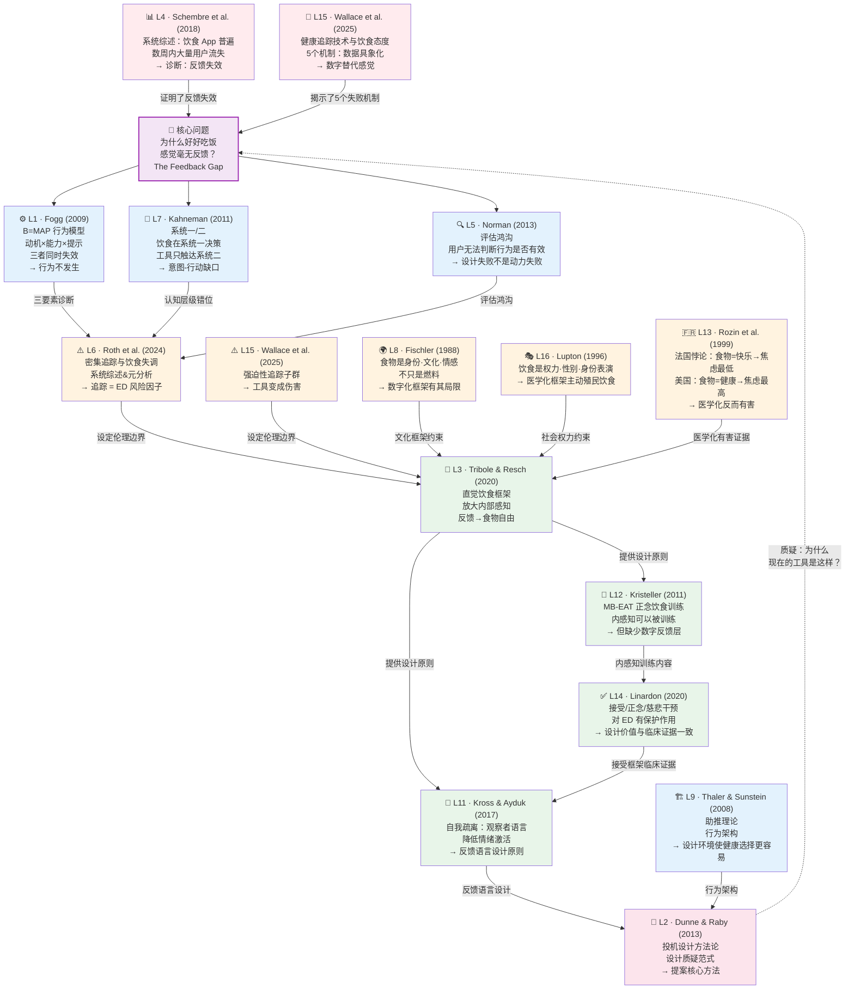
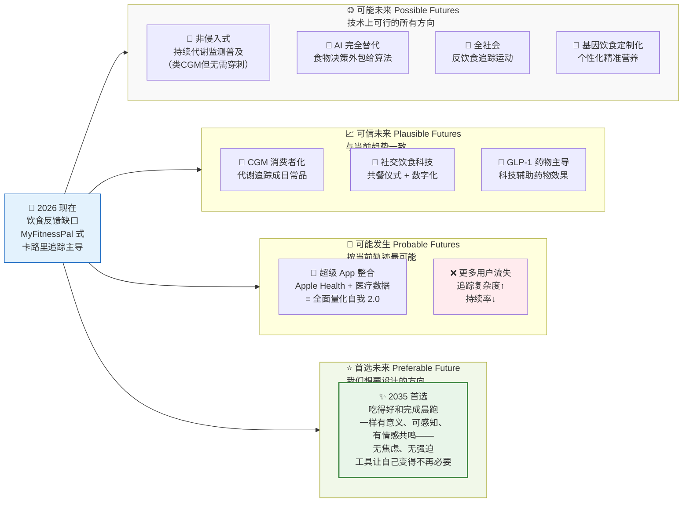
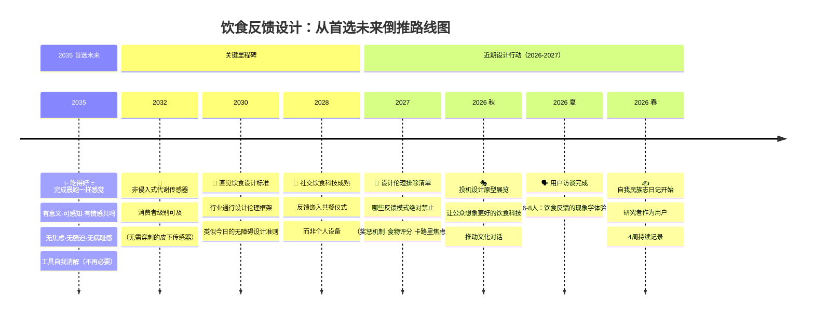

# IRP 急救计划 — Shannon 会面前夜

> **使用说明：** 这是为 2026-04-08 与 Shannon 的 20 分钟 tutorial 设计的"作战地图"。四个部分可以独立使用：Step 1 说话用，Step 2-3 打印/展示用，Step 4 会后行动用。

---

# ✅ 文献库更新记录（2026-04-07 新增）

今日新增 6 篇文献笔记至 `Literature Notes/`：

| 代码 | 文献 | 核心贡献 |
|------|------|---------|
| [[L11 - Kross and Ayduk (2017)]] | Self-distancing 自我疏离 | 反馈**语言**设计的理论基础：观察者视角 vs 沉浸式评判 |
| [[L12 - Kristeller and Wolever (2011)]] | MB-EAT 正念饮食训练 | 内感知训练的临床证据；设计机会：缺少数字反馈层 |
| [[L13 - Rozin et al (1999)]] | 跨文化食物态度研究 | 医学化食物观 → 焦虑↑；快乐文化 → 焦虑↓ |
| [[L14 - Linardon (2020)]] | AMC 干预与饮食失调 | 接受/正念/慈悲框架对 ED 的保护性证据 |
| [[L15 - Wallace et al (2025)]] | 健康追踪技术与饮食 | 5 个机制：数据具象化→感觉被数字替代 |
| [[L16 - Lupton (1996)]] | 食物、身体与自我 | 饮食是权力/身份/情感表演，不只是营养 |

---

---

# 第一步：核心矛盾 — The "Why"（直接、不客套）

## 🎯 一针见血：这篇提案的核心矛盾

> **用一句话说：** 你试图同时做两件相互拉扯的事——*让饮食反馈更有效*（关闭反馈缺口），但*又不能让追踪变得更密集*（密集追踪→饮食失调风险）。

这不是小问题。这是整个提案最难的地方：

```
❌ 简单路径（行不通）：
"现有反馈太差 → 给更好的反馈 → 行为改变"
（问题：更好的反馈 = 更多数据凝视 = 更高 ED 风险）

✅ 你的实际主张（更难，但正确）：
"设计一种质上不同的反馈——放大内部感知，而非用外部数字替代它"
```

你的解法（"Amplify, don't replace"）在提案中有**原则**，但还没有**机制**。Shannon 明天大概率会在这里追问。

---

## 🔑 向 Shannon 索取的 3 个关键反馈

### 反馈 ①：原创性定位（最重要）

**你的问题（直接问）：**
> *"My central design argument is 'amplify vs. replace' — using feedback to build interoceptive literacy rather than substitute for it. Is this distinction sufficiently theorised as an original contribution, or does it already exist under another name in the clinical or design literature? How do I defend the originality of this framing?"*

**为什么这个问题最重要：**
"放大而非替代"是一个有直觉吸引力的原则，但你需要知道它是否已经存在于：临床心理学（Supported Self-Management）、健康设计（Patient-Centred Design）或内感知研究（Interoceptive Training）的既有框架中。Shannon 的答案决定你的 Section 4 是否需要重写。

---

### 反馈 ②：投机设计的边界（伦理定位）

**你的问题（直接问）：**
> *"Given that my topic involves acute eating disorder risk, how provocative should my speculative prototypes be? Should I imagine potentially harmful design futures and critique them — or should I focus only on 'preferred future' scenarios? Where does critical design end and irresponsible speculation begin in a topic with clinical stakes?"*

**为什么要问这个：**
Dunne & Raby 的方法论允许你"设计坏的未来"以引发反思。但在 ED 领域，一个设计不佳的原型可以造成真实伤害（如果有脆弱用户接触它）。你需要 Shannon 帮你定边界。

---

### 反馈 ③：时间线可行性（方法论现实核查）

**你的问题（直接问）：**
> *"My methodology combines a 4-week autoethnographic diary, ethics approval (2–3 weeks), 6–8 semi-structured interviews, speculative prototyping, and participatory critique — all before September. Is this sequencing realistic? What should I ruthlessly cut if I'm short on time?"*

**为什么要问这个：**
你不需要在 20 分钟里证明你很厉害。你需要在 9 月前交出真实的东西。Shannon 的优先级排序建议是实际可执行的金矿。她会告诉你哪个环节可以"快速完成"，哪个是真正的核心。

---

---

# 第二步：文献关系全景图（Mermaid 知识图谱）

> 在 Obsidian 中渲染后，你可以一眼看清：谁在诊断问题，谁在提供理论，谁在设定约束，谁在提供出路。



---

---

# 第三步：Design Futures 高级可视化蓝图

## 3A — 未来视锥（The Futures Cone）

> Dator (2009) / Stuart Candy 经典框架，应用到饮食反馈课题。



---

## 3B — 回溯法时间轴（Backcasting Timeline）

> 从 2035 首选未来**倒推**至今天的关键设计决策节点。



---

---

# 第四步：顶级图表"按图索骥"指南

> 不用我发图给你——告诉你去哪里找、找什么关键词。这三张图直接截图，放 PPT 完全够用。

---

## 🖼️ 图表 ① — Fogg 行为模型曲线图

**必须找的理由：** 这是 B=MAP 的视觉核心——一条"行动线"（Action Line）将行为发生区和行为失败区分开，直观显示为什么三要素缺一不可。

**怎么找：**
1. 去 **[behaviormodel.org](https://behaviormodel.org)** — BJ Fogg 的官方网站，首页就有
2. 关键词：`"Fogg Behavior Model" graph "action line"` （找那条分割"行为发生区"和"失败区"的绿色曲线）
3. 找那张有三个轴（横轴 Ability·纵轴 Motivation·斜曲线 Prompt）的经典坐标系图

**怎么用在 PPT：**
> 截图 + 标注三个红色叉：左上角（高动机但能力差）= MyFitnessPal 用户入门；中间偏左（动机下降）= 两周后流失；右下角（低动机低能力）= 大多数真实用户状态

---

## 🖼️ 图表 ② — 未来视锥（The Futures Cone）

**必须找的理由：** 这是你整个 Design Futures 方法论的视觉锚。没有这张图，你的"投机设计"和"回溯法"说起来总是虚的。

**怎么找：**
1. Google 搜索：`"futures cone" Stuart Candy possible probable preferable`
2. 找 **Stuart Candy** 版本（比 Dator 原版更好看），通常是一张从左到右扩展的彩色漏斗图
3. 或去 **[thinkingfutures.net](https://thinkingfutures.net)** 直接找 Candy 的原图

**怎么用在 PPT：**
> 在图上标注你的三个 2035 场景（High-Tech Biometric·Ambient Social·Intuitive Technology），说明它们分布在 Possible 到 Preferable 的哪个区域

---

## 🖼️ 图表 ③ — Dunne & Raby 投机设计"A/B"示意图

**必须找的理由：** Dunne & Raby 在《Speculative Everything》里有一张非常清晰的图，把"Affirmative Design"（解决现有问题）和"Critical Design"（质疑问题本身）区分为 A/B 两路，这是你选择投机设计方法论的直接视觉依据。

**怎么找：**
1. 直接搜索：`Dunne Raby "Speculative Everything" "affirmative design" "critical design" diagram`
2. 或者去 **[dunneandraby.co.uk](https://www.dunneandraby.co.uk/content/bydandr/13/0)** 找"Beyond Radical Design?" 这篇文章里的图
3. 关键词：`Dunne Raby "A" "B" design categories` — 找那张两列比较表或二维坐标图

**怎么用在 PPT：**
> 标注：你的项目**从 A（Affirmative）出发理解现状**（Section 2 应用审计），然后**用 B（Critical）质疑现状**（投机原型），以**引导公众想象 C（Preferred Future）**

---

---

# 附：20分钟 Tutorial 节奏建议

| 时间 | 内容 | 目标 |
|------|------|------|
| 0–2 min | 一句话总结项目 + 你的三条设计原则 | 让 Shannon 快速进入语境 |
| 2–5 min | 展示文献关系图（Step 2 的 Mermaid） | 证明你的理论基础扎实 |
| 5–10 min | 提出 3 个关键问题（Step 1） | 这才是 tutorial 的核心目的 |
| 10–15 min | 展示三个 2035 场景 + 未来视锥 | 显示你有 Futures thinking |
| 15–18 min | 请 Shannon 指出最弱的环节 | 开放性问题获取最大价值 |
| 18–20 min | 确认下一步行动（伦理审查/自我民族志） | 把对话变成可执行计划 |

> **最重要的一句话，Tutorial 前默念三遍：**
> ==*"我不是来汇报进度的，我是来获取 Shannon 的判断力的。"*==

---

*文件生成：Claudian，2026-04-07*
*关联文献库：L1–L16（今日新增 L11-L16）*
