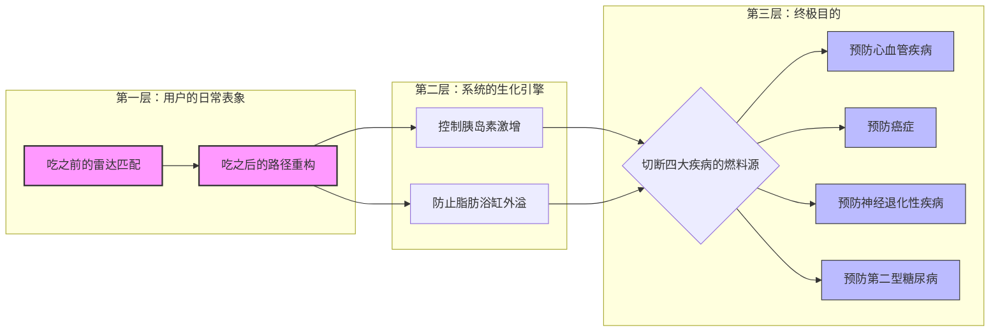

## 1.可能的未来表格
把这三个信号沿两个轴一拉,就出来四种**可能的未来**(轴 X:食物/身体数据是开放透明、还是被产业掌控;轴 Y:人终身依赖数据、还是数据把身体直觉养回来):

**①「毕业生」——透明 + 直觉养回(你的 preferable)** 数据标准化、可查询;个性化传感便宜;AI 是个**临时教练**,帮你把被超加工食品劫持的身体信号重新学回来,然后你**毕业、撤掉它**。两个透明都补上 → 错位被化解 → 你凭恢复的直觉、平静地按自己的目的吃。 支撑信号:Sunrise 2027(可查询)+ OTC CGM(短期校准)+ ZOE(个性化优于平均)。

**②「读数生活」——透明 + 终身依赖(最可能/probable)** 同样的基础设施,但 AI 永不离身,每一口都靠读数;方便,但身体的声音被永久外包。 支撑信号:CGM 作为永久订阅的 wellness 趋势 + 那条"数据焦虑"的阴影。

**③「黑箱投喂」——不透明 + 依赖(cautionary)** 数据存在,但握在食品工业/平台手里;"个性化"优化的是利润和黏性,不是你的好。你依赖一个把你推向"好卖的东西"的黑箱。你说的"食品工业是最大拦路虎"就活在这里。 支撑信号:GS 1 文档里 2D 码链接的信息是"品牌可控的";食物被排除在数据护照之外(产业没被强制开放)。

**④「玄学反扑」——不透明 + 反数据(另一种坏结局)** 人被数据焦虑/乱信息搞怕了(S 2"网上太乱我不想信"、S 3"我一点也不信数据"),干脆全盘拒绝数据,退回网红/直觉但没有真知识;社会审美扭曲(S 3"90 斤更好看")和误导继续,内耗照旧。 支撑信号:BBC 报道医生质疑血糖减肥风潮;社交比较式审美。

## 2.不同的饮食人群
享受型，生存性和 ED
**F 4** 同意出图——一张**受众地图**:三维度 = 食者类型(享乐/非享乐…)× 年龄段 × 地区(伦敦),在图上**标出目标段 + 排除临床 ED**。放 §13,§11 引用。〔图你来画,我可帮你定维度〕

冰山图——我的目的

![[Pasted image 20260603231658.png]] ![[Pasted image 20260603232008.png]]
这个图表应该是动态的智能图表。我们可以进行随意的添加和改动。当我们输入资料时，它就能够自动识别并将其添加在图表的对应位置。以及他会知道跟那些旧的资料之间的关系在哪里，他还会把自己的名字给自动缩减，找到最关键的部分。以及你觉得，这样的图需要具备哪些特点才能被称为“智能图表”呢？

第一层深思：什么是真正的“智能图表”？（需求与功能设计）

你提出的功能（随意改动、自动识别对应位置、理清旧资料关系、自动缩减提炼关键名）已经非常准确。在这个基础上，一个能被称为“设计未来（Design Futures）”级别的智能图表，还需要具备以下 **5 大核心特征（Features）**：

1. **语义缩放（Semantic Zooming - 你的缩减名字功能）：**
    - 当全局鸟瞰时，节点只显示“果糖危机”或“FDA 监管漏洞”；当用户点击放大时，它自动展开底层的专业数据（如“新生脂肪合成 DNL”、“GRAS 法案”）。
2. **因果链自适应（Auto-Causal Linking）：**
    - 当你输入一个新的阻力（如“食品巨头游说”），系统会自动生成红色虚线，连结到它造成的后果（如“政策延误”和“大众代谢异常”）。
3. **时间轴沙盘推演（Temporal Simulation）：**
    - 图表底部有一个时间滑块（2024 ➡️ 2050）。滑动时，图表上的“阻力节点”会随着政策和科技的介入逐渐变小，而“健康资产节点”会逐渐变大。
4. **利益相关者权重切换（Stakeholder Toggle）：**
    - 提供“动力（Drivers）”与“阻力（Barriers）”的视角切换。一键高亮显示哪些机构在作恶，哪些技术在救人。
5. **动态干预反馈（Intervention Feedback）：**
    - 允许用户在图表中拖入一个“设计解法”（比如你的 AR 营养透视 UI），系统能视觉化地展示它如何切断现有的恶性循环。

整个 IRP 的发展是这样的：

最开始是 Medicine 3.0。当时想做 Medicine 3.0，但发现医学 3.0 范围太大了，于是我把它缩小了。因为医学 3.0 包含了营养、运动、睡眠、情绪等各个方面，它的目的是让老年时期不受癌症、糖尿病、心血管疾病、神经性疾病这四种疾病的折磨。

因为太大了，当时我选择做营养方面。后来我推出了第二个方面，叫做 Why，因为是 “Why Eating Will Feel Nothing”，是关于 Feedback 的。当时有人提出什么是 “will”，为什么是 “feel nothing”，以及 “feel nothing” 是好是坏。

再到后面，我发现这里面其实是关于食物和人体之间互动的问题。我又进行了一个转变，把主题换成了 “No Absolute Healthy Food”，即没有绝对健康的食物，只有适合你的食物。这次又变成了研究食物本身。

但其实到了最后面，我才发现这里面最大的问题是人对于自己身体的不了解和对食物本身的不了解。所以我现在在做的是关于食物和身体的透明度。

我发现食物的不透明度主要来自于：
1.  **人工添加剂的出现导致配料表故意复杂。**
    *   配料表故意复杂，导致人们很难花时间和精力去阅读和理解。
    *   一些食品巨头对食品添加剂的数据进行保密，不公布完整数据，导致我们无法知道其对人体究竟有多大影响。
    *   为了利益，他们甚至隐藏了糖的危害，让脂肪背锅，还资助哈佛教授发布不实论文。
    *   总之，食品巨头不愿意配合公布真实数据，因为会耽误他们赚钱。
    *   配料表太复杂，人们根本没有精力去阅读那么多东西。
2.  **身体方面，之前的科技无法真正了解个人的身体需求。**
    *   想要了解身体需要多少营养太复杂了。比如蛋白质、碳水、脂肪，蛋白质又分谷氨酸、亮氨酸、各种氨基酸，脂肪又分不饱和脂肪酸、饱和脂肪酸等等。这些东西太复杂了，普通人根本没有精力去研究。
    *   食物本身对每个人个体来说是不一样的，需要个性化的实时监测。

这两方面导致了不透明度。那么如何实现透明度呢？

**食物的透明度：**
1.  **数据公开：** 如何劝说，通过利益交换还是政策要求，让食品巨头必须把非常详细的数据（比如各种氨基酸比例等）公开到一个公共平台上面。现在的数据我觉得非常简略。
2.  **配料表解读：** 配料表太复杂，读不懂。
    *   人工添加剂的问题：你根本不知道人工添加剂里面到底是什么东西。
    *   大部分人最多看卡路里；稍微有点研究的看脂肪、碳水和蛋白质的比例；再有研究的才会去研究配料表里每种物质的作用。但越深入越花时间，没人有那么多时间。
    *   所以，第二个不透明是阅读的难易度。如何把配料表的“摩擦力”减到最小，让正常人都能看懂。
    *   关于配料表上的数据和食品监管方面的问题，我还需要查一下资料，你帮我标注一下。

**身体的透明度：**
1.  **了解自身需求：** 之前人们不知道自己该吃多少。
    *   这通常是健身教练或营养专家的工作，他们会给出普适性的规则。
    *   但一般人去搜索会发现各种流派，路径不清晰，说法不一，没有统一数据。从浩瀚的数据中找到有用信息非常困难，我觉得这叫做“知识的噪音”。
    *   健身教练或营养学家给出的都是普适性的，是一个群体的平均值，但放到每个人身上就不一定了。每个人的肠胃菌落、吸收能力都不同，同一个东西放在你身上可能导致疾病，放在别人身上却没事。
    *   所以，个性化的需求之前没有条件实现。现在有了 CGM（如血糖监测仪）的发展，它从医疗器械转变为身体监测器械。
    *   AI 的出现也让人类能够以低成本了解自己的身体。之前你需要咨询专业专家，阅读数据也很困难。

大概就是往这个方面推。