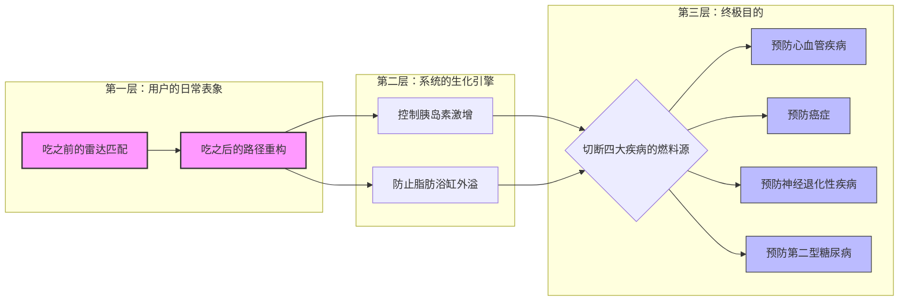

## 1.可能的未来表格
把这三个信号沿两个轴一拉,就出来四种**可能的未来**(轴 X:食物/身体数据是开放透明、还是被产业掌控;轴 Y:人终身依赖数据、还是数据把身体直觉养回来):

**①「毕业生」——透明 + 直觉养回(你的 preferable)** 数据标准化、可查询;个性化传感便宜;AI 是个**临时教练**,帮你把被超加工食品劫持的身体信号重新学回来,然后你**毕业、撤掉它**。两个透明都补上 → 错位被化解 → 你凭恢复的直觉、平静地按自己的目的吃。 支撑信号:Sunrise 2027(可查询)+ OTC CGM(短期校准)+ ZOE(个性化优于平均)。

**②「读数生活」——透明 + 终身依赖(最可能/probable)** 同样的基础设施,但 AI 永不离身,每一口都靠读数;方便,但身体的声音被永久外包。 支撑信号:CGM 作为永久订阅的 wellness 趋势 + 那条"数据焦虑"的阴影。

**③「黑箱投喂」——不透明 + 依赖(cautionary)** 数据存在,但握在食品工业/平台手里;"个性化"优化的是利润和黏性,不是你的好。你依赖一个把你推向"好卖的东西"的黑箱。你说的"食品工业是最大拦路虎"就活在这里。 支撑信号:GS 1 文档里 2D 码链接的信息是"品牌可控的";食物被排除在数据护照之外(产业没被强制开放)。

**④「玄学反扑」——不透明 + 反数据(另一种坏结局)** 人被数据焦虑/乱信息搞怕了(S 2"网上太乱我不想信"、S 3"我一点也不信数据"),干脆全盘拒绝数据,退回网红/直觉但没有真知识;社会审美扭曲(S 3"90 斤更好看")和误导继续,内耗照旧。 支撑信号:BBC 报道医生质疑血糖减肥风潮;社交比较式审美。

## 2.不同的饮食人群
享受型，生存性和 ED
**F 4** 同意出图——一张**受众地图**:三维度 = 食者类型(享乐/非享乐…)× 年龄段 × 地区(伦敦),在图上**标出目标段 + 排除临床 ED**。放 §13,§11 引用。〔图你来画,我可帮你定维度〕

冰山图——我的目的

![[Pasted image 20260603231658.png]] ![[Pasted image 20260603232008.png]]
这个图表应该是动态的智能图表。我们可以进行随意的添加和改动。当我们输入资料时，它就能够自动识别并将其添加在图表的对应位置。以及他会知道跟那些旧的资料之间的关系在哪里，他还会把自己的名字给自动缩减，找到最关键的部分。以及你觉得，这样的图需要具备哪些特点才能被称为“智能图表”呢？

第一层深思：什么是真正的“智能图表”？（需求与功能设计）

你提出的功能（随意改动、自动识别对应位置、理清旧资料关系、自动缩减提炼关键名）已经非常准确。在这个基础上，一个能被称为“设计未来（Design Futures）”级别的智能图表，还需要具备以下 **5 大核心特征（Features）**：

1. **语义缩放（Semantic Zooming - 你的缩减名字功能）：**
    - 当全局鸟瞰时，节点只显示“果糖危机”或“FDA 监管漏洞”；当用户点击放大时，它自动展开底层的专业数据（如“新生脂肪合成 DNL”、“GRAS 法案”）。
2. **因果链自适应（Auto-Causal Linking）：**
    - 当你输入一个新的阻力（如“食品巨头游说”），系统会自动生成红色虚线，连结到它造成的后果（如“政策延误”和“大众代谢异常”）。
3. **时间轴沙盘推演（Temporal Simulation）：**
    - 图表底部有一个时间滑块（2024 ➡️ 2050）。滑动时，图表上的“阻力节点”会随着政策和科技的介入逐渐变小，而“健康资产节点”会逐渐变大。
4. **利益相关者权重切换（Stakeholder Toggle）：**
    - 提供“动力（Drivers）”与“阻力（Barriers）”的视角切换。一键高亮显示哪些机构在作恶，哪些技术在救人。
5. **动态干预反馈（Intervention Feedback）：**
    - 允许用户在图表中拖入一个“设计解法”（比如你的 AR 营养透视 UI），系统能视觉化地展示它如何切断现有的恶性循环。