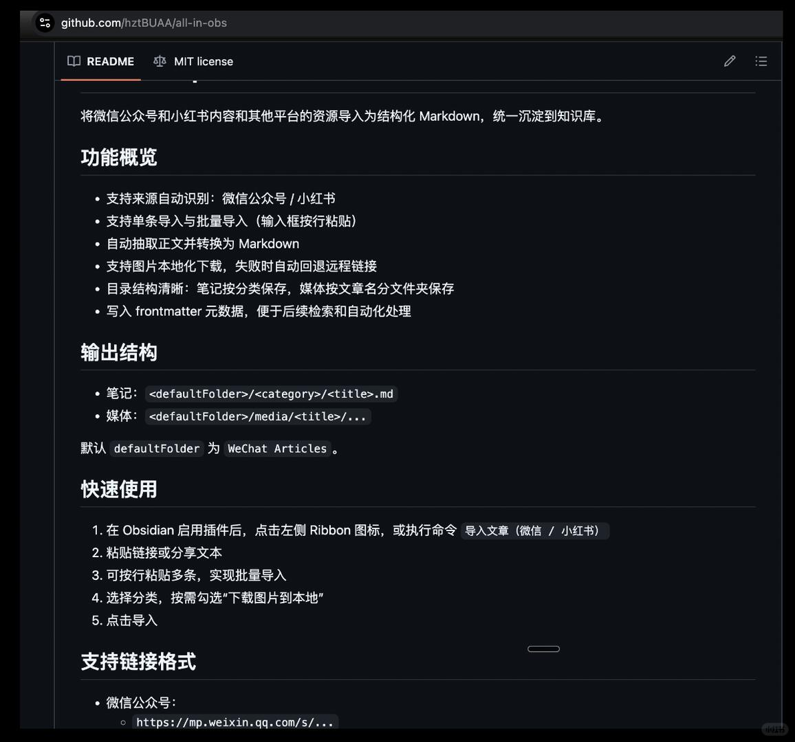
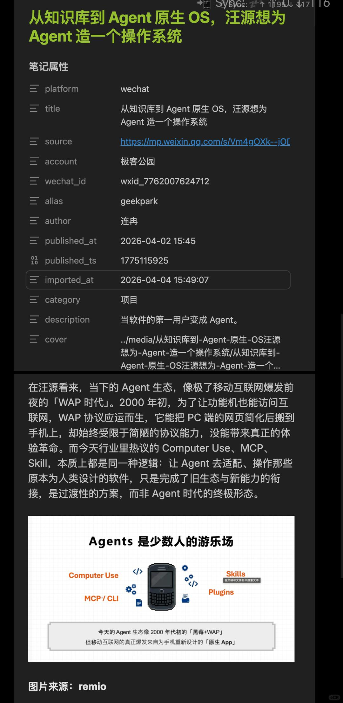

# 微信&#x2F;小红书内容一键变成个人知识库

过去我一直有个痛点：
微信文章、小红书笔记收藏一堆，真正复盘时根本找不到、也整理不动。  而我一直在使用obsidian来记录自己，也会让AI直接根据我的obsidian资料工作。而无论是cc还是codex，它们的web search大都会无法直接拿到微信公众号以及小红书的高品位文章，导致后续工作的质量也是大打折扣。
所以我自己做了一个 Obsidian 插件：all-in-obs。
现在只要粘贴链接（支持单条/按行批量），就能自动导入到 Obsidian：
- 自动识别来源：微信公众号 + 小红书
- 自动提取正文并转成可读 Markdown
- 图片默认下载到本地，并按“文章名”分文件夹管理（不再 media 平铺）
- 自动写 frontmatter（标题、来源、发布时间、分类等）
- 同名文件自动避让，不覆盖旧笔记
我现在的工作流是：
“看到好内容 -> 粘贴链接 -> 进 Obsidian 分类归档 -> 后续检索/写作直接复用”。
信息终于从“平台流量池”变成了“自己的知识资产”。
仓库已开源，正在走商店上架流程。
想使用的朋友可以先手动安装，欢迎提 issue/建议，我会持续迭代多平台导入能力和个人不断膨胀的需求。

