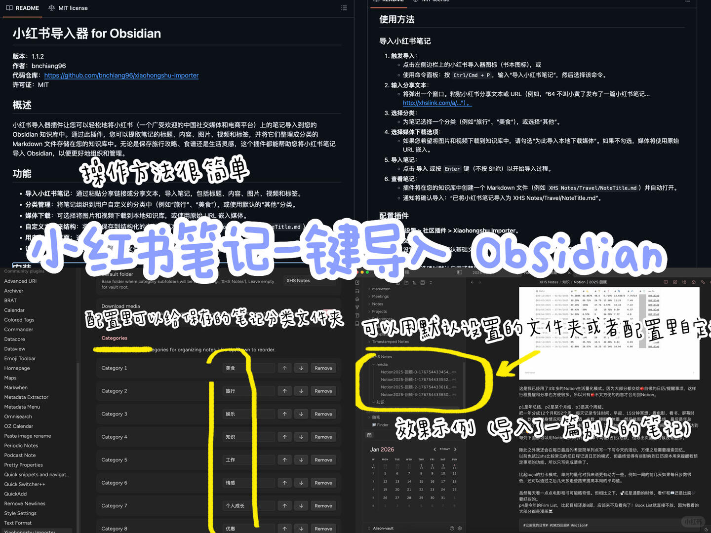
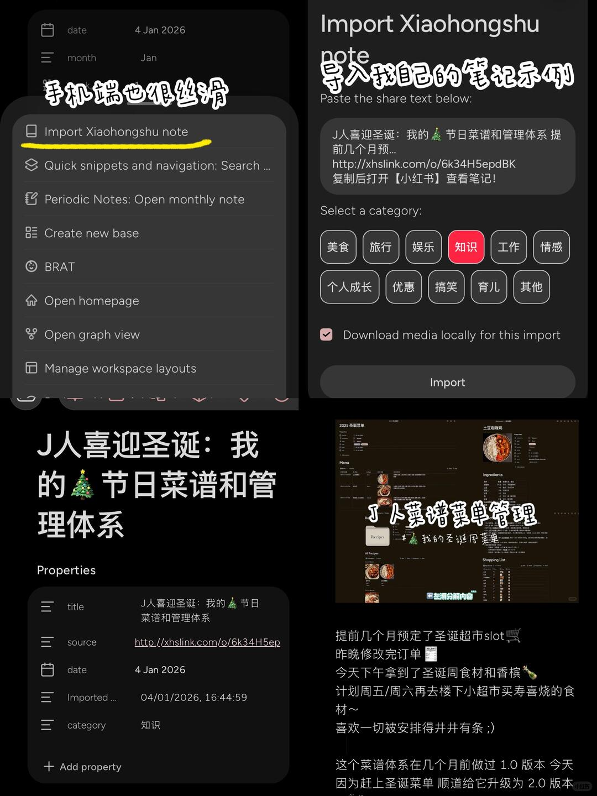

# 爱用分享：小红书图文笔记保存到Obsidian



今天逛论坛偶然发现的
试了一下效果很不错
当然可能图片不能保存为特别高清的 但图文保存效果很好
反正我是非常心水了🩷
配置非常简单 可以自定义收藏文件夹和子分类
每次只需要复制笔记链接 就能【一键导入】
💻和📱均可操作～（📱端方法见👆图2️⃣）
而且导入的图片会加上笔记名为前缀 这个太方便管理了！😭
	
markdown 格式的时代 保存到 Obsidian 的笔记 转存到哪里基本都没问题～

```
#Obsidian# #obsidian库# #Obsidian教程# #obsidian笔记# #Obsidian插件# #Obsidian技巧# #笔记软件# #效率软件# #知识管理# #个人知识库# #生产力工具# #技巧分享# #文件管理# #笔记管理# #效率神器# #学习工具# #数字生活# #学习党#
```



