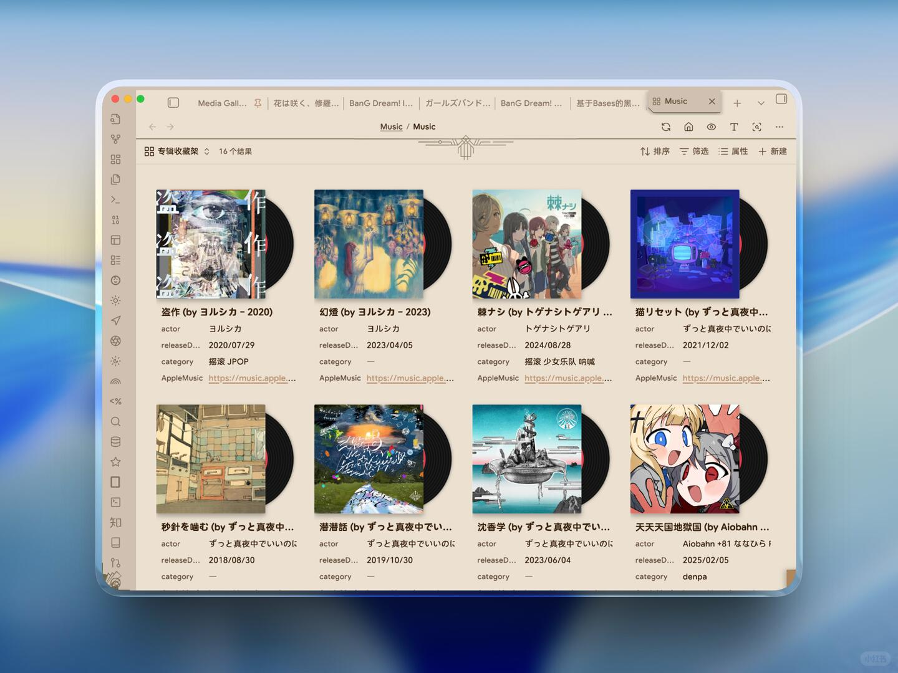
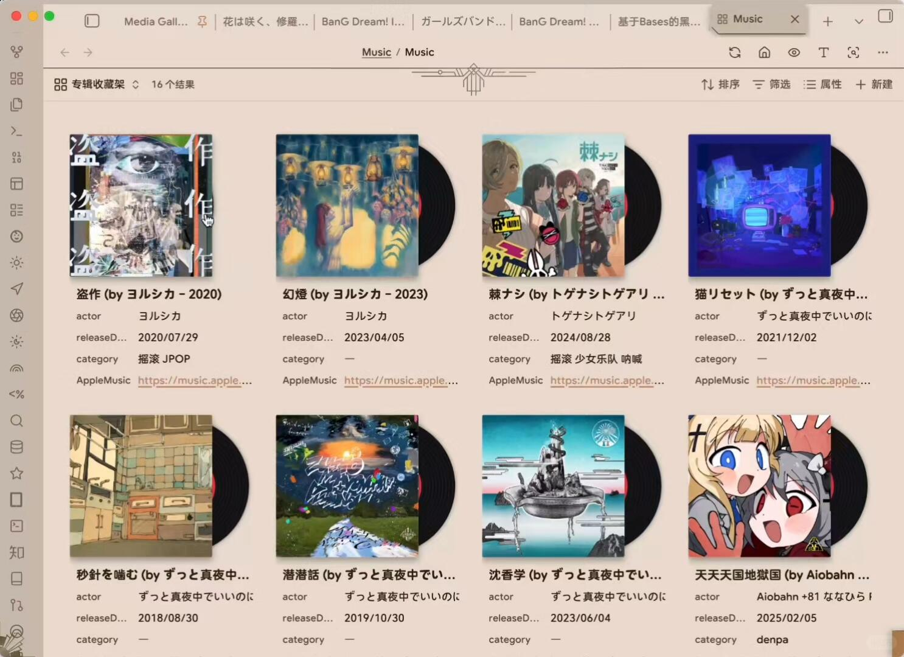
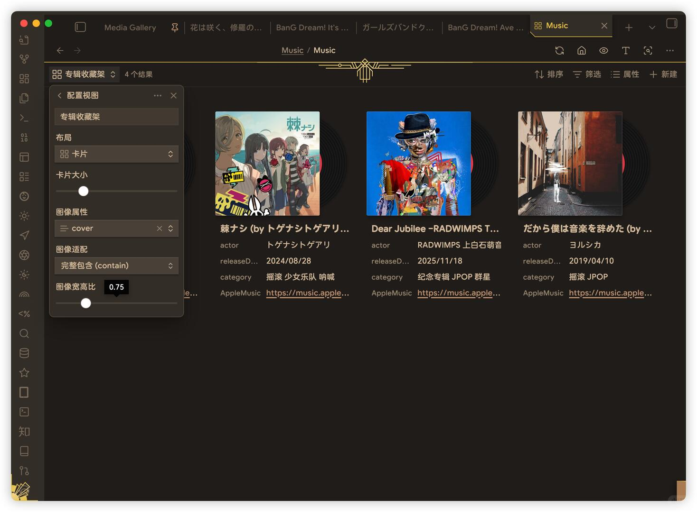
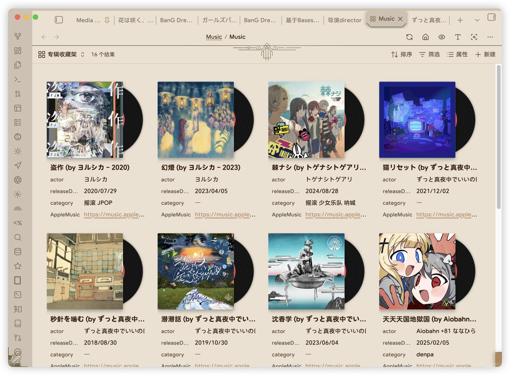
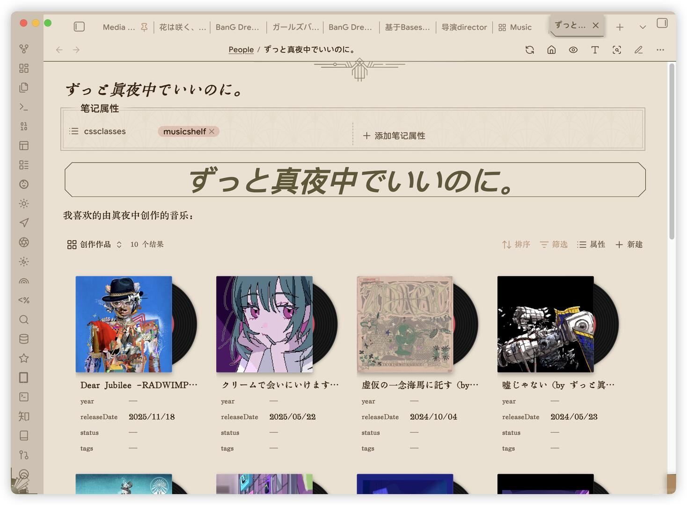

# 💿在Obsidian中打造一面自己的专辑墙！



🎵 最近完善了音乐专辑的导入工作流，粮仓库中收藏的精神食粮更加丰盛，但是 Bases 页面对专辑的展示又仅仅停留于专辑封面，视之颇为单调
📖 前段时间 Obsidian 的 CEO，Kepano，随手发布了一个 CSS 片段，可以将 Bases 卡片视图展示的图片美化为精装书封皮——那我也可以写一个将卡片视图变成专辑展示柜的片段
✍🏻 受此启发，借助 AI 的力量，我也整了一个 CSS 片段，可以为卡片视图的封面添上一张黑胶唱片
🤓 同时还有一个动效：鼠标指针悬浮在专辑上，唱片会丝滑地缩回去再滚回来(P2)
🦾 使用时注意需要结合将 cover 模式设置成 contain，宽高比（经我测试）使用 0.75 比较合适(P3)
💬 没想到发布到 Discord 后，Kepano 居然也给我点了 Star⭐(P4)
🔖 同时根据评论的提议，我还为片段优化了两种选择性应用模式：
📂 一种是通过文件名识别：如果 Bases 文件名包含 `Music`，则该 CSS 片段会对当前文件生效，反之不生效(P5)
📜 另一种是通过 `cssclasses`：如果 markdown 笔记的 `cssclasses` 属性包含了 `musicshelf` 字段，则该笔记中嵌入或写入的 Bases 也会应用黑胶唱片效果(P6)
😉 这次加入收藏专辑功能，粮仓库正在逐步完善中…

```
#Obsidian# #Bases# #数据库# #专辑收藏# #专辑墙# #黑胶唱片# #CSS# #音乐#
```







