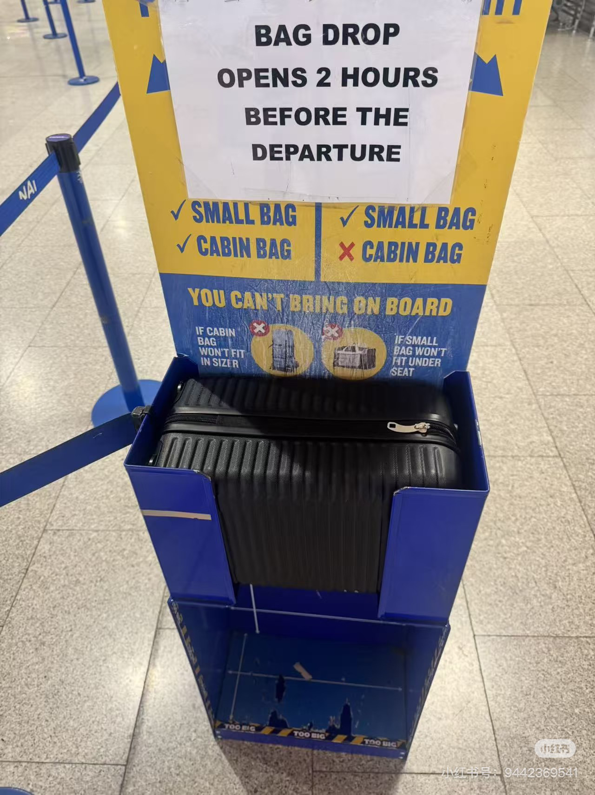

### 2026-03-30_紧急_4247去爱_MjI4ODk0MzYy.md
---
slug: MjI4ODk0MzYy
created_at: "2026-03-30 20:06:09"
updated_at: "2026-03-30 20:10:32"
tags: ["任务/紧急"]
source: "ios"
---

#任务/紧急

4.2—4.7去爱丁堡

湖区

---

### 2026-03-30_紧急_obclau_MjI4NzYzOTE0.md
---
slug: MjI4NzYzOTE0
created_at: "2026-03-30 03:50:06"
updated_at: "2026-03-30 03:50:07"
tags: ["任务/紧急"]
source: "ios"
---

#任务/紧急

ob+claude code

---

### 2026-03-30_紧急_你现在是你不_MjI4NzU5MTAx.md
---
slug: MjI4NzU5MTAx
created_at: "2026-03-30 01:34:56"
updated_at: "2026-03-31 06:40:21"
tags: ["任务/紧急"]
source: "ios"
---

#任务/紧急

你现在是你不会考虑说我每天吃的好不好，而是说就考虑我今天吃其实有没有吃多了，会不会会长胖营养方面的。就不会考虑就比如说不会考虑自己是否就是说缺乏某种维生素什么的。至少。这两三天我有单位。所以说你的目标其实是在维持你的体重，那你就说。但你觉得微信也不能说你现在的饮食会让你觉得难受吗？。反正意思是说现在就是你正常时就我吃饱了就停，然后就吃也不会长胖。那你就会刻意去控制，不是自己吃。吃东西进不健康吗？比如说你在外面吃，比如说我们偶尔会吃火锅什么的，这个你会对吃了以后你会感到愧疚会。那种的OK OK。那你一般自己做吗？。你一般去超市里面买更多的是什么？就是一些新鲜的水果蔬菜什么的，还是说偏零食或水果？。所以其实你对零食是没有的。那我觉得你这个营养方面的你还是刻在。有的。还是会一直自己住，觉得可能碳水吃多了会胖还是会抑制。稍微有一点点肿。谢谢。觉得他真的很好用。

---

### 2026-03-30_紧急_好的这是We_MjI4ODc4NjYy.md
---
slug: MjI4ODc4NjYy
created_at: "2026-03-30 18:04:47"
updated_at: "2026-04-01 21:20:53"
tags: ["任务/紧急"]
source: "web"
---

#任务/紧急

好的！这是 Weijie Li 的完整两天日程：

**DAY 1 — 3月30日（周一）**

时间地点内容10:00-11:00LT1Keynote: Multispecies Design Futures11:30-12:30**S236**Understanding power and privilege12:30-1:30—午饭 🍱1:30-2:30**S230**Speculative to post-speculative2:30-3:00—休息3:00-4:00LT1Keynote: Futures as a practice

**DAY 2 — 3月31日（周二）**

时间地点内容11:30-12:30**S236**Research methodologies for technology projects12:30-1:30—午饭 🍱1:30-2:30**S236**From making to knowing: prototyping3:00-4:00**S236**Keynote: Extrapolation and Speculation in the Archive4:00-5:00全体Closing Event: AI VS HUMANS 🎉

注意今天（30日）**你已经有10点的keynote了**，现在几点了？要出发了吗！

---

### 2026-03-30_紧急_我的快递怎么_MjI4OTA4NjI1.md
---
slug: MjI4OTA4NjI1
created_at: "2026-03-30 21:35:34"
updated_at: "2026-03-31 03:48:06"
tags: ["任务/紧急"]
source: "ios"
---

#任务/紧急

我的快递怎么样了

---

### 2026-03-30_紧急_淘宝找人办签_MjI4OTI1MDY0.md
---
slug: MjI4OTI1MDY0
created_at: "2026-03-30 23:02:39"
updated_at: "2026-03-31 04:11:48"
tags: ["任务/紧急"]
source: "web"
---

#任务/紧急

淘宝找人办签证什么的or只是slot

---

### 2026-03-30_紧急_看看roya_MjI4NzY2MDk5.md
---
slug: MjI4NzY2MDk5
created_at: "2026-03-30 05:36:24"
updated_at: "2026-03-31 04:12:03"
tags: ["任务/紧急"]
source: "ios"
---

#任务/紧急

看看royal albert的票

---

### 2026-03-30_紧急_给iq发邮件_MjI4ODU1Nzcx.md
---
slug: MjI4ODU1Nzcx
created_at: "2026-03-30 15:44:49"
updated_at: "2026-03-30 15:45:03"
tags: ["任务/紧急"]
source: "ios"
---

#任务/紧急

给iq发邮件晚点4月底五月交

以及问他有没有hsbc交款方式

或者去app看一眼

---

### 2026-03-31_手语_曾经不想和人_MjI5MDM5ODEy.md
---
slug: MjI5MDM5ODEy
created_at: "2026-03-31 15:56:15"
updated_at: "2026-03-31 15:56:17"
tags: ["想做的事/手语"]
source: "ios"
---

#想做的事/手语

曾经不想和人说话，学过一段手语

---

### 2026-03-31_紧急_claude_MjI4OTQ4MDc2.md
---
slug: MjI4OTQ4MDc2
created_at: "2026-03-31 04:12:11"
updated_at: "2026-04-01 21:20:44"
tags: ["任务/紧急"]
source: "ios"
---

#任务/紧急

claude会员

---

### 2026-03-31_紧急_httpsm_MjI5MTA3MTc1.md
---
slug: MjI5MTA3MTc1
created_at: "2026-03-31 22:48:20"
updated_at: "2026-03-31 22:48:26"
tags: ["任务/紧急"]
source: "ios"
---

#任务/紧急

https://mp.weixin.qq.com/s/5lAB7CPkX2FL6sH2W6H9wQ

盘一下Claude Code源码里的8个隐藏新功能。

今天的乐子事大家都知道了。

Claude Code的所有源码因为一个非常低级的问题泄露了，估计全世界产品的Agent框架都要起飞了，anthropics这次又以一己之力推动了全球AI圈的进步。

源码地址：https://github.com/instructkr/claude-code

我也不是啥开发，你让我盘源码盘架构我也盘不明白，但是，我对功能还是非常感兴趣的。

所以呢，借助AI还有身边的大佬，一起盘了下泄露的源码里面所有的隐藏的未上线的新功能，这块我觉得还是最有意思的，都给我盘兴奋了。

1. Buddy，你的AI宠物
源码里有一个叫BUDDY的功能，可以给你的Claude Code配一个宠物，它有18种物种可以选，有5个属性，甚至还有稀有度，普通60%到传说1%。

---

### 2026-03-31_紧急_httpsm_MjI5MTE3ODM4.md
---
slug: MjI5MTE3ODM4
created_at: "2026-03-31 23:47:04"
updated_at: "2026-03-31 23:47:06"
tags: ["任务/紧急"]
source: "ios"
---

#任务/紧急

https://mp.weixin.qq.com/s/9ejYjBP-hmmz6lliDbROjg

选择越多，行动力越低。

我们做交互设计的时候，也有过一个叫做7±2的信息块的原则，不能更多，再多的话，用户会认知过载，这时候大脑会宕机。

AI时代，就像给你的就是这种24种果酱的状态，你能做的事情太多了，多到你直接懵逼了，什么都不做了。

解决方法特别简单，是主动给自己加约束。

第一个，工具约束。比如这次只用一个工具。无论是Claude Code，或者Midjourney，或者Seedance 2.0，选一个就够了，别贪多。

第二个，时间约束。就一个下午或者一个晚上。绝对不能是一周，不是一个月，就今天下午，比如到晚饭前必须有一个能跑的东西。

第三个，范围约束。只做一个功能，解决一个问题。

---

### 2026-03-31_紧急_sains买_MjI5MTEwNDM5.md
---
slug: MjI5MTEwNDM5
created_at: "2026-03-31 23:05:13"
updated_at: "2026-04-02 04:09:45"
tags: ["任务/紧急"]
source: "ios"
---

#任务/紧急

sains买三文鱼还有滤水器

橘子

牛排

红薯

打扫卫生

挑选照片

研究claude

洗衣服

回信息

---

### 2026-03-31_紧急_不着急快递还_MjI4OTQ5MzUx.md
---
slug: MjI4OTQ5MzUx
created_at: "2026-03-31 05:21:07"
updated_at: "2026-04-01 21:20:45"
tags: ["任务/紧急"]
source: "ios"
---

#任务/紧急

不着急快递，还有个耳机盒

---

### 2026-03-31_紧急_快递价格有点_MjI5MTAyMjg0.md
---
slug: MjI5MTAyMjg0
created_at: "2026-03-31 22:25:17"
updated_at: "2026-04-01 21:20:41"
tags: ["任务/紧急"]
source: "ios"
---

#任务/紧急

快递价格有点问题

---

### 2026-03-31_紧急_扫描做过的那_MjI5MDg3MDMx.md
---
slug: MjI5MDg3MDMx
created_at: "2026-03-31 21:01:48"
updated_at: "2026-03-31 21:02:00"
tags: ["任务/紧急"]
source: "ios"
---

#任务/紧急

扫描做过的那些act的worksheet

那些事irp的appendix

---

### 2026-03-31_紧急_看我的快递_MjI5MDgwNzYy.md
---
slug: MjI5MDgwNzYy
created_at: "2026-03-31 20:22:48"
updated_at: "2026-04-01 21:20:40"
tags: ["任务/紧急"]
source: "ios"
---

#任务/紧急

看我的快递

---

### 2026-03-31_紧急_购买brit_MjI4OTQ2NzU5.md
---
slug: MjI4OTQ2NzU5
created_at: "2026-03-31 03:10:26"
updated_at: "2026-04-01 21:20:48"
tags: ["任务/紧急"]
source: "ios"
---

#任务/紧急

购买brita水壶

看看sains有没有

---

### 2026-04-01_紧急_吃饭洗澡打印_MjI5MjIwNzA2.md
---
slug: MjI5MjIwNzA2
created_at: "2026-04-01 15:35:52"
updated_at: "2026-04-01 21:20:13"
tags: ["任务/紧急"]
source: "ios"
---

#任务/紧急

吃饭

洗澡

打印

存钱

看快递

---

### 2026-04-01_紧急_打印明天讲的_MjI5MTM0OTcx.md
---
slug: MjI5MTM0OTcx
created_at: "2026-04-01 05:20:40"
updated_at: "2026-04-01 21:20:16"
tags: ["任务/紧急"]
source: "ios"
---

#任务/紧急 打印明天讲的内容

---

### 2026-04-01_紧急_烤牛排蒸红薯_MjI5MjU5MzMy.md
---
slug: MjI5MjU5MzMy
created_at: "2026-04-01 19:48:57"
updated_at: "2026-04-01 21:20:12"
tags: ["任务/紧急"]
source: "ios"
---

#任务/紧急

烤牛排

蒸红薯

买东西

煮生菜

---

### 2026-04-01_紧急_看柑橘味的香_MjI5MjgyMDc1.md
---
slug: MjI5MjgyMDc1
created_at: "2026-04-01 22:15:33"
updated_at: "2026-04-01 22:15:34"
tags: ["任务/紧急"]
source: "ios"
---

#任务/紧急

看柑橘味的香气

---

### 2026-04-02_紧急_claude_MjI5NDUxNTc5.md
---
slug: MjI5NDUxNTc5
created_at: "2026-04-02 19:21:18"
updated_at: "2026-04-02 19:21:20"
tags: ["任务/紧急"]
source: "ios"
---

#任务/紧急

claude和notion写作库结合

---

### 2026-04-02_紧急_一天两练的可_MjI5NDQ4NTMz.md
---
slug: MjI5NDQ4NTMz
created_at: "2026-04-02 19:00:51"
updated_at: "2026-04-02 19:00:52"
tags: ["任务/紧急"]
source: "ios"
---

#任务/紧急

一天两练的可行性

---

### 2026-04-02_紧急_严格的训练计_MjI5NDQwODk2.md
---
slug: MjI5NDQwODk2
created_at: "2026-04-02 18:07:46"
updated_at: "2026-04-02 18:07:47"
tags: ["任务/紧急"]
source: "ios"
---

#任务/紧急

严格的训练计划

严格的多套歌单

---

### 2026-04-02_紧急_买两把锁锁柜_MjI5NDM0NDUw.md
---
slug: MjI5NDM0NDUw
created_at: "2026-04-02 17:42:08"
updated_at: "2026-04-02 17:42:11"
tags: ["任务/紧急"]
source: "ios"
---

#任务/紧急

买两把锁锁柜子

---

### 2026-04-02_紧急_买锁纹身贴v_MjI5NDM4Njgw.md
---
slug: MjI5NDM4Njgw
created_at: "2026-04-02 17:59:30"
updated_at: "2026-04-02 17:59:31"
tags: ["任务/紧急"]
source: "ios"
---

#任务/紧急

买锁

纹身贴

valen带回来

---

### 2026-04-02_紧急_你的小红书收_MjI5NDE3NjQy.md
---
slug: MjI5NDE3NjQy
created_at: "2026-04-02 16:27:24"
updated_at: "2026-04-02 16:27:26"
tags: ["任务/紧急"]
source: "ios"
---

#任务/紧急

🔧 你的小红书收藏夹在吃灰吗？ 💫 经常刷到好内容，... http://xhslink.com/o/6TLDZguFbd

复制后打开【小红书】查看笔记！

---

### 2026-04-02_紧急_健身包_MjI5NDQ0NTAz.md
---
slug: MjI5NDQ0NTAz
created_at: "2026-04-02 18:33:11"
updated_at: "2026-04-02 18:33:12"
tags: ["任务/紧急"]
source: "ios"
---

#任务/紧急

健身包

---

### 2026-04-02_紧急_拼卡_MjI5NDQzMzgz.md
---
slug: MjI5NDQzMzgz
created_at: "2026-04-02 18:25:35"
updated_at: "2026-04-02 18:25:36"
tags: ["任务/紧急"]
source: "ios"
---

#任务/紧急

拼卡

---

### 2026-04-02_紧急_楼下有黑咖啡_MjI5MzEyMDk0.md
---
slug: MjI5MzEyMDk0
created_at: "2026-04-02 02:34:33"
updated_at: "2026-04-02 02:34:34"
tags: ["任务/紧急"]
source: "ios"
---

#任务/紧急

楼下有黑咖啡

---

### 2026-04-02_紧急_重新分配药剂_MjI5NDQzODc2.md
---
slug: MjI5NDQzODc2
created_at: "2026-04-02 18:28:48"
updated_at: "2026-04-02 18:28:49"
tags: ["任务/紧急"]
source: "ios"
---

#任务/紧急

重新分配药剂

---

### 2026-04-02_紧急_音乐会捞人健_MjI5NDEwNjEw.md
---
slug: MjI5NDEwNjEw
created_at: "2026-04-02 15:46:58"
updated_at: "2026-04-02 15:47:20"
tags: ["任务/紧急"]
source: "ios"
---

#任务/紧急

音乐会捞人

健身

收拾屋子

看照片

Claude

irp

和奶奶打电话

---

### 2026-04-03_紧急_刮胡刀刮私密_MjI5NjEzNTU3.md
---
slug: MjI5NjEzNTU3
created_at: "2026-04-03 15:54:03"
updated_at: "2026-04-03 15:57:54"
tags: ["任务/紧急"]
source: "ios"
---

#任务/紧急

刮胡刀刮私密

健身

选照片

玩claude

irp

---

### 2026-04-03_紧急_好给你说清楚_MjI5NjQyMjM4.md
---
slug: MjI5NjQyMjM4
created_at: "2026-04-03 19:06:18"
updated_at: "2026-04-03 19:06:19"
tags: ["任务/紧急"]
source: "ios"
---

#任务/紧急

好，给你说清楚。

Ideal Home Show 是什么

英国历史最悠久、规模最大的家居展览，从1908年办到现在，每年吸引超过16万名观众 。

说白了就是——英国人装修房子、买家居产品、了解生活方式趋势的年度盛会。不是行业B2B展，是面向普通消费者的，任何人买票都能进。

里面有什么

600多个品牌参展，分九大区域：Interiors（室内设计）、Home Renovation（装修）、Gardens（花园）、Beauty & Wellbeing（美容健康）、Home Accessories（家居配件）、Spring Clean & Lifestyle（生活方式）、Eat & Drink Festival（饮食）等

你最该逛的区域是 Beauty & Wellbeing 和 Home Accessories——这两块是健康疗愈类产品最集中的地方。

在哪里、怎么去

地点就是上面地图的 Olympia London，Hammersmith Road W14 8UX

地铁坐到 Kensington Olympia站，出来走2分钟就到了。

实际情况

∙  时间：现在到4月19日，每天都能去

∙  票价：工作日约£15，周末约£20，官网买

∙  语言压力：几乎为零——你只需要看产品、拍照，不需要开口说话

∙  带上1688 App，看到感兴趣的东西就搜图

这是你目前最低门槛、最直接能做的市场调研。今天买票，明天就去。

---

### 2026-04-03_紧急_洗衣机20和_MjI5NDk5Mjc5.md
---
slug: MjI5NDk5Mjc5
created_at: "2026-04-03 00:00:16"
updated_at: "2026-04-03 02:08:03"
tags: ["任务/紧急"]
source: "ios"
---

#任务/紧急

洗衣机20和15

---

### 2026-04-03_紧急_现在就能去I_MjI5NjQxOTQx.md
---
slug: MjI5NjQxOTQx
created_at: "2026-04-03 19:03:44"
updated_at: "2026-04-03 19:03:45"
tags: ["任务/紧急"]
source: "ios"
---

#任务/紧急

바로 지금 갈 수 있는 게 있어.

🎯 现在就能去

Ideal Home Show 2026

∙  📅 4月10日–19日，Olympia London，工作日10am–5pm，周末10am–6pm

∙  📍 Hammersmith Road W14 8UX（地铁Kensington Olympia站）

∙  💷 票价约£15–20，网上买更便宜

为什么你要去：

超过600个品牌参展，涵盖Beauty & Wellbeing、Home Accessories、家居装饰等九大品类 ——正好是你要找产品的方向。

去了之后做一件事：

手机下载1688 App，看到任何感兴趣的产品，直接拍照搜图，5秒知道中国有没有在做、价格多少。

记录下来三类产品：

- 看起来简单但卖得很贵的
- 健康/情绪/疗愈相关的
- 设计感强但你觉得中国能做的

今天还有票，明天就能去。

---

### 2026-04-04_紧急_人间烟火_MjI5Nzk3Mzcx.md
---
slug: MjI5Nzk3Mzcx
created_at: "2026-04-04 21:01:58"
updated_at: "2026-04-04 21:01:59"
tags: ["任务/紧急"]
source: "ios"
---

#任务/紧急

人间烟火

---

### 2026-04-04_紧急_健身包腰带弹_MjI5ODA3NTYx.md
---
slug: MjI5ODA3NTYx
created_at: "2026-04-04 22:14:03"
updated_at: "2026-04-05 21:13:18"
tags: ["任务/紧急"]
source: "ios"
---

#任务/紧急

健身包

腰带

弹力带

练臀脚套

纹身贴

---

### 2026-04-04_紧急_冷笑话学英语_MjI5NzAwMDYw.md
---
slug: MjI5NzAwMDYw
created_at: "2026-04-04 06:32:54"
updated_at: "2026-04-04 06:33:05"
tags: ["任务/紧急"]
source: "ios"
---

#任务/紧急

冷笑话学英语

这个方法我觉得是可行的！让我给你设计一个计划。

核心思路

把3500个高考词汇分成小组，每组10-15个词，我来把这些词自然地编进冷笑话故事里。你不需要刻意背，只需要轻松读完，留下印象。

计划框架

第一步：分批处理词汇

把3500词按主题分组，比如”人物与情感”、“自然与环境”、“学校与学习”等，每天一个主题，10-15个词。

第二步：每天的学习流程

∙ 早上5分钟：读当天的冷笑话（我来写）

∙ 读完后不用刻意复习，正常过日子

∙ 晚上2分钟：回想今天笑话里你还记得的词

第三步：遇到不认识的词不要停

读笑话时遇到不懂的词就继续读，靠上下文猜意思，这本身就是训练。

第四步：每周小回顾

每周五我给你出5道小题，都是本周笑话里出现过的词，检验一下哪些真的留下印象了。

时间预估

每天10-15个词，一年内可以覆盖全部3500词。但其实3个月就能覆盖最核心的1000个高频词。

明天要开始的话，你告诉我两件事就可以：

- 你现在英语大概什么水平？（初中/高中/备考阶段）
- 每天大概有多少时间？

我根据这个来调整笑话的难度和数量 😄

---

### 2026-04-04_紧急_树底下拉拉我_MjI5NzgxODI5.md
---
slug: MjI5NzgxODI5
created_at: "2026-04-04 18:56:28"
updated_at: "2026-04-04 18:56:30"
tags: ["任务/紧急"]
source: "ios"
---

#任务/紧急

树底下拉拉

（我就知道你会找到我的）

---

### 2026-04-04_紧急_毫无意义的工_MjI5Njk4ODU2.md
---
slug: MjI5Njk4ODU2
created_at: "2026-04-04 06:02:02"
updated_at: "2026-04-04 06:02:03"
tags: ["任务/紧急"]
source: "ios"
---

#任务/紧急

毫无意义的工作

---

### 2026-04-04_紧急_类似于平板a_MjI5Njk4MTc4.md
---
slug: MjI5Njk4MTc4
created_at: "2026-04-04 05:37:26"
updated_at: "2026-04-04 05:37:28"
tags: ["任务/紧急"]
source: "ios"
---

#任务/紧急

类似于平板ai教学画画一样来画画

---

### 2026-04-04_紧急_通过英语冷笑_MjI5Njk4MTcw.md
---
slug: MjI5Njk4MTcw
created_at: "2026-04-04 05:37:06"
updated_at: "2026-04-04 05:37:07"
tags: ["任务/紧急"]
source: "ios"
---

#任务/紧急

通过英语冷笑话学习英语

---

### 2026-04-05_紧急_吃饭红薯健身_MjI5OTIwMzMy.md
---
slug: MjI5OTIwMzMy
created_at: "2026-04-05 18:08:47"
updated_at: "2026-04-05 19:51:15"
tags: ["任务/紧急"]
source: "ios"
---

#任务/紧急

吃饭

红薯

健身

练腿，腰，腹部—谭缓存

买东西给姐妹，弹力带，练臀脚套，腰带

回信息

---

### 2026-04-05_紧急_周一存钱_MjI5ODUxMDc5.md
---
slug: MjI5ODUxMDc5
created_at: "2026-04-05 08:36:14"
updated_at: "2026-04-05 12:36:17"
tags: ["任务/紧急"]
source: "ios"
---

#任务/紧急

周一存钱

---

### 2026-04-05_紧急_咖啡因摄入量_MjI5OTM1NzEy.md
---
slug: MjI5OTM1NzEy
created_at: "2026-04-05 20:22:47"
updated_at: "2026-04-05 20:23:15"
tags: ["任务/紧急"]
source: "ios"
---

#任务/紧急

咖啡因摄入量

每次106mg

3次接满1.5l

---

### 2026-04-05_紧急_把我的每日怎_MjI5OTIzODUy.md
---
slug: MjI5OTIzODUy
created_at: "2026-04-05 18:40:51"
updated_at: "2026-04-05 18:41:01"
tags: ["任务/紧急"]
source: "ios"
---

#任务/紧急

把我的每日怎么吃的有个记录表给我整理出来，然后我每天都要进行一个记录和打勾，打印出来

---

### 2026-04-05_紧急_搞一个肌肉运_MjI5OTM2NzQw.md
---
slug: MjI5OTM2NzQw
created_at: "2026-04-05 20:30:52"
updated_at: "2026-04-05 20:30:54"
tags: ["任务/紧急"]
source: "ios"
---

#任务/紧急

搞一个肌肉运动解剖图再配上相关动作，以及最终效果

---

### 2026-04-05_紧急_明天存钱然后_MjI5OTM0NTky.md
---
slug: MjI5OTM0NTky
created_at: "2026-04-05 20:13:54"
updated_at: "2026-04-05 20:30:27"
tags: ["任务/紧急"]
source: "ios"
---

#任务/紧急

明天存钱

然后 boots 买东西

复活节就是要复活

让 ai 安排任务

姐妹回来之前

安排好碳循环 健身事项

去看一下 pret 环境 车站旁边的

中午的改为带饭

---

### 2026-04-05_紧急_玩手机要么跑_MjI5OTM2OTY4.md
---
slug: MjI5OTM2OTY4
created_at: "2026-04-05 20:32:36"
updated_at: "2026-04-05 20:32:41"
tags: ["任务/紧急"]
source: "ios"
---

#任务/紧急

玩手机要么跑步机要么拉伸（房间）

---

### 2026-04-05_紧急_练腹和腰和屁_MjI5OTE2MjI3.md
---
slug: MjI5OTE2MjI3
created_at: "2026-04-05 17:35:33"
updated_at: "2026-04-05 17:35:33"
tags: ["任务/紧急"]
source: "ios"
---

#任务/紧急

练腹和腰和屁股

---

### 2026-04-06_紧急_2200必须_MjMwMTI2MTQ1.md
---
slug: MjMwMTI2MTQ1
created_at: "2026-04-06 23:51:20"
updated_at: "2026-04-06 23:51:24"
tags: ["任务/紧急"]
source: "ios"
---

#任务/紧急

22.00必须睡觉

---

### 2026-04-06_紧急_hsbc思考_MjMwMDk0MTM5.md
---
slug: MjMwMDk0MTM5
created_at: "2026-04-06 20:53:56"
updated_at: "2026-04-06 20:53:58"
tags: ["任务/紧急"]
source: "ios"
---

#任务/紧急

hsbc

思考要不要去健身

超市（先想好购买的物品，和口袋）

---

### 2026-04-06_紧急_买黑咖啡_MjMwMDUzMjc1.md
---
slug: MjMwMDUzMjc1
created_at: "2026-04-06 15:57:16"
updated_at: "2026-04-06 15:57:17"
tags: ["任务/紧急"]
source: "ios"
---

#任务/紧急

买黑咖啡

---

### 2026-04-06_紧急_如何剃私处毛_MjI5OTcyOTkw.md
---
slug: MjI5OTcyOTkw
created_at: "2026-04-06 00:36:37"
updated_at: "2026-04-06 00:36:38"
tags: ["任务/紧急"]
source: "ios"
---

#任务/紧急

如何剃私处毛

回复岛的提问

---

### 2026-04-06_紧急_妹妹的面试以_MjMwMDcxODYx.md
---
slug: MjMwMDcxODYx
created_at: "2026-04-06 18:10:26"
updated_at: "2026-04-06 18:10:28"
tags: ["任务/紧急"]
source: "web"
---

#任务/紧急

妹妹的面试，以及什么时候要

---

### 2026-04-06_紧急_明天存钱_MjI5OTc1NTY0.md
---
slug: MjI5OTc1NTY0
created_at: "2026-04-06 01:09:14"
updated_at: "2026-04-06 01:09:15"
tags: ["任务/紧急"]
source: "ios"
---

#任务/紧急

明天存钱

---

### 2026-04-06_紧急_更换滤芯_MjI5OTc2Mjk1.md
---
slug: MjI5OTc2Mjk1
created_at: "2026-04-06 01:20:15"
updated_at: "2026-04-06 01:20:16"
tags: ["任务/紧急"]
source: "ios"
---

#任务/紧急

更换滤芯

---

### 2026-04-06_紧急_每日健身_MjI5OTkxMzgy.md
---
slug: MjI5OTkxMzgy
created_at: "2026-04-06 07:54:22"
updated_at: "2026-04-06 07:54:24"
tags: ["任务/紧急"]
source: "web"
---

#任务/紧急

每日健身

---

### 2026-04-06_紧急_研究clau_MjI5OTc3Njc3.md
---
slug: MjI5OTc3Njc3
created_at: "2026-04-06 01:43:06"
updated_at: "2026-04-06 07:54:18"
tags: ["任务/紧急"]
source: "ios"
---

#任务/紧急

研究claude帮我打印

---

### 2026-04-06_紧急_这个时间点前_MjI5OTkxODc2.md
---
slug: MjI5OTkxODc2
created_at: "2026-04-06 07:59:32"
updated_at: "2026-04-06 07:59:39"
tags: ["任务/紧急","任务/紧急"]
source: "web"
---

#任务/紧急

这个时间点前的任务已经全部清洗完成

更新: 2026-03-27 00:39

#任务/紧急

苹果手环or watch

---

### 2026-04-07_紧急_ob的ilc_MjMwMjc5NTc1.md
---
slug: MjMwMjc5NTc1
created_at: "2026-04-07 20:54:19"
updated_at: "2026-04-07 20:54:21"
tags: ["任务/紧急"]
source: "web"
---

#任务/紧急

ob的ilcoud

【【双向连接

局部关系图

skill-每日日报同步到ob去

ob的可视化插件

---

### 2026-04-07_紧急_ob里面有很_MjMwMzA2OTk0.md
---
slug: MjMwMzA2OTk0
created_at: "2026-04-07 23:29:09"
updated_at: "2026-04-07 23:29:11"
tags: ["任务/紧急"]
source: "web"
---

#任务/紧急

ob里面有很多很有趣的那种插件，比如说如何学英语啊，还有各种各样的东西。

我觉得都很牛逼，我就可以在上面去实验一下。

---

### 2026-04-07_紧急_买一个便宜的_MjMwMTU2OTM0.md
---
slug: MjMwMTU2OTM0
created_at: "2026-04-07 08:18:38"
updated_at: "2026-04-07 08:18:50"
tags: ["任务/紧急"]
source: "ios"
---

#任务/紧急

买一个便宜的苹果手表或者手环

主要是测一下心率什么的就行，然后睡眠

---

### 2026-04-07_紧急_如何赚外快并_MjMwMTI5OTg4.md
---
slug: MjMwMTI5OTg4
created_at: "2026-04-07 00:19:12"
updated_at: "2026-04-07 00:19:23"
tags: ["任务/紧急"]
source: "ios"
---

#任务/紧急

如何赚外快并且学习

有什么接单网站吗

---

### 2026-04-07_紧急_每天工作把c_MjMwMTMxNDQ0.md
---
slug: MjMwMTMxNDQ0
created_at: "2026-04-07 00:31:16"
updated_at: "2026-04-07 00:31:17"
tags: ["任务/紧急"]
source: "ios"
---

#任务/紧急

每天工作把cowork玩到limit

---

### 2026-04-07_紧急_食谱碳循环动_MjMwMjQ1Njgw.md
---
slug: MjMwMjQ1Njgw
created_at: "2026-04-07 16:59:19"
updated_at: "2026-04-07 19:09:57"
tags: ["任务/紧急"]
source: "ios"
---

#任务/紧急

食谱（碳循环）

动作谱（一天两次，先早起or先一天两次）

boots购买（护肤，头发）

每日循环♻️（睡眠，任务管理，routine，电子邮件查看）——日报

p 一张图

irp详细分析

健身

---

### 2026-04-08_紧急_excali_MjMwMzIzMzk3.md
---
slug: MjMwMzIzMzk3
created_at: "2026-04-08 02:40:09"
updated_at: "2026-04-08 02:40:10"
tags: ["任务/紧急"]
source: "ios"
---

#任务/紧急

excalidraw

---

### 2026-04-08_紧急_我的拍立得_MjMwNDIzNzI0.md
---
slug: MjMwNDIzNzI0
created_at: "2026-04-08 16:17:54"
updated_at: "2026-04-08 16:19:54"
tags: ["任务/紧急"]
source: "ios"
---

#任务/紧急

我的拍立得

---

### 2026-04-08_紧急_有个没改的p_MjMwNDU0NDE2.md
---
slug: MjMwNDU0NDE2
created_at: "2026-04-08 19:39:39"
updated_at: "2026-04-11 21:01:50"
tags: ["任务/紧急"]
source: "web"
---

#任务/紧急

有个没改的pstc

---

### 2026-04-08_紧急_诺兰奥德赛_MjMwMzE2Mzc5.md
---
slug: MjMwMzE2Mzc5
created_at: "2026-04-08 00:36:44"
updated_at: "2026-04-08 00:36:44"
tags: ["任务/紧急"]
source: "web"
---

#任务/紧急

诺兰——奥德赛

---

### 2026-04-09_紧急_向右R跟开发_MjMwNTAzMjIz.md
---
slug: MjMwNTAzMjIz
created_at: "2026-04-09 00:36:35"
updated_at: "2026-04-11 21:01:49"
tags: ["任务/紧急"]
source: "ios"
---

#任务/紧急

[向右R]跟开发者要了码: lessnoise

可以白嫖兑换？

aihaoji.com

---

### 2026-04-10_紧急_中国银行卡冲_MjMwNzU2ODc3.md
---
slug: MjMwNzU2ODc3
created_at: "2026-04-10 13:12:57"
updated_at: "2026-04-11 21:01:46"
tags: ["任务/紧急"]
source: "ios"
---

#任务/紧急

中国银行卡冲销了多少次

---

### 2026-04-10_紧急_了解外贸全流_MjMwNjkxMzMx.md
---
slug: MjMwNjkxMzMx
created_at: "2026-04-10 02:22:13"
updated_at: "2026-04-11 21:01:48"
tags: ["任务/紧急"]
source: "ios"
---

#任务/紧急

了解外贸全流程

---

### 2026-04-10_紧急_了解外贸全流_MjMwNjkxMzMy.md
---
slug: MjMwNjkxMzMy
created_at: "2026-04-10 02:22:13"
updated_at: "2026-04-11 21:01:49"
tags: ["任务/紧急"]
source: "ios"
---

#任务/紧急

了解外贸全流程

---

### 2026-04-10_紧急_他们会查酒店_MjMwNjkyOTQ0.md
---
slug: MjMwNjkyOTQ0
created_at: "2026-04-10 03:14:19"
updated_at: "2026-04-11 21:01:48"
tags: ["任务/紧急"]
source: "ios"
---

#任务/紧急

他们会查酒店吗

我可以买了以后就退了吗

---

### 2026-04-10_紧急_南法和南意的_MjMwNzc4NTEw.md
---
slug: MjMwNzc4NTEw
created_at: "2026-04-10 15:34:44"
updated_at: "2026-04-11 21:01:45"
tags: ["任务/紧急"]
source: "ios"
---

#任务/紧急

南法和南意的书和电影

去那边转转

---

### 2026-04-10_紧急_哈喽宝们欢迎_MjMwNzk3Mzg4.md
---
slug: MjMwNzk3Mzg4
created_at: "2026-04-10 17:23:55"
updated_at: "2026-04-11 21:01:45"
tags: ["任务/紧急"]
source: "ios"
---

#任务/紧急

哈喽🍠宝们👋 欢迎大家加入咱们的交流群呀🥰

我是加宁，业余在写小红书，拉着我表妹@朱又炖AI 来帮忙。

给大家分享一波我和表妹自己手搓的AI学习资料，都是我们俩一点点做出来的干货👇

https://my.feishu.cn/drive/folder/HBGbfMTUqlkGKldQWRkcJcRjnOh

文件夹内容会不断更新哒！而且全部都是免费的，大家有需要直接戳链接自取就好～有什么想了解的，欢迎随时来找我们聊天、探讨、一起摸索🙌 互动多的宝们可以获得随机掉落的辅导答疑和小礼物哦🎁

---

### 2026-04-10_紧急_暂停实验室运_MjMwODA3Nzk4.md
---
slug: MjMwODA3Nzk4
created_at: "2026-04-10 18:19:29"
updated_at: "2026-04-11 21:01:44"
tags: ["任务/紧急"]
source: "ios"
---

#任务/紧急

暂停实验室？运作模式

---

### 2026-04-10_紧急_用AI频繁记_MjMwNzAzNjA4.md
---
slug: MjMwNzAzNjA4
created_at: "2026-04-10 07:40:50"
updated_at: "2026-04-10 07:40:51"
tags: ["任务/紧急","自我提升","个人成长","ai","改变生活方式","AI人工智能","效率","小红书年度诗篇","复盘","小红书科技AMA","AI工具"]
source: "ios"
---

#任务/紧急

用AI频繁记录自己，普通人成本最低改命方式 自从AI出... http://xhslink.com/o/67iMRb2mFSB

复制后打开【小红书】查看笔记！

自从AI出现以后，我开始用obsidian构建我的第二大脑。在AI时代频繁地记录自己可以构建自己的数字分身、保存属于自己的上下文，做自己的史官。

怎么记 语音记录【工具：闪电说、元宝“AI录音笔”功能】 提醒自动化【ios快捷指令、ai定时提醒、obsidian日记模版】

记什么 1. 记情绪-情绪急救包，CBT/情绪ABC/佛法哲学 具体提示词：【情绪陪伴助手 & 情绪观察周报生成要求-obsidian】

- 记决策-DRIFT模型 具体提示词：【决策记录助手+决策教练】
- 记灵感-种子 ➔ 展开 ➔ 验证 具体提示词：【灵感收集周报生成要求-obsidian】
- 记日记-obsidian自动版本，昨日睡眠，今日的精神状态，每天例行，喜欢的一句座右铭。提醒自己今天应该要聚焦的事情，今天有什么值得感恩和忏悔的事情，今天有学到和推进什么新的事情，以及明天有什么需要继续和可以自动化的部分 具体提示词：【数字分身采访官 & 日记模版-obsidian template】

避坑指南 减小摩擦拆解任务 让ai变犀利，拒绝讨好 行动起来！！！不吃灰（守仓）夹

#自我提升 #个人成长 #ai #改变生活方式 #AI人工智能 #效率 #小红书年度诗篇 #复盘 #小红书科技AMA #AI工具

哈，大家好，我是佳宁，我不知道有多少朋友和我一样经炒到博主分享说频繁的记录自己能够改名，但是迟迟没有开始动手，可能是因为太费时间，经常会忘记，也觉得没有什么好记的，记完了以后也不知道要怎么样去处理。但是今天这条视频我想要告诉大家，在AI时代，频繁的记录自己是一个你的B选项，也是普通人能够改命运的成本最低的方式。如果你是新手小白，刚看完我从0~1学习AI的视频，今天这条视频就可以帮助你快速的把AI真正意义上的融入到你的生活当中去。今天这条视频我会系统的分享如何用AI频繁的记录自己，包括为什么要记，怎么记，应该记一些什么，还有怎么样去避坑，怎么样更好的运用AI，包含大量干货以及相应的可以运用到的工具。大家都知道，我们之所有命运这么一说，是因为我们每个人其实都有自己独特的想法和性格，而这些想法和性格呢，会带来相应的行为和情绪，这些行为会产生一定的结果，这个结果我们把它称之为命运。所以某种程度上，当你的想法改变的时。

然后你的命运自然就会改变。那么为什么要高频的记录以及用AI去记录能够改命运？首先就是人不知道自己所不知道的东西，这个理论叫做乔哈里视窗，而AI刚好是这样的一个镜子，它无所不在，可以帮助你识别你的模式，看到你所不知道的东西。第二就是当你以年为单位去纠正自己行为的时候，其实很容易纠偏，但是如果你把一些小的事情、小的行为以非常短的时间，以天为单位去记录的时候，他就会更好的反馈。第三，也是大家耳熟能详做众所周知的显化效应，也就是我们人其实都是自我验证、自我实现的，当我们相信以及我们显化了我们自己能够成为什么样子的人的这种意向的时候，我们就会更容易成功。

第四，也是最最重要的，就在AI时代，很多AI你现在做一问一答的时候，他是不知道你是谁的，但是当你拥有了更多关于你自己的数据，你更多关你的信息的时候，AI就拥有了关于你的上下文，从而你就有机会形成你属于你自己的AI，建立你自己的数字分身，让这个数字分身帮你工作，甚至帮你去做很多其他的推演。第二点也是很多人会问的，就是我们到底应该去怎么样记录呢？那在AI时代，我自己觉得非常好用的一种方式就是语音记录，我自己在电脑上面会用的是这个APP，叫做闪电说，在手机上面我会用元宝的录音笔，大家只需要跟元宝说提取AI录音笔，它就会自动开始进行录音，这样做的好处呢，它会非常第一阻力的帮助你去输入，你也不用去管什么错别的字，乱七八糟的AI都会帮你去纠正。第二，很多人会忘记掉什么时候去记，这个时候我会建议大家建立一些到点的提醒，或者让记录这件事情变得非常的简单，比如说如果大家是苹果手机的话，IOS有一个提醒事项，像这个碎念整理，你自动的就可以把你的想法。

要记录下来，包括大家在手机上面有的一些APP，比如元宝啊，豆包，其实都可以非常简单的用语音的方式快速的记录你当天有的一些情绪和想法。第三，你记录完了以后，一定要用AI去帮你去做一个数据分析师去帮你分析，形成你自己的认知。飞轮整体来说我觉得把它称之为一个air系统，就你要让这个采集的过程变得非常的无痛，非常的自然流畅。第二，你希望AI能够给你提供一些深度的洞察和分析，最后你自己一定要付诸行动，这一步超级无敌重要化重点好了，讲完怎么记，为什么要记以后呢？也是最重要的就是到底记什么。在这里面我主要分享一些我自己的经历和实践，当然大家完全可以记一些自己想记的东西，我自己主要在记得几个点，第一个是记录情绪，我一般会把情绪和其他理性的行为分开来记，因为我记情绪的一个常见的需求就是我容易有一些突发的情绪，当这些突发情绪来的时候，我希望自己能够快速的平静下来，那么这个时候我往往会使用AI作为我的一个情绪急救包。这里我运用到的理论是CBT。

认知行为疗法、act、接纳与承诺疗法、情绪ABC，还有一些佛法里面的内容。整体来说呢，分为三步，先是让AI共请我，然后分析，最后整合行动。关于这一点，我写了一个非常详细的提示词，主要就是刚刚说的这些步骤，分析行动以及一些相应的理论，我都把它放进了这个提示词里面。第二个模块和第二类和第三类，我经常使用的记录就是决策和灵感，这两类主要是在公众场景中会比较多一些，生活场景中也有，而且主要是服务于我的数字分身的建立，以及我自己的一个认知飞轮的建立的。在决策方面，我推荐大家使用一个叫drift的模型，主要就是我要做什么决定，为什么倾向于做这个决定，我掌握了哪些信息，以及我会在这个信息里面有什么样的恐惧和幻想，以及这件事情、这个选择的代价和相应我要去承担的东西是什么，并且在每周结束以后，我会让AI给我形成一个决策周报。这个周报就是包含了一些我自己前。

给您设置好的一个框架，AI会自动的帮我去填入，我每周就可以直接去看这个决策周报，同样的在灵感层面，我也会用语音的方式在原报陈列，说各种方式随时随地无痛的输入给到AI，然后让AI帮我去做整体的分析，就像种下一颗种子一样，它会自动的去展开，并且可以尝试帮我去验证。那不管是模块三，模块二还是模块一，我都有一个相应的周报的提示词，大家使用任何的APP，不管是元宝、豆包还是GPT call扣，都可以运用我的这个提示词，包括已经设置好的这个skill，来让AI自动的给你生成这个相应的周报，帮助你分析。这三个主要是我的一个日常的碎片化的记录。那我平常还会每天在晚上的时候坐下来，在电脑前用电脑做一个日记的记录，之所以会这样，是因为我觉得自己白天用脑用的非常的多，我不知道大家有没有这种感觉，有了AI以后，信息量变得非常的大，大脑的前额叶和整个交感神经都非常的活跃。所以我希望在晚上的时候够让。

自己静下来记日记就是一个特别好的能够让自己静下来的这个习惯。我的日记主要会在obc店里面去进行一个记录，它是一个本地的知识库，我在我其他的笔记里面也有分享过，后面可能也会跟大家更多的去分享这个OPC店的使用的情况。我在里面有一个模板，我每天点一下，它就会自动的产生。这个模板包含了我的睡眠，我每天希望自己去培养的一些习惯，我今天要聚焦的一件最重要的事情，我可能今天有的需要感恩和忏悔的地方，我今天学到了什么，以及我明天需要做哪些准备。有了以上的四块内容，基本上大家每天可以收集到非常多有关自己的数据，我也给自己做了一个数字分身，这个分身就是基于这些数据以及一套相应的采访提示词，我会有一个这样的结构，基本上包含了我在数字世界里面可能会涉及到的一些决策所需要的数据。我现在已经有在用这个数字分身帮我写一些内容，包括帮我去做一些分享，也会用这些数字分身，甚至去做一些关于未来的推演。今天。

的时间有限，我可能不会在这儿展开，但是大家有了这些基础以后，就可以有更好的方式去实现自己数字的分身，如果有更多想要了解关于数字分身的话，大家也可以持时关注我，我后面会有时间的时候会分享这一块的内容。最后是一些关于AI记录使用的避坑，首先大家不用太多的去纠结排版逻辑，还有一些错别字什么的，这些AI都会帮你去整理，你完全不用去考虑这些。另外就是不要把AI简单的当成安慰剂，一定要尽可能的在看完以后就形成一些行动指南，或者直接去做起来，我基本上每一个提示词都会非常强化这一步。好了，以上就是我自己如何用AI频繁记录自己的实践，我也会后续跟大家分享更多如何把AI运用到我自己的生活，形成系统的一些方法论，如果有其他你想要看的内容的话，欢迎给我留言。

---

### 2026-04-10_紧急_签证汇丰存钱_MjMwNzAzOTA5.md
---
slug: MjMwNzAzOTA5
created_at: "2026-04-10 07:43:59"
updated_at: "2026-04-11 21:01:46"
tags: ["任务/紧急"]
source: "ios"
---

#任务/紧急

签证

汇丰存钱

iq交钱

boots

电脑💻咖啡店日常安排（靠焦点那边）

写作业

搞ob

---

### 2026-04-10_紧急_记得退票退房_MjMwNzAzNzE2.md
---
slug: MjMwNzAzNzE2
created_at: "2026-04-10 07:42:02"
updated_at: "2026-04-11 21:01:47"
tags: ["任务/紧急"]
source: "ios"
---

#任务/紧急

记得退票，退房，可以退一半吗

保险不退

---

### 2026-04-11_紧急_1看展2激活_MjMxMDEzNjAw.md
---
slug: MjMxMDEzNjAw
created_at: "2026-04-11 23:29:28"
updated_at: "2026-04-11 23:29:29"
tags: ["任务/紧急"]
source: "ios"
---

#任务/紧急

1.看展

2.激活学生卡

3.买菜

---

### 2026-04-11_紧急_怎么把公众号_MjMwOTYyNzUx.md
---
slug: MjMwOTYyNzUx
created_at: "2026-04-11 18:18:54"
updated_at: "2026-04-11 21:01:41"
tags: ["任务/紧急"]
source: "ios"
---

#任务/紧急

怎么把公众号文章发给Ob呢？

---

### 2026-04-11_紧急_我突然意识到_MjMwOTUzNjMy.md
---
slug: MjMwOTUzNjMy
created_at: "2026-04-11 17:10:51"
updated_at: "2026-04-11 21:01:43"
tags: ["任务/紧急"]
source: "ios"
---

#任务/紧急

我突然意识到吕冰儿的课题是关于AI选择和我们的直觉选择，但是我觉得其实他在往下面真挖一层，应该是他的建议和我们的内心的声音才是他的课题，这个AI的时代，他能建议变多了

其实理智上就是实际上来讲的话，就是说AI就是跟他人没有什么太大的区别，跟他人的建议他可能比大部分人人的建议更好，因为他有很多的模型什么的，但是他可能也跟很多人建议不太好的原因是因为他的建议可能是有很深很实际的实际案例出发的

---

### 2026-04-11_紧急_晚上看打印的_MjMwOTYyNzQ4.md
---
slug: MjMwOTYyNzQ4
created_at: "2026-04-11 18:17:30"
updated_at: "2026-04-11 21:01:42"
tags: ["任务/紧急"]
source: "ios"
---

#任务/紧急

晚上看打印的纸质书

怎么才能不用手机但是有音乐？

用ipad？

回家以后把手机放在一个隐蔽的角落充电

不允许看小说

---

### 2026-04-11_紧急_最重要的任务_MjMwOTY5MjE3.md
---
slug: MjMwOTY5MjE3
created_at: "2026-04-11 19:13:09"
updated_at: "2026-04-11 21:01:40"
tags: ["任务/紧急"]
source: "ios"
---

#任务/紧急

最重要的任务：研究决策，选择，容错率，复利，最优解（保持怀疑），不要过多的选择上，去给妹妹写一封信

---

### 2026-04-11_紧急_煮鸡蛋播客h_MjMwOTQ3NTM1.md
---
slug: MjMwOTQ3NTM1
created_at: "2026-04-11 16:28:25"
updated_at: "2026-04-11 21:01:43"
tags: ["任务/紧急"]
source: "ios"
---

#任务/紧急

煮鸡蛋🥚

播客

hsbc

我的饮食表

我的健身表（谭成义）

关于选择的skill

张雪峰skill

女娲skill

如何记录睡眠（时间）

网络购买boots

完成邮件设置

写明信片

每日早上的阅读栏目计划

完成任务安排周报

补交的作业（tutor skill）

irp （tutor skill）

昨天的安排的任务

去看展

去拿boots

吃饭

健身

睡觉💤

---

### 2026-04-11_紧急_相册云盘感想_MjMwOTU5ODk5.md
---
slug: MjMwOTU5ODk5
created_at: "2026-04-11 17:56:38"
updated_at: "2026-04-11 21:01:42"
tags: ["任务/紧急"]
source: "ios"
---

#任务/紧急

相册云盘感想，小说摘录

---

### 2026-04-11_紧急_给妹妹写一封_MjMwOTY3ODYz.md
---
slug: MjMwOTY3ODYz
created_at: "2026-04-11 19:01:50"
updated_at: "2026-04-11 21:01:39"
tags: ["任务/紧急"]
source: "ios"
---

#任务/紧急

给妹妹写一封信

---

### 2026-04-11_紧急_网上买boo_MjMwODY0NDUy.md
---
slug: MjMwODY0NDUy
created_at: "2026-04-11 01:15:54"
updated_at: "2026-04-11 21:01:44"
tags: ["任务/紧急"]
source: "ios"
---

#任务/紧急

网上买 boots 优惠更多

然后去自提就好

---

### 2026-04-11_紧急_长期主义和复_MjMwOTY3MzAz.md
---
slug: MjMwOTY3MzAz
created_at: "2026-04-11 18:56:33"
updated_at: "2026-04-11 21:01:40"
tags: ["任务/紧急"]
source: "ios"
---

#任务/紧急

长期主义和复利主义做选择

---

### 2026-04-11_紧急_限制每个任务_MjMwOTY2MzQx.md
---
slug: MjMwOTY2MzQx
created_at: "2026-04-11 18:48:23"
updated_at: "2026-04-11 21:01:41"
tags: ["任务/紧急"]
source: "ios"
---

#任务/紧急

限制每个任务的时间

---

### 2026-04-12_紧急_不是给ai路_MjMxMTMyMzYw.md
---
slug: MjMxMTMyMzYw
created_at: "2026-04-12 19:03:40"
updated_at: "2026-04-12 19:03:42"
tags: ["任务/紧急"]
source: "web"
---

#任务/紧急

不是给ai路径，而是确定ai的边界

长的SOP，你会发现，真正值钱的，其实就只剩这五个核心拷问：

它的绝对触发条件和绝对排斥条件分别是什么?

在业务层面上，做到哪一步才算拿到了最终的确定性结果?

它能调用的最小、无歧义工具集是什么？这些工具各自的雷区在哪?

遇到事实断层时，它必须去哪个指定的API核验？查不到时退路在哪？

整个流程中，哪个节点是必须物理阻断、等待入类介入确认的?

这五条不是让你照抄的句式，而是划定Agent活动范围的五道护栏。把这五件事想透彻了，比你写五十条操作路径要管用得多。

最后，再补一句

Workflow的任务，你当然可以把路彻底堵死。但既然你选择了开放式的Agent任务，就千万别再企图把

---

### 2026-04-12_紧急_出去旅游住的_MjMxMTMyNDA4.md
---
slug: MjMxMTMyNDA4
created_at: "2026-04-12 19:04:01"
updated_at: "2026-04-12 19:07:45"
tags: ["任务/紧急"]
source: "web"
---

#任务/紧急

出去旅游住的话可以考虑airbnb

尼斯的房间好贵啊

有没有其他地方便宜的

思考一下

以及意大利那边也是一样的

---

### 2026-04-12_紧急_臀推50kg_MjMxMDM1Nzc3.md
---
slug: MjMxMDM1Nzc3
created_at: "2026-04-12 04:36:44"
updated_at: "2026-04-12 04:36:47"
tags: ["任务/紧急"]
source: "ios"
---

#任务/紧急

臀推50kg

---

### 2026-04-14_紧急_打印那张像心_MjMxMzg2NDg1.md
---
slug: MjMxMzg2NDg1
created_at: "2026-04-14 04:27:06"
updated_at: "2026-04-14 04:27:07"
tags: ["任务/紧急"]
source: "ios"
---

#任务/紧急

打印那张像心电图一样的那个石榴

---

### 2026-04-15_紧急_hsbcgl_MjMxNjg5MTY4.md
---
slug: MjMxNjg5MTY4
created_at: "2026-04-15 18:57:13"
updated_at: "2026-04-15 18:57:13"
tags: ["任务/紧急"]
source: "web"
---

#任务/紧急

hsbc glaobal 有个流氓扣费被拒绝，因为我把卡冻住了，怎么解决

---

### 2026-04-15_紧急_健身看诺兰新_MjMxNzMyNDMz.md
---
slug: MjMxNzMyNDMz
created_at: "2026-04-15 23:29:22"
updated_at: "2026-04-15 23:29:23"
tags: ["任务/紧急"]
source: "ios"
---

#任务/紧急

健身

看诺兰新电影

---

### 2026-04-15_紧急_微信的龙虾插_MjMxNjc1NTE0.md
---
slug: MjMxNjc1NTE0
created_at: "2026-04-15 17:23:51"
updated_at: "2026-04-15 17:23:58"
tags: ["任务/紧急"]
source: "ios"
---

#任务/紧急

微信的龙虾插件，ob能用吗

---

### 2026-04-16_紧急_ob如何连接_MjMxNzUxNjU0.md
---
slug: MjMxNzUxNjU0
created_at: "2026-04-16 02:46:08"
updated_at: "2026-04-16 02:46:16"
tags: ["任务/紧急"]
source: "ios"
---

#任务/紧急

ob如何连接日历和每日任务

自动化

---

### 2026-04-16_紧急_买酱油和黑胡_MjMxOTM3NzQx.md
---
slug: MjMxOTM3NzQx
created_at: "2026-04-16 21:13:48"
updated_at: "2026-04-17 01:26:14"
tags: ["任务/紧急"]
source: "ios"
---

#任务/紧急

买酱油和黑胡椒

---

### 2026-04-16_紧急_传内容给一诺_MjMxNzY4NTEx.md
---
slug: MjMxNzY4NTEx
created_at: "2026-04-16 08:20:47"
updated_at: "2026-04-16 08:20:49"
tags: ["任务/紧急"]
source: "ios"
---

#任务/紧急

传内容给一诺

---

### 2026-04-16_紧急_哈喽宝们欢迎_MjMxNzk0NjQ3.md
---
slug: MjMxNzk0NjQ3
created_at: "2026-04-16 10:47:28"
updated_at: "2026-04-16 10:47:29"
tags: ["任务/紧急"]
source: "ios"
---

#任务/紧急

哈喽🍠宝们👋 欢迎大家加入咱们的交流群呀🥰

我是加宁，业余在写小红书，拉着我表妹@朱又炖AI 来帮忙。

给大家分享一波我和表妹自己手搓的AI学习资料，都是我们俩一点点做出来的干货👇

https://my.feishu.cn/drive/folder/HBGbfMTUqlkGKldQWRkcJcRjnOh

文件夹内容会不断更新哒！而且全部都是免费的，大家有需要直接戳链接自取就好～有什么想了解的，欢迎随时来找我们聊天、探讨、一起摸索🙌 互动多的宝们可以获得随机掉落的辅导答疑和小礼物哦🎁

---

### 2026-04-16_紧急_回去处理gy_MjMxNzQ0MjQx.md
---
slug: MjMxNzQ0MjQx
created_at: "2026-04-16 00:43:55"
updated_at: "2026-04-16 00:43:56"
tags: ["任务/紧急"]
source: "ios"
---

#任务/紧急

回去处理gym的扣费

---

### 2026-04-16_紧急_我写第一人称_MjMxNzcwNDQz.md
---
slug: MjMxNzcwNDQz
created_at: "2026-04-16 08:32:08"
updated_at: "2026-04-16 08:32:44"
tags: ["任务/紧急","想要做的"]
source: "ios"
---

#任务/紧急 #想要做的

我写第一人称视角在AI帮我撰写第三人称英雄剧本

---

### 2026-04-16_紧急_纸笔大疆_MjMxNzUzNjkw.md
---
slug: MjMxNzUzNjkw
created_at: "2026-04-16 04:05:56"
updated_at: "2026-04-16 04:05:57"
tags: ["任务/紧急"]
source: "ios"
---

#任务/紧急

纸笔大疆

---

### 2026-04-17_紧急_DPDUKP_MjMxOTQzNTM2.md
---
slug: MjMxOTQzNTM2
created_at: "2026-04-17 01:26:19"
updated_at: "2026-04-17 04:22:41"
tags: ["任务/紧急"]
source: "ios"
---

#任务/紧急

DPD (UK) Parcel Delivery Exception

At 09:15 am, courier Amelia Shaw (ID: 482159) was unable to complete delivery, as there was no authorised person available to accept the parcel at the address. The parcel has been returned to the local depot and remains on hold awaiting your direction.

To avoid any disruption to receiving your parcel, please visit our website to reschedule delivery within 24 hours.

https://dpd.kelvexor.cfd/com

(Reply with “Y”, then close the SMS and reopen it to activate the link. If the link still does not work, please copy it and paste it directly into Safari.)

The parcel is now being held pending updated delivery instructions.

Available options include:

• selecting a different delivery date or time

• redirecting the parcel to a nearby collection point

Important: The parcel will be held until 19 April. If no arrangements are made before this date, it may be sent back to the sender.

---

### 2026-04-17_紧急_thevgy_MjMyMDY0NDk2.md
---
slug: MjMyMDY0NDk2
created_at: "2026-04-17 17:03:15"
updated_at: "2026-04-17 19:09:45"
tags: ["任务/紧急"]
source: "ios"
---

#任务/紧急

thevgym group 退钱

---

### 2026-04-17_紧急_如果gymg_MjMyMTAyMTE3.md
---
slug: MjMyMTAyMTE3
created_at: "2026-04-17 23:31:52"
updated_at: "2026-04-17 23:31:59"
tags: ["任务/紧急"]
source: "web"
---

#任务/紧急

如果gymgroup还不还钱，就找银行

---

### 2026-04-17_紧急_拿快递2妹妹_MjMxOTQ2MDI1.md
---
slug: MjMxOTQ2MDI1
created_at: "2026-04-17 06:01:08"
updated_at: "2026-04-17 16:35:05"
tags: ["任务/紧急"]
source: "ios"
---

#任务/紧急

拿快递

2.妹妹的翻译

1.照片

2.作业

---

### 2026-04-18_紧急_当然有些人天_MjMyMjMwMTYy.md
---
slug: MjMyMjMwMTYy
created_at: "2026-04-18 21:11:56"
updated_at: "2026-04-18 21:11:58"
tags: ["任务/紧急"]
source: "ios"
---

#任务/紧急

当然有些人天生喜欢教书育人，

喜欢看着学生成长，那是一种很好的选择。

但对于像我们这种，

骨子里就有很强创造欲和野心的人来说，

把一辈子花在“让别人变好”上面，

内心是会拧巴到窒息的。

**

所以搞清楚自己厌恶什么、真正渴望什么，是一件极其重要的事。只有想透了这个问题，才不会在一条拧巴的路上耗完自己的一生。**

---

### 2026-04-18_紧急_我目前还需要_MjMyMjU1NTIy.md
---
slug: MjMyMjU1NTIy
created_at: "2026-04-18 23:49:50"
updated_at: "2026-04-18 23:49:50"
tags: ["任务/紧急"]
source: "web"
---

#任务/紧急

我目前还需要以下这些东西：

-
建立立即反馈机制
目前感觉缺乏那种能够提供即时反馈的功能。

-
进度条功能
我现在还没看到一个比较好的进度条插件或工具。

-
游戏化与可视化看板
这方面目前还是欠缺一些。虽然我现在有“影音看板”和“任务看板”，但我更需要一个像飞书那样带有数字、能生成折线图的看板，现在的方案还是差了点意思。

-
相册管理
我在想它能不能管理我的相册。因为我有超级多的照片，在想通过什么方式能把这些照片管理起来。

-
计时与统计功能
能不能添加一个计时功能？每次我开始做任务时就启动计时，系统能统计我每天的时间都花在了哪里。这样我才能知道每天完成工作的效率如何，以及每个项目大概需要花费多少时间。

目前大概就是这些内容。

---

### 2026-04-18_紧急_设立3个功能_MjMyMTk2ODQ2.md
---
slug: MjMyMTk2ODQ2
created_at: "2026-04-18 16:47:58"
updated_at: "2026-04-18 16:48:02"
tags: ["任务/紧急"]
source: "web"
---

#任务/紧急

-
[ ] 设立 3 个功能账户（日常运转 / 旅游基金 / 储备缓冲），落地财务架构

-
[ ] 确认 The Gym Group 等周期性扣款，完成支付。

-
[ ] 查中国银行卡冲销情况，处理 HSBC 账户及存钱事宜。

-
[ ] 查收 lebara 电话卡

-
[ ] IRP 修改

-
[ ]  了解外贸全流程（副业探索，本月启动）

-
[ ] 了解南法/南意的书单和电影（旅行前深度研究）

-
[ ] 测试 微信龙虾插件是否兼容 Obsidian。

-
[ ] ob 如何和小红书和抖音打通

---

### 2026-04-19_紧急_思考有哪些需_MjMyMjgzOTY3.md
---
slug: MjMyMjgzOTY3
created_at: "2026-04-19 08:31:30"
updated_at: "2026-04-19 08:31:31"
tags: ["任务/紧急"]
source: "ios"
---

#任务/紧急

思考有哪些需求是我能解决的

以及是否是真需求

以及这个需求还有没有别的解决方式

---

### 2026-04-19_紧急_手机转号_MjMyMjYxNDEy.md
---
slug: MjMyMjYxNDEy
created_at: "2026-04-19 00:38:35"
updated_at: "2026-04-19 00:38:43"
tags: ["任务/紧急"]
source: "ios"
---

#任务/紧急

手机转号

---

### 2026-04-19_紧急_投影仪星空_MjMyMjc0MjIx.md
---
slug: MjMyMjc0MjIx
created_at: "2026-04-19 05:45:20"
updated_at: "2026-04-19 05:45:21"
tags: ["任务/紧急"]
source: "ios"
---

#任务/紧急

投影仪星空

---

### 2026-04-19_紧急_是创造价值不_MjMyMjgzODcz.md
---
slug: MjMyMjgzODcz
created_at: "2026-04-19 08:30:31"
updated_at: "2026-04-19 08:30:32"
tags: ["任务/紧急"]
source: "ios"
---

#任务/紧急

是创造价值不是出卖时间

创造价值的第一性原理是解决问题不是提供劳动

解决问题的第一性原理是识别真需求不是自我感动

识别真需求的第一性原理是实践反馈不是闭门造车

实践反馈的第一性原理是快速迭代不是仔细打磨

快速迭代的第一性原理是验证模型不是为了交付

验证模型的第一性原理是为了系统复制而不是个人苦干

---

### 2026-04-19_紧急_看清情绪背后_MjMyNDA0MTcx.md
---
slug: MjMyNDA0MTcx
created_at: "2026-04-19 22:36:55"
updated_at: "2026-04-19 22:36:56"
tags: ["任务/紧急"]
source: "ios"
---

#任务/紧急

看清情绪背后的需要 http://xhslink.com/o/8hMkdI8NSrw

复制后打开【小红书】查看笔记！

---

### 2026-04-19_紧急_睡眠时间记录_MjMyMjk5NTAw.md
---
slug: MjMyMjk5NTAw
created_at: "2026-04-19 10:35:26"
updated_at: "2026-04-19 18:49:56"
tags: ["任务/紧急"]
source: "ios"
---

#任务/紧急

睡眠时间记录

饮食和健身详细计划

调整新手机

收一个手机壳

贴手机膜

人祖转

---

### 2026-04-19_紧急_试一下小的三_MjMyMjY4OTE0.md
---
slug: MjMyMjY4OTE0
created_at: "2026-04-19 02:24:39"
updated_at: "2026-04-19 02:24:41"
tags: ["任务/紧急"]
source: "ios"
---

#任务/紧急

试一下小的三脚架

大的云台

放到最低

---

### 2026-04-20_紧急_给花换水登陆_MjMyNTU3NTQz.md
---
slug: MjMyNTU3NTQz
created_at: "2026-04-20 19:37:40"
updated_at: "2026-04-21 21:48:55"
tags: ["任务/紧急"]
source: "ios"
---

#任务/紧急

给花换水

登陆微信

存现金（这个月已经满了）（记得转rmb给小号）

冲销

irp

检查mail box

汇丰卡的解决

去法签

播客的记录和整理

住宿

行李🧳

明天去机场行程

---

### 2026-04-21_紧急_london_MjMyNjEzNTM5.md
---
slug: MjMyNjEzNTM5
created_at: "2026-04-21 03:46:18"
updated_at: "2026-04-21 03:46:19"
tags: ["任务/紧急"]
source: "ios"
---

#任务/紧急

london 当天来回的地方

---

### 2026-04-21_紧急_我的文风转化_MjMyNjEzNjA2.md
---
slug: MjMyNjEzNjA2
created_at: "2026-04-21 03:48:55"
updated_at: "2026-04-21 05:26:56"
tags: ["任务/紧急"]
source: "ios"
---

#任务/紧急

我的文风转化器

很重要

把我喜欢的细腻文字全部导入

总结文字特性

预定规则

比如不许出现我字

其实我很讨厌用那种名言名句，或者说那种我不讨厌名言名句，但是我很讨厌那种什么那种专有名词，就是整一堆花里胡哨的，然后就特别文艺范的那种，让别人听不懂的感觉

---

### 2026-04-21_紧急_摄影没流量摄_MjMyNjE0NzA5.md
---
slug: MjMyNjE0NzA5
created_at: "2026-04-21 04:39:48"
updated_at: "2026-04-21 04:39:49"
tags: ["任务/紧急"]
source: "ios"
---

#任务/紧急

摄影没流量

摄影可以是入口

但是抓人一定是文字

---

### 2026-04-21_紧急_看沉思录_MjMyNjQyMDM1.md
---
slug: MjMyNjQyMDM1
created_at: "2026-04-21 09:31:54"
updated_at: "2026-04-21 09:31:55"
tags: ["任务/紧急"]
source: "ios"
---

#任务/紧急 看沉思录

---

### 2026-04-21_紧急_计数第多少个_MjMyNjEzMzAy.md
---
slug: MjMyNjEzMzAy
created_at: "2026-04-21 03:36:06"
updated_at: "2026-04-21 03:36:07"
tags: ["任务/紧急"]
source: "ios"
---

#任务/紧急

计数

第多少个俯卧撑

第多少餐干净饮食

---

### 2026-04-22_学习法律_我觉得法律很_MjMyODUyMzIy.md
---
slug: MjMyODUyMzIy
created_at: "2026-04-22 11:49:46"
updated_at: "2026-04-22 11:49:47"
tags: ["想做的事/学习法律"]
source: "ios"
---

#想做的事/学习法律

我觉得法律很重要，你得知道什么是犯法，什么不是犯法，你才知道你的生意的边界在哪里

---

### 2026-04-22_学习编程_小红书上有个_MjMyODQzNzY3.md
---
slug: MjMyODQzNzY3
created_at: "2026-04-22 11:02:10"
updated_at: "2026-04-22 11:02:11"
tags: ["想做的事/学习编程"]
source: "ios"
---

#想做的事/学习编程

小红书上有个叫

coursera

卖的好像是google的什么编程课？

---

### 2026-04-22_紧急_HSBCGl_MjMyODI4OTM3.md
---
slug: MjMyODI4OTM3
created_at: "2026-04-22 09:42:08"
updated_at: "2026-04-22 09:42:15"
tags: ["任务/紧急"]
source: "web"
---

#任务/紧急

HSBC Global

汇丰换点欧元？

---

### 2026-04-22_紧急_kindle_MjMyNzg3OTY1.md
---
slug: MjMyNzg3OTY1
created_at: "2026-04-22 00:10:06"
updated_at: "2026-04-22 00:10:08"
tags: ["任务/紧急"]
source: "ios"
---

#任务/紧急

kindle 下载

---

### 2026-04-22_紧急_利用拓展物看_MjMyNzk5OTcy.md
---
slug: MjMyNzk5OTcy
created_at: "2026-04-22 04:05:54"
updated_at: "2026-04-22 04:05:56"
tags: ["任务/紧急"]
source: "ios"
---

#任务/紧急

利用拓展物，看看能不能多端口充电

以及可能带两个转换插头吧

---

### 2026-04-22_紧急_厨房毛巾带去_MjMyNzk2MTY3.md
---
slug: MjMyNzk2MTY3
created_at: "2026-04-22 01:59:56"
updated_at: "2026-04-22 01:59:57"
tags: ["任务/紧急"]
source: "ios"
---

#任务/紧急

厨房毛巾带去旅行

---

### 2026-04-22_紧急_去hsbc绑_MjMyODAzMTE1.md
---
slug: MjMyODAzMTE1
created_at: "2026-04-22 06:11:24"
updated_at: "2026-04-22 06:11:25"
tags: ["任务/紧急"]
source: "ios"
---

#任务/紧急

去hsbc绑定一下global卡

---

### 2026-04-22_紧急_小红书收藏链_MjMyNzk4NTU4.md
---
slug: MjMyNzk4NTU4
created_at: "2026-04-22 03:06:05"
updated_at: "2026-04-22 03:06:06"
tags: ["任务/紧急"]
source: "ios"
---

#任务/紧急

小红书收藏链路没打通

---

### 2026-04-22_紧急_带ipad吗_MjMyNzkyNzU1.md
---
slug: MjMyNzkyNzU1
created_at: "2026-04-22 01:00:10"
updated_at: "2026-04-22 01:00:58"
tags: ["任务/紧急"]
source: "ios"
---

#任务/紧急

带 ipad 吗？

ipad能不能跑ob的ai

---

### 2026-04-22_紧急_带个画画的本_MjMyNzkyMzY1.md
---
slug: MjMyNzkyMzY1
created_at: "2026-04-22 00:54:54"
updated_at: "2026-04-22 00:54:56"
tags: ["任务/紧急"]
source: "ios"
---

#任务/紧急

带个画画的本子

---

### 2026-04-22_紧急_明天行程安排_MjMyODM3OTEw.md
---
slug: MjMyODM3OTEw
created_at: "2026-04-22 10:30:23"
updated_at: "2026-04-22 19:20:53"
tags: ["任务/紧急"]
source: "web"
---

#任务/紧急

明天行程安排：明天再试验一下apple pay

早上我需要：

- 整理行李
- 整理行李要整理哪些呢？再拿一个白色那个插头
- 把桌上所有的线全部都收走
- 我的洗漱用品，特别是：
(a) 刮胡刀
(b) 粉底液
(c) 防晒
(d) 腮红
(e) 止汗剂（不带香水了）

- 吃饭
- 洗澡
- 1点钟出门，先去楼下看我的卡到了没有
- 送花

落地

1.电话卡

2.买车票

第二天

1.对，机场换汇汇率是最差的，别在那换。

到市区随便找个银行ATM取就行了，法国街上BNP Paribas、Société Générale这些大银行ATM都很常见，取50€搞定。

---

### 2026-04-23_学习法律_学习法律把诈_MjMyOTkzNjgw.md
---
slug: MjMyOTkzNjgw
created_at: "2026-04-23 06:08:31"
updated_at: "2026-04-23 06:08:33"
tags: ["想做的事/学习法律"]
source: "ios"
---

#想做的事/学习法律

学习法律，把诈骗那个人抓出来

---

### 2026-04-23_尼斯行程_搜到关键信息_MjMzMTE3OTU3.md
---
slug: MjMzMTE3OTU3
created_at: "2026-04-23 16:21:35"
updated_at: "2026-04-23 16:21:36"
tags: ["任务/尼斯行程"]
source: "ios"
---

#任务/尼斯行程

搜到关键信息了，帮你捋清楚：

关于FlixBus去意大利：

从尼斯出发，不从芒通/摩纳哥上车，FlixBus起点在尼斯中心站，去热那亚约2小时45分。

关于明天尼斯→芒通→摩纳哥的交通：

超划算——600路公交，单程只要€2.50，每15分钟一班，从尼斯港口出发，一路途经摩纳哥直达芒通，沿途海景极美。 完全不用买通票。

最终行程安排：

今天（23号） → 昂蒂布（火车20分钟去）+ 尼斯本地晚上

明天（24号） → 600路公交：尼斯出发 → 摩纳哥（停几小时）→ 芒通（下午）→ 晚上回尼斯住

25号 → 尼斯中心站坐FlixBus去意大利 ✅

这样完美，不绕路，芒通玩完坐公交回尼斯，25号直接出发。

---

### 2026-04-23_紧急_今天看看回去_MjMzMTA0MTM5.md
---
slug: MjMzMTA0MTM5
created_at: "2026-04-23 15:12:28"
updated_at: "2026-04-23 15:12:29"
tags: ["任务/紧急"]
source: "ios"
---

#任务/紧急

今天看看回去的机票

---

### 2026-04-23_赶紧跑通ai_城外的人怕错_MjMyOTkyNzcz.md
---
slug: MjMyOTkyNzcz
created_at: "2026-04-23 05:39:31"
updated_at: "2026-04-23 05:39:32"
tags: ["想做的事/赶紧跑通ai"]
source: "ios"
---

#想做的事/赶紧跑通ai

城外的人，怕错过这一代基础设施，拼命往里钻。

城里的人，看着订阅成本越来越高，又觉得憋屈。

所以这件事，已经不能再拿薅羊毛的福利心态去看了。

眼下最要紧的，是趁着低价窗口还没彻底关严实，赶紧把自己的高频工作流训出来。

把提示词模板、私有知识库，固化成你手里的硬资产。

而且千万别把身家性命全绑死在一个平台上。

今天它便宜你用，明天它提价，或者封号，你连哭都找不到地方。
你必须留出随时切到另一个模型的后路。

收口只是一次正常的商业呼吸，是三波钱切换后的必然动作。

看懂这个底层逻辑，你才能在下一次涨价到来前，先一步挖好自己的护城河。

---

### 2026-04-23_赶紧跑通ai_这篇文章的底_MjMyOTkyODM4.md
---
slug: MjMyOTkyODM4
created_at: "2026-04-23 05:41:34"
updated_at: "2026-04-23 05:41:35"
tags: ["想做的事/赶紧跑通ai"]
source: "ios"
---

#想做的事/赶紧跑通ai

这篇文章的底层逻辑是对的，我来给你拆一下时间窗口。

现在在哪个阶段？

大约处于第二波→第三波的过渡期。收紧套餐这个信号本身，就说明最激进的补贴期已经过了。但还没到完全市场化定价——因为竞争还很激烈，OpenAI、Anthropic、Google三方还在互相压价。

还有多少时间？

粗略估计：6到18个月的窗口期，之后价格体系会基本稳定在一个明显更高的水平。

关键触发点有三个：

•  某一家头部平台率先大幅涨价且用户没有大规模流失

•  GPU算力成本没有按预期下降（Blackwell产能爬坡比预期慢）

•  企业客户ARR开始占主导，散户议价能力彻底消失

对你具体意味着什么？

你在做的方向——行为设计×数字健康——AI工具恰好是你thesis研究的基础设施，不是消遣。所以万叔说的”固化高频工作流”对你来说非常具体：

现在值得投入时间的是把你的研究提示词体系、文献处理流程、设计框架模板真正沉淀下来，而不只是每次临时用。

这才是你在窗口期真正该拿走的东西——不是算力，是工作流资产。

想聊聊怎么具体搭这套东西吗？

---

### 2026-04-24_goolemap_用Googl_MjMzMzMyMTM1.md
---
slug: MjMzMzMyMTM1
created_at: "2026-04-24 17:56:50"
updated_at: "2026-04-24 20:23:23"
tags: ["想做的事/goolemap"]
source: "ios"
---

#想做的事/goolemap

用Googlemap配上我的照片，让它跃然纸上

---

### 2026-04-24_用纸币_用纸币cas_MjMzMjg0NDcw.md
---
slug: MjMzMjg0NDcw
created_at: "2026-04-24 14:57:44"
updated_at: "2026-04-24 14:57:47"
tags: ["想做的事/用纸币"]
source: "ios"
---

#想做的事/用纸币

用纸币cash

---

### 2026-04-24_紧急_打印山鸡和墨_MjMzMjczNDM4.md
---
slug: MjMzMjczNDM4
created_at: "2026-04-24 06:08:46"
updated_at: "2026-04-24 13:41:08"
tags: ["任务/紧急"]
source: "ios"
---

#任务/紧急

打印山鸡和墨鱼照片

---

### 2026-04-24_紧急_给徐徐绵绵照_MjMzMzMzOTcw.md
---
slug: MjMzMzMzOTcw
created_at: "2026-04-24 20:36:52"
updated_at: "2026-04-24 20:36:55"
tags: ["任务/紧急"]
source: "ios"
---

#任务/紧急

给徐徐绵绵照片

---

### 2026-04-25_ai上色_让AI不改变_MjMzNTA4MTI5.md
---
slug: MjMzNTA4MTI5
created_at: "2026-04-25 23:08:15"
updated_at: "2026-04-25 23:08:17"
tags: ["想做的事/ai上色"]
source: "ios"
---

#想做的事/ai上色

让AI不改变我的风格的同时给我上个色

---

### 2026-04-25_ob_用好Note_MjMzMzc5MjY3.md
---
slug: MjMzMzc5MjY3
created_at: "2026-04-25 05:37:57"
updated_at: "2026-04-25 05:37:58"
tags: ["任务/ob"]
source: "ios"
---

#任务/ob

用好Notebooklm帮你省下八成token费 NotebookLM+Claud... http://xhslink.com/o/4kamc3eUlRC

复制内容后去【小红书】，直接看笔记详情。

研究ob和 note 以及！kindle高亮导出

---

### 2026-04-25_紧急_思考去意大利_MjMzMzc2MjA0.md
---
slug: MjMzMzc2MjA0
created_at: "2026-04-25 03:15:58"
updated_at: "2026-04-25 03:22:26"
tags: ["任务/紧急"]
source: "ios"
---

#任务/紧急

思考去意大利还是去瑞士🇨🇭🤔

去瑞士那就去米兰然后到瑞士

---

### 2026-04-25_紧急_火车站到机场_MjMzNDc0ODQx.md
---
slug: MjMzNDc0ODQx
created_at: "2026-04-25 19:19:49"
updated_at: "2026-04-25 19:19:50"
tags: ["任务/紧急"]
source: "ios"
---

#任务/紧急

火车站到机场最晚班次

---

### 2026-04-25_紧急_要不要去戛纳_MjMzMzc2MjA3.md
---
slug: MjMzMzc2MjA3
created_at: "2026-04-25 03:22:14"
updated_at: "2026-04-25 03:22:29"
tags: ["任务/紧急"]
source: "ios"
---

#任务/紧急

要不要去戛纳那边那个什么修道院小岛去看看

---

### 2026-04-25_紧急_跨国巴士去米_MjMzMzg0Mzg2.md
---
slug: MjMzMzg0Mzg2
created_at: "2026-04-25 07:24:52"
updated_at: "2026-04-25 18:21:06"
tags: ["任务/紧急"]
source: "ios"
---

#任务/紧急

跨国巴士去米兰（省一晚）

早上去放包

然后去到处逛

晚上去好好休息充电（洗衣服）

第二天继续逛（晚上bus去罗马or佛）

相同的操作（省一晚住好的）

去佛还是去罗还是去威尼？

反正要最好在车上住一晚

下车能直接去酒店

然后找一天便宜的票回去l

---

### 2026-04-25_紧急_随身带转换呜_MjMzMzc1MDEx.md
---
slug: MjMzMzc1MDEx
created_at: "2026-04-25 02:42:26"
updated_at: "2026-04-25 02:42:27"
tags: ["任务/紧急"]
source: "ios"
---

#任务/紧急

随身带转换呜

---

### 2026-04-26_三条横的拼一个图_远景近景和人_MjMzNTQ2NjA1.md
---
slug: MjMzNTQ2NjA1
created_at: "2026-04-26 08:58:00"
updated_at: "2026-04-26 08:58:04"
tags: ["想做的事/三条横的拼一个图"]
source: "ios"
---

#想做的事/三条横的拼一个图

远景，近景，和人景

---

### 2026-04-26_紧急_以后多买ty_MjMzNTMyODk0.md
---
slug: MjMzNTMyODk0
created_at: "2026-04-26 05:31:13"
updated_at: "2026-04-26 05:31:15"
tags: ["任务/紧急"]
source: "ios"
---

#任务/紧急

以后多买typec的线

---

### 2026-04-26_紧急_思考两件事情_MjMzNTMzODY5.md
---
slug: MjMzNTMzODY5
created_at: "2026-04-26 06:05:06"
updated_at: "2026-04-26 06:05:08"
tags: ["任务/紧急"]
source: "ios"
---

#任务/紧急

思考两件事情，第一件卢灯和那个get维特哪个更好？

第二件事情，5月2号那个更加的阳间时间

然后他们的差价大概是30英镑，感觉不确定

---

### 2026-04-27_ai调色_MjMzODQxNDM4.md
---
slug: MjMzODQxNDM4
created_at: "2026-04-27 22:20:29"
updated_at: "2026-04-27 22:33:12"
tags: ["想做的事/ai调色"]
source: "ios"
---

#想做的事/ai调色

**附件:**
[音频: audio_record_1777299579_EozGsqrb.m4a](flomo/attachments/2026/04/27/audio_record_1777299579_EozGsqrb.m4a)

---

### 2026-04-27_伦敦干嘛_去小红书上搜_MjMzODA0NDMz.md
---
slug: MjMzODA0NDMz
created_at: "2026-04-27 18:26:13"
updated_at: "2026-04-27 18:26:15"
tags: ["想做的事/伦敦干嘛"]
source: "ios"
---

#想做的事/伦敦干嘛

去小红书上搜索一下去那些没有来伦敦的人，假如他们来了伦敦他们想去干嘛，我就去帮他们实现梦想

---

### 2026-04-27_伦敦干嘛_回去学习那个_MjMzODA2Nzc0.md
---
slug: MjMzODA2Nzc0
created_at: "2026-04-27 18:42:53"
updated_at: "2026-04-27 18:43:24"
tags: ["想做的事/伦敦干嘛"]
source: "ios"
---

#想做的事/伦敦干嘛

回去学习那个ai的课程 吴恩达啥的好像是

买会员之前

先上官网看有什么课和价格，不要直接买

---

### 2026-04-27_钢盔🪖墨鱼_钢盔墨鱼小绳_MjMzODQzODI3.md
---
slug: MjMzODQzODI3
created_at: "2026-04-27 22:33:31"
updated_at: "2026-04-27 22:33:41"
tags: ["想做的事/钢盔🪖墨鱼"]
source: "ios"
---

#想做的事/钢盔🪖墨鱼

钢盔墨鱼小绳子跳舞小人

---

### 2026-04-28_紧急_把我的罚款都_MjM0MTUwNTYy.md
---
slug: MjM0MTUwNTYy
created_at: "2026-04-28 17:12:07"
updated_at: "2026-04-29 16:21:34"
tags: ["任务/紧急"]
source: "ios"
---

#任务/紧急

把我的罚款

都打印出来贴在墙上

---

### 2026-04-28_紧急_火车票退款_MjMzOTc4ODQz.md
---
slug: MjMzOTc4ODQz
created_at: "2026-04-28 16:57:43"
updated_at: "2026-04-28 17:10:13"
tags: ["任务/紧急"]
source: "ios"
---

#任务/紧急

火车票退款

---

### 2026-04-29_外贸纪录片_09564外_MjM0MTU3MDM0.md
---
slug: MjM0MTU3MDM0
created_at: "2026-04-29 16:57:09"
updated_at: "2026-04-29 16:57:10"
tags: ["想做的事/外贸纪录片"]
source: "ios"
---

#想做的事/外贸纪录片

09:56

：！

⑨4

外贸谈判|看这几部外贸综艺，直接开挂

跨境电商/出海实战类

《全球创业狂》

海外买家到中国采购＋伦敦快闪店竞赛，学选品、供应链对接、海外零售、本土化销售，B2B/B2C都能用

《数字丝路：跨境电商二十年》

官方梳理跨境电商从代购到独立站/社媒的全历程，搭建行业认知、看懂平台规则、预判趋势

《央央好物嗨购派》

外贸企业转内销+国货出海实战，看内外贸一体化、选品、品牌、渠道、直播带货

《出海吧！合伙人》

国货出海东南亚/欧洲，学本土化运营、社媒引流、线下拓客、合规避坑

谈判/销售/高客单类

《销售为王》

全球顶级销售实战，拆解客户心理、逼单、价值塑造、异议处理，外贸谈单直接套用

《谈判专家》

国际商务＋跨境纠纷谈判，学让步策略、底线把控、跨文化博弈、合同条款

C 说点什么•

7850

1.1万

81

09:56 C

：！

今 93

《豪宅大赏》

高端房产销售，学大客户开发、客情维护、溢价谈判、竞品对比

供应链/工厂/物流类

《超级工厂》

全球顶级工厂全流程，学生产、质检、成本、交付、供应链管理

《这货哪来的》

拆解中国供应链、工厂、物流、成本、选品逻辑，外贸选品/供应链优化必看

《全球物流战》

海运/空运/清关/仓储全链路，学跨境物流成本、时效、风险、舱位博弈

⑦ 跨文化沟通/市场洞察类

《非正式会谈》

各国青年聊文化、习俗、消费习惯、谈判思维、送礼禁忌，外贸新人必刷

《世界青年说》

多国代表谈商业文化、消费偏好、市场规则，快速读懂不同国家客户

《环球同此凉热》

2 说点什么•

7850

1.1万

81

09:57 C

93

《环球同此凉热》

全球市场消费趋势、文化差异、贸易政策，外贸市场调研、选品定位参考

RECEIPT

合规/风控/管理类

《卧底老板》

高管潜入一线，学团队管理、流程优化、员工激励、一线问题排查

《商业大事件》

全球贸易纠纷、合规案例、知识产权、反倾销，外贸风控、合规、危机处理

《公司的力量》

商业制度、公司治理、全球化经营，外贸企业管理、战略布局

商业思维/创业类

《隐姓亿万富翁》

90天100美元创百万企业，学市场调研、低成本启动、资源整合、海外拓客

《学徒》

商业实战+团队竞标＋谈判+危机处理，外贸团队管理、项目竞标必看

2 说点什么•

7850

1.1万

81

---

### 2026-04-29_紧急_做一个前女友_MjM0MjE1Njc5.md
---
slug: MjM0MjE1Njc5
created_at: "2026-04-29 23:34:49"
updated_at: "2026-04-29 23:34:58"
tags: ["任务/紧急"]
source: "ios"
---

#任务/紧急

做一个前女友合集

每个人最多三张图

---

### 2026-04-29_紧急_每天的伙食碳_MjM0MTUwNjUy.md
---
slug: MjM0MTUwNjUy
created_at: "2026-04-29 16:22:01"
updated_at: "2026-04-29 20:05:04"
tags: ["任务/紧急"]
source: "ios"
---

#任务/紧急

每天的伙食 碳循环！！！严格

算钱（包括现金50和充值90？和信用卡）

火车票退钱

我的视频和照片

健身房到期时间（app）和退款（邮件）

---

### 2026-04-29_紧急_让c老师给我_MjM0MjExNzgx.md
---
slug: MjM0MjExNzgx
created_at: "2026-04-29 23:08:07"
updated_at: "2026-04-29 23:09:59"
tags: ["任务/紧急"]
source: "ios"
---

#任务/紧急 让c老师给我提问

ob有局限

还是应该加入飞书

和notion

一个是工作任务安排

一个是图库展示

---

### 2026-04-29_紧急_调整一下和c_MjM0MjE1NDI5.md
---
slug: MjM0MjE1NDI5
created_at: "2026-04-29 23:33:10"
updated_at: "2026-04-29 23:33:11"
tags: ["任务/紧急"]
source: "ios"
---

#任务/紧急

调整一下和cjz的合照

---

### 2026-04-30_紧急_iq的住房是_MjM0MjkwMTUx.md
---
slug: MjM0MjkwMTUx
created_at: "2026-04-30 11:44:32"
updated_at: "2026-04-30 11:47:35"
tags: ["任务/紧急"]
source: "web"
---

#任务/紧急

iq的住房是到9.5号

我准备九月15左右去冰岛

然后10月份参加毕业典礼

所以现在开始存钱（每天都存一笔）

然后开始清理厚衣服，转运海运回国

(收二手行李箱，然后找暑假回国的带回去，对比一下和海运的价格，以及落地邮寄的价格）

然后和深蹲从陆地回国

---

### 2026-04-30_紧急_notebo_MjM0MjcwMjc4.md
---
slug: MjM0MjcwMjc4
created_at: "2026-04-30 10:02:52"
updated_at: "2026-04-30 10:02:54"
tags: ["任务/紧急"]
source: "ios"
---

#任务/紧急

notebook和ob c打通

---

### 2026-04-30_紧急_九月中旬去北_MjM0Mjg4Nzkw.md
---
slug: MjM0Mjg4Nzkw
created_at: "2026-04-30 11:35:40"
updated_at: "2026-04-30 11:35:51"
tags: ["任务/紧急"]
source: "ios"
---

#任务/紧急

九月中旬去北欧

秋天去

---

### 2026-04-30_紧急_倒垃圾打印垃_MjM0MjIxOTg1.md
---
slug: MjM0MjIxOTg1
created_at: "2026-04-30 00:24:42"
updated_at: "2026-04-30 09:41:10"
tags: ["任务/紧急"]
source: "ios"
---

#任务/紧急 倒垃圾

打印垃圾表单

---

### 2026-04-30_紧急_去primM_MjM0MjU2ODE1.md
---
slug: MjM0MjU2ODE1
created_at: "2026-04-30 09:12:59"
updated_at: "2026-04-30 09:13:38"
tags: ["任务/紧急"]
source: "ios"
---

#任务/紧急

去prim Mark买一个廉航专用小行李箱

友友看看是不是一样？我在线下买的，拆下轮子就正好塞进框子里[派对R]

是这款吗？ 我查到的也是48.5x25x20

**附件:**

---

### 2026-04-30_紧急_安德玛紧身衣_MjM0MjIwNzIz.md
---
slug: MjM0MjIwNzIz
created_at: "2026-04-30 00:13:09"
updated_at: "2026-04-30 00:13:11"
tags: ["任务/紧急"]
source: "ios"
---

#任务/紧急

安德玛紧身衣

---

### 2026-04-30_紧急_老师根据我的_MjM0MjI3NDkz.md
---
slug: MjM0MjI3NDkz
created_at: "2026-04-30 01:21:12"
updated_at: "2026-04-30 01:21:14"
tags: ["任务/紧急"]
source: "ios"
---

#任务/紧急

老师根据我的所有的资料进行提问，找到我的北极星

自己上可以使用欧币的，也可以使用它自己的App，然后选中那个欧币的文件夹就行

---

### 2026-04-30_紧急_让ai根据这_MjM0MjcwNTU0.md
---
slug: MjM0MjcwNTU0
created_at: "2026-04-30 10:04:37"
updated_at: "2026-04-30 10:04:39"
tags: ["任务/紧急"]
source: "ios"
---

#任务/紧急

让ai根据这个给我提问

03:04

⑨9

时间定住问刖沉刻廷定回后沉动呢！

有一句很鸡汤的话相信大家都听过，是：你不会比今天更年轻了。

它其实是在催促你快一点，再快一点，去抓住还没发生的东西。

这种时间，是“向前流”的。

你站在现在，盯着未来，

衡量的是：我还缺什么，我还能得到什么。

所以很容易焦虑。

因为未来永远是空的，于是总想要得到很多东西来填补。

但我在读《走出非洲》这本书的时候，竟然被另一种时间观轻轻撞了一下。

书里给我一种完全不同的时间观念，时间不是向未来流的，而是向过去展开的；

人不是面对未来生活，而是面对已经发生的一切。

整本书用了很大篇幅来描写动物、天气、日落、旱季雨李⋯

这些变化不是为了服务某个目标，它们只是在发生，人在其中呢，也不再是推动时间的人，而是经历，是被时间包裹的一部分。

所以如果用两种视角去看同一件事，会很有意思：

土 面向未来的时间：

会问 我还能成为什么样的人？

2 说点什么•

4636

1883

53

03:04

3 99

姜丝蟹

关注

面向过去的时间：

会问 我正在成为一个怎样被记住的人？

前者让人兴奋，也让人焦虑；后者让人笃定，但需要一点耐心。

我们习惯的东亚叙事似乎更偏向第一种，一路向前，目标清晰，路径明确：

读书、考试、工作、晋升⋯⋯•每一步都在指向未来，

于是很容易把人生过成一份待完成清单。

但问题是，

当你一直盯着未来，你就会不断和“还没得到的自己”比较，而焦虑就是这样长出来的；

但当你稍微转过身，看向已经走过的路，会发现自己并非一无所有的，是已然发生了很多。

我们走过的弯路、做过的选择、甚至那些后悔的决定，都在一点点构成我们。

不应该在等待一个更好的人生，

是正在制造一个“以后可以被回望的人生”。

那回到最开始的问题，时间到底是向前还是向后呢？

我的答案是时间本身不重要，重要的是你站在哪里看它。

因为我们在赶路的同时，也在书写自己的史诗。

C 说点什么•

4636

1883

53

---

### 2026-04-30_紧急_那个健身房的_MjM0MjcxMjUz.md
---
slug: MjM0MjcxMjUz
created_at: "2026-04-30 10:08:33"
updated_at: "2026-04-30 10:08:34"
tags: ["任务/紧急"]
source: "ios"
---

#任务/紧急

那个健身房的咖啡因只能早上去健身的时候喝，晚上健身不能喝，晚上喝了睡不着，我操

---

