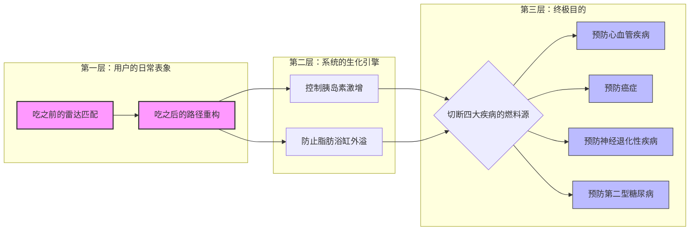

将“医学 3.0”的底层逻辑完全注入后，这 16 个章节就形成了一条无法反驳的铁链：**进化错配与系统黑箱制造了代谢危机 ➔ 盲目试探带来了道德愧疚与反复失败 ➔ 设计必须介入建立中立的“可读层” ➔ 人们看懂客观底线后成为自己的食物架构师 ➔ 最终在 2050 年实现透明、不愧疚的健康寿命跃升。**

**中午的超市：成为自己的食物架构师** 你走进一家便利店买午餐。货架上的食物不再印着密密麻麻、如同免责声明般的成分表，也没有居高临下的“健康之星”打分。 你透过轻量级的 AR 眼镜（或直接看包装上的动态电子标签），食物的信息被翻译成了极其直观的“结构光谱”**。一份看似健康的鲜榨果汁，在你的可读层里呈现出“高密度、快速释放”的锋利形态（代表液体果糖的快速冲击）；而旁边的一份坚果沙拉，则呈现出“平缓、持久”的钝角形态。 你此刻需要下午集中精力做设计，你需要平稳的燃料。于是，你像一个工匠挑选木材一样，自然而然地拿起了沙拉。没有“我在克制欲望”的苦大仇深，也没有“我真自律”的道德高潮，你只是做了一个完美的**匹配（Alignment）。今天下午，你将进行一场非常激烈的运动比赛，建议吃一份高能量的午餐。

所有的食物都会进行一个像图表一样的量化处理，比如：
1. 左边是饱腹感
2. 右边是营养成分
3. 右下角是胰岛素影响水平

系统会根据这些维度给食物打分，就像连线一样，最后形成一个直观的图表。
建议使用场景为下午激烈的运动比赛


以及说比如蛋糕吃下去以后，它会给你多个选项进行选择。

比如说：
1. 本周可以增加一次力量训练
2. 晚上回去多散步 30 分钟
3. 或者你可以选择体重直接增加 0.5 千克

类似于这样的方式。


这才是真正的 2050 年伦敦快照。当「中立可读层」与「医学 3.0」的底层逻辑彻底咬合，我们看到的不再是一个被医疗器械绑架的反乌托邦，而是一个人类终于夺回身体主权的新世界。

在这个世界里，医学 3.0 不再是诊所里昂贵的检测项目，而是化作了日常环境中的隐形基建。没有说教，没有审判，只有绝对的信息对称。

以下是重构后的 2050 年未来全景图：

### 2050 伦敦：「透明·不再错位」

在这个时代，制造食物恐惧的黑箱被彻底拆除。普通人不再是被动承受衰老和发胖的“受害者”，而是自己代谢系统的“领航员”。吃东西这件事，被清晰地切分为两个绝对透明的阶段。

#### 一、 吃之前的选择：医学 3.0 的全息预判与场景匹配

**现象描述：**

你走进一家餐厅或超市。面对食物，你不再需要像医学 2.0 时代那样，去艰难地猜测卡路里，或者在“低碳”和“生酮”的宗教式流派中摇摆。系统的「可读层」将食物的内部生化结构彻底展开，变成了一个极其直观的“食物架构雷达图”。

**交互与医学本质：**

- **多维度的客观解析：** 雷达图上没有“健康/垃圾”的评分，只有三个客观坐标：饱腹感指数、营养素密度、胰岛素激增速率。
    
- **场景驱动的自由匹配：** 系统不发号施令，它只提供预判。如果你今天下午要进行一场高强度的体能比赛，系统会清晰地告诉你，那份高胰岛素释放率的果汁和碳水是“完美的瞬时燃料”。但如果你整个下午都要坐在桌前高强度画图，系统会客观展示，这份食物会造成血糖过山车，而另一份由优质蛋白和单元不饱和脂肪组成的沙拉，才能提供平稳的代谢续航。
    
- **医学 3.0 的日常化：** 这正是医学 3.0 “主动防御”的核心。你不再是在生病（或发胖）后去寻找原因，而是在第一口食物咬下之前，就已经精准对齐了当下的生理需求。工具为你排除了系统性的不透明，剩下的，全是你的自由意志。
    

#### 二、 吃之后的选择：身体的极度透明与路径重构

**现象描述：**

晚上，你越过了常规的界限，吃下了一大份高糖高脂的巧克力熔岩蛋糕。在过去，咽下最后一口的瞬间，伴随而来的是极度的道德愧疚和“今天全毁了”的自暴自弃。但在 2050 年，系统接住了你。

**交互与医学本质：**

- **生理状态的透明显影：** 食物进入身体后不再是盲区。「可读层」就像你车上的仪表盘，平静地向你展示当前的生理物理现实：大量的糖原已经入库，你的胰岛素正在飙升，你的“皮下脂肪储存浴缸”此刻已经满载。
    
- **非强制性的后果导航：** 没有任何警报声或红字警告。系统像 GPS 偏航重新计算路线一样，为你铺开了三条基于医学 3.0 逻辑的应对道路：
    
    - **路径 A（代谢对冲）：** 本周增加一次力量训练。系统告诉你，肌肉是最大的葡萄糖消耗池，这能有效清空刚才摄入的溢出能量。
        
    - **路径 B（即时平抑）：** 今晚多散步 30 分钟。这将在当下最快地平缓胰岛素的峰值，防止脂肪在内脏周围恶意堆积。
        
    - **路径 C（物理结算）：** 什么都不做，坦然接受体重直接增加 0.5 千克。
        
- **医学 3.0 的去道德化：** 这三个选项是对“代谢危机”最漂亮的拆解。在医学 3.0 的视角下，能量守恒是铁律，多余的热量必然需要去处。系统把这个残酷的物理现实翻译成了你面前的选项。如果你选择了 C，那就意味着你今晚心甘情愿地用 0.5 千克的脂肪储存空间，去交换了那块蛋糕带来的巨大快乐。**这里只有等价交换，没有道德审判。**
    

### 结局：内耗消失的真正原因

这个未来之所以是你的 Preferable Future，是因为它完成了人类与食物关系的终极和解。

过去的错位，是因为环境的复杂蒙蔽了双眼，人像是在地雷阵里盲走，炸了（胖了/病了）只能怪自己意志力薄弱。

2050 年的透明，是把地雷阵变成了一张高清地图。你可以走捷径，你可以绕远路，你甚至可以为了看远处的风景主动踩进一小片沼泽（偶尔的放纵），因为你清楚地知道沼泽有多深，也清楚地知道走出来需要几步。

**医学 3.0 划定了不可僭越的生理底线，而你的设计，把这根底线变成了一张普通人随时可以查看、复盘并规划下一步的导航图。** 这就是真正的成为自己身体与食物的架构师。

```
```
